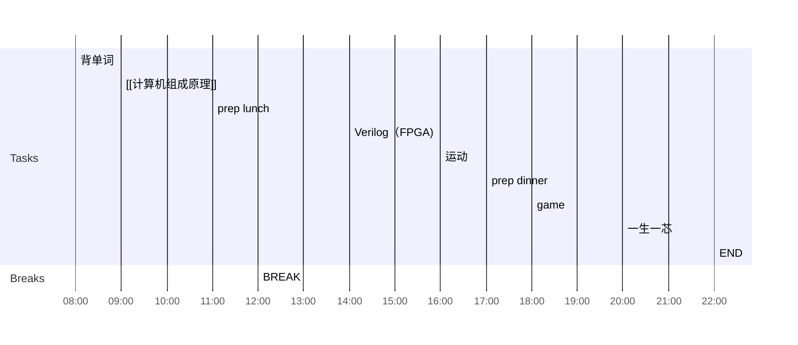

## Day Planner

### Morning
- [x] 08:00 背单词
- [x] 09:00 [[计算机组成原理]]
- [x] 11:00 prep lunch
- [x] 12:00 BREAK

### Afternoon
- [x] 14:00 Verilog（FPGA)
- [x] 16:00 运动
- [x] 17:00 prep dinner

### Eevening
- [ ] 18:00 game
- [ ] 20:00 一生一芯
- [ ] 22:00 END

# 今日完成任务
1. 

# 待完成任务
1.  
2. 

# Day summary

