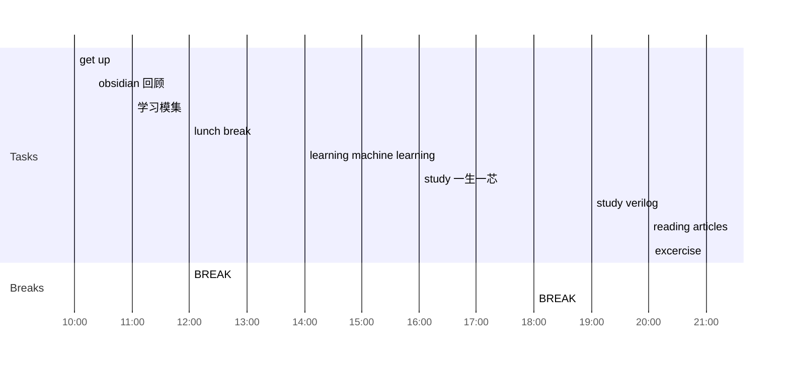

## Day Planner

### Morning
- [x] 10:00 get up
- [x] 10:20 obsidian 回顾
- [ ] 11:00 学习模集
- [ ] 12:00 lunch break

### Lunch time
- [ ] 12:00 BREAK
	- [x] Games 1h
	- [x] sleep 1h

### Afternoon
- [ ] 14:00 learning machine learning
- [ ] 16:00 study 一生一芯
- [ ] 18:00 BREAK

### Evening
- [ ] 19:00 study verilog
- [ ] 20:00 reading articles
- [ ] 21:00 excercise
