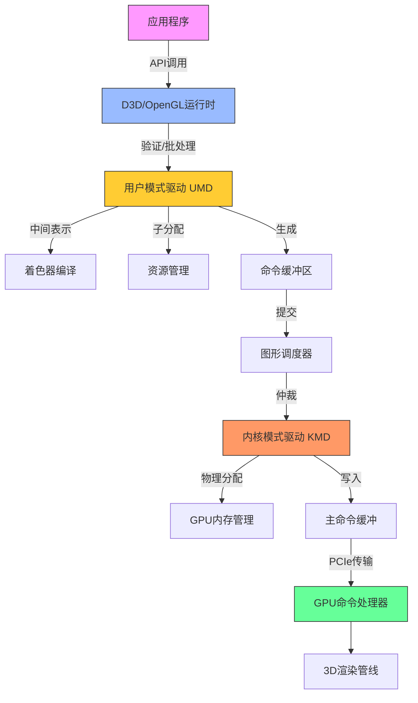
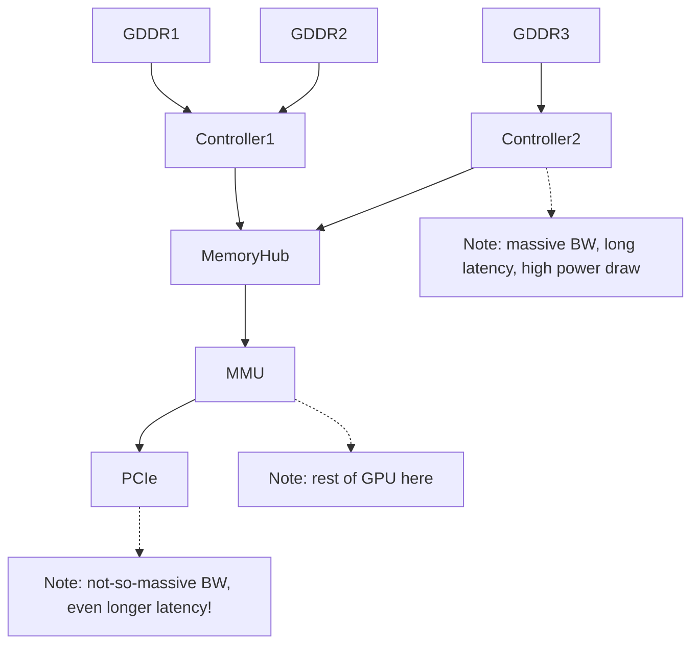

# Part 1: Introduction the Software stack

运行 D3D9/10/11 的 DX11 级 PC 硬件， 虽然除了开头部分外，API 细节不会太重要；一旦进入 GPU 内部，一切都是本地指令了



## 应用程序（The application）

这是你写的代码。也是你的 Bug，真的。是的，API 运行库和驱动也有 bug，但这次真不是它们的锅。快去修吧。

---

## API 运行时（The API runtime）

你通过它创建资源、设置状态、发出绘图调用。它记录你设定的状态、检查参数的合法性和一致性，管理用户可见的资源，也可能会验证着色器代码及其 shader 连接（至少 D3D 会处理，OpenGL 则在驱动层面中处理）。它还可能做一些批处理操作，然后将工作交给图形驱动，更具体说，是交给用户态驱动（UMD）。

---

## 用户态图形驱动（User-Mode Driver, UMD）

这是 CPU 端大多数“魔法”发生的地方。如果你的应用因为某个 API 调用崩溃，通常就是在这里发生的。它是一个用户态的 DLL 文件（比如 Nvidia 的 `nvd3dum.dll` 或 AMD 的 `atiumd*.dll`），运行在你的程序地址空间内，没有任何系统权限。

它实现了 D3D 调用的 DDI（Device Driver Interface），这个 API 比你看到的 D3D 更底层些，比如更明确地处理内存管理等。

这里是着色器编译的地方。D3D 会把预验证的着色器令牌流（已经过类型检查、资源数量限制检查等）传给 UMD。这个字节码是从 HLSL 编译而来，并在前期做了一些高级优化（死代码消除、循环展开等），这有助于驱动少做很多耗时优化。

不过，一些底层优化（如寄存器分配、循环展开）还是要由驱动完成，因为这取决于具体硬件资源和调度限制。所以驱动通常会把 D3D 字节码转成中间表示（IR）再进一步编译。

如果你的游戏很有名，Nvidia 或 AMD 的工程师可能会专门为其编写手动优化的替代着色器，并由 UMD 进行识别和替换。当然结果必须一致，否则就是丑闻。

有趣的是，一些 API 状态可能会被“编译进”着色器。例如一些少见功能（如纹理边界）可能不是 GPU 原生支持的，而是由着色器代码模拟的，这意味着驱动可能需要为不同的 API 状态组合生成多个版本的着色器。

你第一次使用某个资源或着色器时可能会卡顿 —— 因为驱动延迟了资源的创建与编译。为了确保资源真正被创建，图形程序员经常会发一个假的绘图调用“热身”资源。虽然丑陋但从1999年以来就是这样，习惯就好。

UMD 还要处理旧版 D3D 的内容，比如 Shader Model 1.x、2.0、3.0，甚至是固定功能管线（FFP），这些东西会被翻译成现代着色器来执行。

此外，它还涉及内存管理，比如纹理创建等。能做一些事情比如交换 texture 的通道，调度 system memory/video memory 之间的传输等。最重要的是，当 KMD 分配并移交给它后，写入 command buffers（或者叫 DMA buffers）。所有的状态切换以及渲染操作会被 UMD 转化为硬件能理解的 commands。还有一些你不会显式执行的操作，比如上传纹理和 shader 到显存。UMD 不能真正映射或管理显存 —— 那是 KMD 的职责 —— 但它可以将纹理做 swizzling（重排）或者安排系统内存与显存之间的数据传输。

更重要的是，它会构建命令缓冲区（Command Buffers 或 DMA Buffers），其中包含所有你设定的状态和绘图命令，还有资源上传指令等。

为了效率，驱动会尽可能将处理放在 UMD 中完成，因为 UMD 是普通 DLL，是用户态代码不需要使用昂贵的内核态切换开销，可以分配内存、多线程、调试等等。如果 UMD 崩溃，只会挂掉应用程序，不会拖垮整个系统。

### 再次解释 UMD 的工作

```text
[ 应用程序 ] 
      ↓ （调用 D3D API）
[ D3D Runtime（验证 $初级优化） ]
      ↓ （提交 ID3D11DeviceContext::XXX）
[ User‑Mode Driver（UMD） ]
   ├─ 二次验证
   ├─ 字节码 → IR → 硬件指令
   ├─ 状态融合与特化
   ├─ 命令缓冲区构建
   └─ 资源管理 / 数据搬运
      ↓ （提交命令缓冲给 KMD）
[ Kernel‑Mode Driver（KMD） ]
   ├─ GPU 内存分配与映射
   ├─ 中断与看门狗
   ├─ DRM / 显示初始化
   └─ 主命令环形缓冲写入
      ↓（DMA via PCIe）
[ GPU Command Processor ] → 后续各硬件流水线
```

-   **接收并验证 API 调用**
    -   当应用调用 `CreateTexture`、`VSSetShader`、`DrawIndexed` 等 D3D API 时，API 运行时（D3D runtime）首先做基本的参数检查和状态追踪，然后把这些调用转发给 UMD。
    -   UMD 会再次检查——尤其是在 Windows 下，D3D runtime 和 UMD 都会做一遍验证，以保证传入的数据完全合法（资源大小、绑定点数量、状态组合等）。
        
-   **高级着色器优化与中间表示转换**
    -   D3D runtime 会将 HLSL 编译成 D3D 字节码，并执行一次“高层”优化（死码消除、常量折叠、循环展开等）。
    -   UMD 接收这个已经过初步优化并验证过的字节码，进一步将其翻译为自己的中间表示（IR），并在此层做与硬件资源、调度策略密切相关的低层优化，例如寄存器分配、指令打包、特定流水线约束调整等。
        
-   **状态合并与特化**
    -   UMD 会把应用在 API 层面设置的各种渲染状态（混合模式、深度测试、采样器状态等）和着色器常量等“融合”到最终的硬件命令中。
    -   对于一些不常用或需要在着色器中模拟的功能（如纹理边界处理、固定功能流水线行为），UMD 会在编译时生成特化版本的着色器或插入额外指令，从而避免硬件中单独实现这些“冷门”特性。
        
-   **命令缓冲区（Command Buffer）构建**
    -   所有“状态更改＋绘制调用＋资源上传”等操作，UMD 最终都会翻译成 GPU 能执行的原语指令，然后打包到所谓的命令缓冲区（也称 DMA buffer）中。
    -   这些缓冲区本身只是普通的 GPU 可寻址内存块，UMD 在用户态完成填充后，将它们提交给内核态驱动。
        
-   **资源管理与数据搬运**
    -   虽然显存真正的分配和映射是由 KMD 执行（因为这是内核特权操作），UMD 可以在用户态挑选合适的内存页、将纹理做“swizzle”（按硬件最优布局重排）或者在后台多线程调度数据上传／下载。
    -   它还负责跟踪哪些资源是“热”的、哪些是“冷”的，以便在必要时向 KMD 提出迁移显存 ↔ 系统内存的请求。
        
-   **插件与游戏特化**
    -   UMD 通常会内置一份“已知热门游戏的着色器替换列表”，当检测到某款游戏的特定 HLSL 字节码时，UMD 会自动用手工高度优化的等效着色器替换它，从而提升性能或修复兼容性问题。
---

## 但等等，我们说的是“用户态驱动”？其实是“多个用户态驱动”

UMD 是 DLL，运行在调用它的每个进程中。但 GPU 是全局资源 —— 只有一个（即便你用 SLI/Crossfire），而系统中可能有多个应用同时访问它。这需要某个调度组件来分配 GPU 使用时间。

---

## 调度器（The Scheduler）

图形调度器会对多个进程之间的 GPU 使用进行时间分片，它会仲裁谁来访问 3D 管线，根据时间片等考虑。切换上下文会带来 GPU 状态的额外切换（会产生额外的 command buffer 指令），而且有可能带来显存资源的 swap in/out。一段时间内只有一个进程会提交 3D 指令。 一次上下文切换意味着要切换 GPU 状态，有时还需要换显存资源 —— 代价不小。而同一时刻只能有一个进程提交命令到 GPU。

控制台游戏程序员常抱怨 PC 的图形 API 抽象太高，影响性能。但其实 PC 驱动的任务更复杂 —— 它必须时刻维护完整状态，因为你可能随时被中断。而且为了避免程序崩溃或性能问题，驱动往往会在用户不知情的情况下悄悄修复错误或优化 —— 不讨好但没办法，商业需求优先。

---

## 内核态驱动（Kernel-Mode Driver, KMD）

KMD 是唯一的、系统级别的图形驱动。多个 UMD 可以同时存在，但只有一个 KMD。如果 KMD 崩溃，整个图形系统都会重启（现在不会蓝屏了，会重载驱动）。

KMD 负责 GPU 初始化、设置显示模式、处理鼠标光标（是的，硬件只支持一个）、设定看门狗定时器、处理中断、管理物理内存映射、处理内容保护路径（DRM）等等。

最关键的是：KMD 管理实际被 GPU 执行的命令缓冲。UMD 构造的命令缓冲只是 GPU 可访问的内存区域，而 KMD 会把它们打包进主命令缓冲（一般是一个小环形缓冲），并通过寄存器将读写指针告诉 GPU。

---

## 总线（The Bus）

这些数据传输并不是直接通往显卡，而是经过总线 —— 通常是 PCI Express。DMA 传输也一样。虽然很快，但也是一个流程阶段。

---

## 命令处理器（The Command Processor）

这是 GPU 的前端 —— 负责读取命令缓冲并执行它们的部分。本文篇幅已长，后续将在下一篇继续介绍从这里开始的内容。

---

## OpenGL 小插曲

OpenGL 与上文类似，但 API 与 UMD 之间界限不明显。而且 GLSL 编译完全由驱动处理，每个硬件厂商都有自己实现的前端 —— 结果就是有一堆略微不同、互相不兼容的 GLSL 方言，还有各种 bug。

相比之下，D3D 的字节码方案更清晰：只有一个编译器，避免了语法差异，且允许在编译阶段进行更复杂的优化。

---

## 遗漏与简化说明

本文只是概览，省略了大量细节。例如调度器有多个实现、CPU 和 GPU 的同步机制没有讲、可能还有我忘记的内容。欢迎指出错误，我会修正！希望下次继续为你带来更多 GPU 内部的内容！


# Part2: GPU memory architecture and the Command Processor.

在上一部分，我解释了你在 PC 上发出的 3D 渲染指令在真正送达 GPU 之前所经历的各个阶段；简而言之：这过程比你想得要复杂。我最后提到了**命令处理器（Command Processor）**，以及它如何最终处理我们辛苦准备好的命令缓冲区。嗯……我要说实话了，我之前其实“骗”了你一点点。这一次我们确实会首次“见到”命令处理器，但你要记住，所有这些命令缓冲其实都还是**通过内存传递**的——要么是通过 PCI Express 访问的系统内存，要么是本地显存。我们正在按顺序讲解整个渲染管线，所以，在真正谈论命令处理器之前，我们得先来谈谈内存子系统。

---

## GPU 内存子系统

GPU 的内存子系统和一般的 CPU 或其他硬件用的内存架构不同，因为 GPU 的设计目标完全不同，使用方式也不一样。有两个关键区别：

---

### 第一：GPU 的内存子系统非常快。真的很快。

比如，一颗 Core i7 2600K 的内存带宽可能最多能达到 19GB/s——那是在理想状态下，比如顺风、下坡、天气晴朗的情况下。而一块 GeForce GTX 480，内存带宽接近 **180GB/s** ——相差快一个数量级！有没有很震撼？

---

### 第二：GPU 的内存子系统非常慢。真的很慢。

比如 Nehalem 架构的第一代 Core i7，在缓存未命中时访问主内存，大约需要 **140 个时钟周期**（你可以拿 AnandTech 给出的延迟乘以频率来算）。而 GTX 480 的内存访问延迟是 **400–800 个时钟周期**。更糟的是，这颗 Core i7 的频率是 **2.93GHz**，而 GTX 480 的 Shader Clock 是 **1.4GHz**，再来一个 2 倍的差距。哎呀，又是一个数量级的落差！

---

## 这意味着什么？

这正是你经常听说的那个经典权衡之一：

> **GPU 获得了超高的带宽，但为此付出了高延迟的代价**（还有较高的功耗，不过我们暂且不谈）。

GPU 的整体设计哲学就是：**“吞吐量优先，延迟靠边站”**。不要傻傻地等结果，没结果的时候就干别的去！

---

## 一点 DRAM 冷知识（对于后面很重要）

GPU 使用的显存（GDDR）是基于 DRAM 技术的。而 DRAM 的内部结构是个二维网格，有水平的“行线”和垂直的“列线”。每个交点都有一个电容和一个晶体管。

> 内部地址会被分为“行地址”和“列地址”，一次 DRAM 访问实际上是**整行**数据被读取或写入。

这意味着，如果你要访问一个 DRAM 的完整行，速度是很快的。但如果你访问的地址跨越了多个行，那延迟就会拉爆。所以如果你想充分发挥前面提到的惊人带宽，你得**按 DRAM 行来批量读取**数据，而不是到处零散读几字节。


## PCIe 主机接口

对图形程序员来说，这玩意儿可能没什么好说的；对 GPU 硬件架构师也一样。但当它成了性能瓶颈时，你就不得不重视它了。

它的主要作用是：

-   CPU 可通过它访问视频内存和 GPU 寄存器；
    
-   GPU 可访问系统内存的部分区域；
    
-   然后大家一起头疼，因为延迟非常大，信号必须从芯片走出、穿过主板、到达 CPU，然后感觉像是经历了一个世纪。
    

> **带宽倒还可以**——PCIe 2.0 x16 理论带宽为 8GB/s，约等于 CPU 内存带宽的一半到三分之一，是可以接受的。

而且和 AGP 不同的是，**PCIe 是双向对等链接**——AGP 只有从 CPU 到 GPU 是快通道，反向很慢；而 PCIe 是双向都有带宽。

---

### 🔧 AGP 的基本概念

AGP，全称 **Accelerated Graphics Port（加速图形端口）**，是英特尔于 1997 年推出的一种专门为图形加速卡（显卡）设计的高速通道接口标准，目的是提供比传统 PCI 更高效的图形数据传输能力。

-   **用途：** 专门为显卡与主板之间的数据传输设计，主要服务于 3D 图形渲染。
    
-   **接口位置：** AGP 插槽通常位于主板上，紧邻 PCI 插槽，但结构略有不同。
    
-   **数据通道：** 单向通道，**从 CPU 到 GPU 是高速的**，**但反方向（GPU → CPU）不快**，这和后来的 PCIe 不同。

---

## 最后再谈点内存细节

我们真的快要看到 3D 渲染命令了，几乎触手可及。但还有最后一个问题：

我们现在有两类内存：**本地显存** 和 **映射的系统内存**。一条通往北方的道路，另一条是南下几千里的长路。我们该走哪一条？

最简单的解决方法是：**加一根地址线**，指明该去哪里。这种方法很简单，也很常见。

但如果你在**统一内存架构**下，比如某些游戏主机（注意：不是 PC），那就只有一块内存，不用选路，去哪都一样。

如果你想更高级点，可以加个 **MMU（内存管理单元）**。这样就可以虚拟化 GPU 的内存地址空间，实现很多技巧：

-   热门数据放在显存；
    
-   冷数据放系统内存；
    
-   甚至未加载的资源可以动态从硬盘读取（大概需要 50 年 😂，因为硬盘真的慢，不是夸张）。
    

MMU 还能在你显存快满时，动态整理内存空间而不真的移动数据。

> MMU 也很有利于多进程共享 GPU。

至于是否必须有 MMU，我也不确定；反正它确实很有用。如果有人能帮我补充这部分，我愿意更新这篇文章。但说实话，现在我懒得查……

---

## DMA 引擎

还有一个叫 DMA（直接内存访问）的模块，能在系统内存与视频内存之间搬数据，而不占用 GPU 核心或 CPU 资源。

通常它可以完成：

-   **系统内存 ↔ 显存** 的复制；
    
-   **显存 ↔ 显存** 的复制（比如进行显存碎片整理）；
    
-   但 **不能做系统内存 ↔ 系统内存** 的搬运——因为你这是 GPU，不是内存拷贝专用设备！你要复制系统内存，**去找 CPU 处理**，不然还得绕 PCIe 一圈呢！
    

---

### DMA（Direct Memory Access，直接内存访问）的作用

1.  **绕过 CPU 直接传输**
    
    -   在没有 DMA 之前，CPU 要在系统内存和外设（如显卡、硬盘、网卡等）之间搬数据，必须不停地读写寄存器，然后把数据从一个缓冲区搬到另一个缓冲区，这样 CPU 要花大量周期来“搬运”数据。
        
    -   有了 DMA，外设可以在不经过 CPU 算术/逻辑单元的情况下，直接将数据从一块内存拷贝到另一块内存。CPU 只需设置一次 DMA 传输的源地址、目的地址、长度等参数，然后去做别的事，DMA 控制器会自动完成后续拷贝，拷完了还会生成一个中断通知 CPU。
        
2.  **减轻 CPU 负担**
    
    -   把大批量数据传输的工作交给 DMA 控制器做，CPU 可以把精力放在更“聪明”的计算任务上，比如图形算法、物理仿真、AI 推理等等。
        
    -   对于 GPU 内部来说，自己的 DMA 引擎可以在后台把系统内存 ↔ 显存的数据搬运搞定，3D 渲染单元（Shader 核心）就不用管这些“搬砖”任务了。
        
3.  **提高总体带宽和效率**
    
    -   DMA 通常有专门的、优化过的总线通路和多通道设计，能让内存拷贝速度更快，而且不会占用 CPU 的缓存或总线带宽，整体系统更加流畅。
        

---

### “系统内存”（System Memory）指哪里

-   “系统内存”就是**主机（PC）上插在主板上的那一组 DRAM 条（DIMM）**，也常称为 **主存** 或 **主内存**，由 CPU 通过内存控制器直接访问。
    
-   API/驱动概念中，系统内存指的就是这块内存区域，与 GPU 的**专用显存（Video Memory / VRAM）**相对。
    
    -   **系统内存**（System Memory）
        
        -   由操作系统管理，用于存放程序代码、全局数据、堆栈、缓存等。
            
        -   CPU 访问延迟低（几十纳秒），带宽一般几十 GB/s。
            
    -   **显存**（Video Memory / VRAM）
        
        -   专门给 GPU 用的高速内存，通常 GDDR或HBM，带宽非常高（上百 GB/s），但往往延迟也更高。
            
        -   只能通过 GPU 或者 PCIe DMA 引擎来读写。
            

在 GPU 渲染流程中，**DMA 引擎** 就是负责在这两者之间搬运数据的“搬运工”。它能从系统内存中把贴图、顶点数据等拉到显存，也能把渲染结果输出到系统内存，供 CPU 或其他外设继续处理。


---

## 总结*

---


现在我们有：

-   CPU 端准备好的命令缓冲；
    
-   PCIe 接口，让 CPU 能把它地址写入寄存器；
    
-   KMD 能通过 DMA 把命令从系统内存搬到显存；
    
-   然后 GPU 的内存子系统能读出这些命令；
    

所有路径都准备好了——我们终于，终于可以来看真正的 GPU 渲染命令了！


## 指令处理器，终于登场！

我们的讨论从一个熟悉的词开始：

> **“缓冲……”（Buffering…）**

### 缓冲的必要性

在 GPU 中，数据通路虽然带宽高，但延迟也高。为了避免在处理命令时卡顿，GPU 会使用较大的 **命令缓冲区（Command Buffer）**，并尽量 **预取（prefetch）** 足够远的命令内容，避免处理器“饿死”。

### 部分指令

从这个缓冲 buffer 开始，我们就将进入实际的命令处理前端。**这个指令处理前端基本上是一个状态机，知道如何解析指令（硬件特定格式的指令）。**
有些指令处理的是 2D 渲染操作--除非有一个单独的指令处理器来处理 2D 的东西，而 3D 前端根本看不到它。
不管是哪种方式，现代 GPU 上仍然隐藏着专门的 2D 硬件，就像在片上的某个地方有一个 VGA 芯片，仍然支持文本模式、4-bit/pixel 位平面模式、平滑滚动和所有这些东西。
没有显微镜的话，很难在片上找到这些部分。总之，那些模块是存在的，但从此以后我就不再提了。
还有一些指令，实际上是把一些图元交给 3D/着色器管道，我将在接下来的文章中介绍它们。还有一些跳转到 3D/shader pipe 的指令，实际上并不渲染任何东西，出于各种原因（以及由于各种流水线配置）；这些将在以后的章节中讨论。

> **位平面模式**
> 是一种图形显示模式。在计算机图形学中，位平面是用于表示图像像素的二进制位的集合。每个位平面包含图像的一个二进制位，多个位平面组合在一起可以表示不同颜色深度的图像。例如，一个8位的图像就有8个位平面，每个位平面表示图像的一个二进制位。这种模式主要用于描述图形硬件如何处理和显示图像数据。

指令会从缓冲区进入命令处理器的前端，这是一个解析硬件格式命令的 **状态机（state machine）**。命令类型包括不限于：

-   2D 渲染操作（可能由独立的 2D 命令处理器处理）
-   提交几何图元到 3D / shader 管线
-   不绘制但会影响渲染管线的状态设置命令
    

### 状态变更指令

然后就是那些**改变状态**的指令。作为程序员，你可能觉得这就像“改个变量”那么简单——实际上基本上确实是这样。但问题在于，GPU 是一个**高度并行的计算机系统**，你不能在这种并行系统中随便改变一个**全局变量**，然后指望一切都能顺利运行——如果你不能通过某种**约束条件（invariant）** 来确保一切都正确运行，那系统中就一定存在 bug，而且迟早会暴露出来。

#### 1. 管线刷新（Flush）

每次改变某个状态时，都必须先让所有可能引用该状态的未完成工作执行完毕（即执行**部分管线刷新**）。过去，显卡芯片就是通过这种方式来处理大多数状态变更的——如果批次少、三角形数量少、管线也短，这种做法既简单又不太昂贵。但随着批次和三角形数量的激增，管线也越来越长，这种方法的成本便骤增。
不过，对于那些**很少变更**的状态（在一帧中只需十几次部分刷新并不会带来太大开销），或者**用更复杂方案实现难度过高**的场景，这种方式依然有效。

#### 2. 无状态设计

某些模块可以设计为 **完全无状态**，只要将状态变化传递到需要它的阶段，每个周期都将当前状态附加在数据上，向下游传递。但若状态数据太大（如纹理采样配置），此方法就不现实了。

#### 3. 双缓冲（State Slot 双槽）

用足够的寄存器（slots）来存储每个状态的两个版本，部分当前任务用 Slot 0 时，可以在不停止任何工作的情况下修改 Slot 1。切换状态只需一个比特位来选择使用哪个槽，而不需要将整个状态在流水线上传递。当然，如果 Slot1 和 Slot 0 都被占用，你还是需要等待，但是你可以领先一步。多槽位的做法同理可推。

#### 4. 类似寄存器重命名机制（Register Renaming）

对于诸如采样器或纹理 Shader Resource View 的状态，理论上可能一次性要设置大量数据，但实际应用中往往不会如此。你不会仅仅因为要跟踪两个“使用中”的状态集合，就为 2×128 个活动纹理预留状态空间。
对于此类场景，可以使用类似**寄存器重命名**的方案——维护一个 128 个物理纹理描述符的“池子”。只有在某个着色器真的需要 128 纹理时，状态变更才会变慢（那就认栽吧）；而在更常见的状况下，应用使用少于 20 个纹理，你就有充足空间同时保留多个状态版本。

这并不是要给出一份详尽的清单——但关键点在于，看似简单地在你的应用程序中改变一个变量（甚至是在 UMD/KMD 或命令缓冲区里改变一个状态！）实际上可能需要相当复杂的硬件支持，以避免性能大幅下降。

---

### 同步（Synchronization）指令

#### CPU ↔ GPU、GPU ↔ GPU 同步

通常，所有这些操作都遵循 **“如果事件 X 发生，就执行 Y”** 的模式。先说说 “执行 Y” 部分——这里的 Y 有两种合理的实现方式：

-   **推送模型（Push）**  
    GPU 主动向 CPU 发出通知，让 CPU 立即采取行动。比如：
    
    > “喂！CPU！我现在进入显示器 0 的垂直消隐区，如果你想无割裂地交换缓冲区，现在就是时候了！”
    
-   **拉取模型（Pull）**  
    GPU 只是在内部记录事件已发生，CPU 日后再去询问。比如：
    
    > “喂，GPU，上次开始处理的是哪个命令缓冲区？”  
    > “让我查查……是序号 303。”
    
推送模型通常用中断来实现，但由于中断开销较大，只会用于不频繁且优先级很高的事件。至于拉取模型，你只需要预留一些 CPU 可见的 GPU 寄存器，并在命令缓冲区里插入指令：在特定事件发生时，把某个值写到这些寄存器里。

举例来说，假设你有 16 个这样的状态寄存器。你可以把当前命令缓冲区的序号（`currentCommandBufferSeqId`）映射到寄存器 0。每次提交一个新的命令缓冲区，都在内核驱动（KMD）里给它分配一个递增的序号；然后在命令缓冲区开头，插入一条“当执行到这里时，把序号写入寄存器 0” 的指令。这样一来，CPU 就能随时读取寄存器 0，知道 GPU 正在处理哪个命令缓冲区。

因为命令处理器会严格按序号顺序执行命令，所以如果我们看到寄存器 0 已经写入了 303，就能确定命令缓冲区 303 的第一条命令已经执行完成。由此可推断，序号 302 及之前的所有命令缓冲区都已经执行完毕，可以由内核驱动回收、重用、修改，或者…做一些别的好玩的事情。

我们现在也有了 X 可能是什么的例子：

> “如果执行到这里”  （我理解为分支判断指令这类）

这或许是最简单的例子，却已经非常有用了。其他例子还包括：

-   “如果所有着色器已完成命令缓冲区中此点之前所有批次的所有纹理读取”
    -   （这标志着可以安全回收纹理或渲染目标的内存）
        
-   “如果对所有活动的渲染目标/UAV（读写纹理）都已完成渲染”
    -   （这标志着可以将它们当作纹理安全地再次使用）
        
-   “如果到此为止的所有操作都已完全完成”

 诸如此类

> **UAV**
>在 Direct3D 11 及以后的版本中，**UAV** 是 **Unordered Access View**（无序访问视图）的缩写。
  -  **含义**：它是一种资源视图，允许着色器（尤其是计算着色器或像素着色器）对缓冲区或纹理进行**无序**的读写访问。

顺便说一句，这类操作通常被称为 **“栅栏”（fence）**。至于写入状态寄存器的值该怎么选，有多种方法可行，但在我看来，最合理的做法是**使用一个递增的计数器**（当然你可能会把其中若干位挪来存放其他信息）。好吧，这条看似随口抛出的建议并没有什么深层理由，只是我觉得你该知道而已。也许在以后的博客里我会详细讲讲（不过不会是本系列的内容）😊
    

### GPU 内部等待指令

我们已经完成了一半——可以把 GPU 的状态反馈给 CPU，从而让驱动程序能够进行合理的内存管理（例如，知道什么时候可以安全地回收顶点缓冲区、命令缓冲区、纹理等资源的内存）。但这还不是全部——还缺少一个关键环节：如果我们需要在纯 GPU 侧进行同步，该怎么办？回到渲染目标的例子，在渲染完成之前（以及某些后续步骤完成之前），我们不能把它当作纹理来使用。解决方案是引入一种“等待”指令：

> “等待，直到寄存器 M 的值变为 N”。

该指令可以是“等于”比较，也可以是“小于”比较（要注意处理值回绕的问题），或者更复杂的条件——这里为简单起见，只讨论等于比较。这条指令允许我们在提交绘制批次前，先对渲染目标进行同步。它也能让我们构建一个完整的 GPU 刷新操作：

1.  “如果所有挂起的任务都完成，则将寄存器 0 的值递增并写入 seqId” ++seqId
    
2.  “等待，直到寄存器 0 的值等于 seqId”
    
如此一来，GPU↔GPU 的同步问题就解决了。在引入具有更细粒度同步功能的 DX11 计算着色器之前，这通常是 GPU 侧唯一的同步机制。对于常规渲染管线而言，也完全足够。


### CPU 控制 GPU 等待

甚至可以反过来：GPU 先执行一个等待指令，等待 CPU 设置某个寄存器值再继续。这可用于实现 **多线程渲染（如 D3D11 风格）**，提前提交命令缓冲，GPU 等待数据准备好。

甚至不需要 CPU 可写寄存器，只要能修改已提交的命令缓冲，插入条件跳转指令就能实现相似机制。

顺便一提，如果你能从 CPU 端也能写这些寄存器，你还可以反向利用它——提交一个包含“等待特定寄存器值”的部分命令缓冲区，然后由 CPU 而不是 GPU 去修改那个寄存器的值。

这种机制可以用来实现 D3D11 风格的**多线程渲染**：你可以提交一个批次（to GPU？），该批次所引用的顶点/索引缓冲区可能仍在 CPU 端被另一个线程锁定并写入。你只需在真正的渲染调用前插入一个等待指令，当顶点/索引缓冲区解锁后，CPU 再去修改那个寄存器的值。


如果 GPU 没执行到那条等待指令，等待就是空操作；如果执行到了，就会在执行处理器里不断轮询，直到数据就绪。挺巧妙的，对吧？实际上，即便没有 CPU 可写的状态寄存器，只要在提交指令缓冲后还能修改它，并且插入“跳转”指令，也能实现类似机制。细节就留给感兴趣的读者自行探索吧 😀

---

#### 解释流程
具体流程可以这样理解：

1.  **CPU 准备数据**
    
    -   线程 A 在 CPU 上锁定一段缓冲区，并往里写新的顶点或索引数据。
        
    -   写完之前，这段缓冲区对 GPU 来说“还不可读”。
        
2.  **提交“部分”命令缓冲区到 GPU**
    
    -   在 CPU 把完整的绘制命令发给 GPU 之前，会先生成一个**命令缓冲区**（Command Buffer），把前面那些不依赖这段缓冲区的渲染或状态切换命令都写进去。
        
    -   在最后你要真正用到该顶点/索引数据之前，命令缓冲里插入一条“Wait until Register X == 1”的指令。
        
3.  **GPU 异步接收并预取命令**
    
    -   GPU 在后台不断**预取**命令缓冲，但当预取到那条“Wait”指令时，它会停下来，不往下执行也不去读那块缓冲区的数据。
        
    -   此时 GPU 的其它任务（如果有）仍可继续执行。
        
4.  **CPU 解锁并通知 GPU**
    
    -   线程 A 完成对缓冲区的数据写入后，释放锁，并通过写寄存器（Register X）或触发一个信号，将它的值设为 1。
        
    -   这个写操作可以是一次简单的 MMIO 写寄存器，或者是通过另一条命令缓冲“写寄存器”指令。
        
5.  **GPU 恢复执行**
    
    -   GPU 在命令处理器中检测到 Register X == 1，就跳过“Wait”，开始执行接下来的绘制调用，安全地从刚才那段缓冲区读取顶点/索引数据。
        

---

### 为什么这么做？

-   **重叠 CPU 与 GPU 工作**：CPU 在准备数据（写缓冲区）的同时，GPU 可以先做其他工作，甚至先把后续不依赖该数据的命令“吃”进来。
    
-   **避免同步阻塞**：在传统做法里，CPU 写完数据后必须完整发一整批绘制命令，然后 GPU 才开始执行；现在则是先提交一部分，让 GPU 等待真正的数据准备好，减少了 CPU/GPU 端点对点的等待时间。
    
-   **支持多线程渲染**：在 D3D11 中，应用可以在多个线程里分别生成命令列表（Command List），然后再在主线程里将它们串联提交。用“Wait”机制，就能安全地跨线程引用同一缓冲区，而不会因为缓冲区还未写完就被 GPU 读取而出错。
    

这样就实现了**CPU 端写数据、GPU 端并行预取命令、再同步到数据就绪**的完整流水，让两者的资源利用率更高。

---

## 可视化结构（简图说明）

当然，你并不一定非要使用“写寄存器/等寄存器”这种模型；对于 GPU ↔ GPU 侧的同步，你也可以直接提供一个“渲染目标屏障（rendertarget barrier）”指令来保证渲染目标可安全使用，或者使用一个“一键刷新”命令来完成所有挂起操作。但我更喜欢写寄存器的方式，因为它能“一石二鸟”：既能把资源使用情况反馈给 CPU，又能让 GPU 自行完成同步。

**更新**：我已经为你画了一张示意图。图有点复杂，以后我会简化细节。基本思路如下：


1.  **FIFO 缓冲区**：命令最先进入一个硬件 FIFO
    
2.  **命令解码逻辑**：从 FIFO 中读出命令并解析
    
3.  **执行单元**：解析后分发到不同模块
    
    -   2D 单元（2D 渲染）
        
    -   3D 前端（常规 3D 渲染）
        
    -   着色器单元（Compute Shader 等）
        
4.  **同步/等待模块**：处理那些 “写寄存器” 或 “等待寄存器” 的命令，这里有之前提到的公开可见寄存器
    
5.  **跳转/调用单元**：处理命令缓冲中的跳转或调用指令，动态改变从 FIFO 拉取命令的地址
    
6.  **完成事件**：所有被调度执行的单元在任务完成后，都会向命令处理器反馈“完成事件”，以便驱动回收不再使用的资源（比如纹理内存）
    

这样就构成了一个完整的命令处理器内部流程。
    

---

## 小结

下一步，我们终于要进入真正的渲染工作了。到这里，我的 GPU 系列文章才讲到第三部分——我们实际上要开始看一些顶点数据了！（还不涉及三角形光栅化，那要稍后才讲。）

实际上，到这个阶段，管线已经出现分支了：如果我们运行的是计算着色器，那么下一步就会直接进入……计算着色器执行。但我们现在还没谈计算着色器，那是后面才会讲的内容！先把常规渲染管线说完。

小小免责声明：我这里主要给你勾勒出大体框架，必要或有趣的地方会深入讲解，但为了方便理解也省略了不少细节。我相信自己没有漏掉真正关键的内容，但难免有疏漏或不当之处。如果你发现任何错误，请告诉我！

# Part3：3D pipeline overview, vertex processing.
本篇文章是“2011 年图形管线之旅”系列的一部分。到目前为止，我们已经将绘制调用从应用程序一路送过各种驱动层和命令处理器；现在，终于要对这些调用做一些真正的图形处理了！在本篇中，我将重点介绍**顶点管线**

## 字母缩写

我们现在正式进入 3D 渲染管线，它由多个阶段组成，每个阶段负责一个特定的任务。我会给出所有阶段的名称——主要沿用 D3D10/11 的“官方”命名以保持一致——并列出对应的缩写。我们在这次系列中最终会看到它们，但要等好几篇文章才会讲到大部分内容——我还专门列了个大纲，要覆盖的内容足够我忙上至少两周！话不多说，下面列出各阶段的名称及一句话概述它们的作用：


-   **IA — 输入装配器（Input Assembler）**  
    读取顶点和索引数据，将它们按绘制调用组装成原语的顶点列表。
	- IA 通过从 1D Buffer 拉取源几何数据，将三角形、线条、点或控制点引入图形流程
	- 除了从缓冲区生成顶点数据外，IA 还可以自动生成标量计数器值，如：[VertexID](https://microsoft.github.io/DirectX-Specs/d3d/archive/D3D11_3_FunctionalSpec.htm#VertexID)（8.16）、[PrimitiveID](https://microsoft.github.io/DirectX-Specs/d3d/archive/D3D11_3_FunctionalSpec.htm#PrimitiveID)（8.17） 和 [InstanceID](https://microsoft.github.io/DirectX-Specs/d3d/archive/D3D11_3_FunctionalSpec.htm#InstanceID)（8.18）），用于图形管线中的着色器阶段输入
	    
-   **VS — 顶点着色器（Vertex Shader）**  
    接收 IA 输出的顶点输入，对每个顶点执行用户定义的变换与计算，并输出给下一级。
	-  模型转化与相机转换、坐标变换（诸如流动、摇曳等与顶点位置相关的动画操作）、逐顶点色彩信息处理
	    
-   **PA — 原语装配（Primitive Assembly）**  
    将经过 VS 处理的顶点按索引组合成基本图元（点、线、三角形）并传递下去。
	- 属于光栅化阶段，把顶点数据收集并组装为简单的基本体（线、点或三角形），通俗的说就是把相关的两个顶点“连连看”，有些能构成面，有些只是线，有些甚至没有与之配对的顶点只能当一个“单身狗”
	    
-   **HS — Hull 着色器（Hull Shader）**  
    接受补丁（patch）原语，输出用于域着色器（DS）的控制点及驱动细分所需的额外数据。
	- 这是一个可编程的阶段，开发者可以指挥GPU如何对顶点进行细分操作，但还不会真正进行细分，就像是指挥流水线上的工人说：“来，帮我把这给这根钢筋中间打上三个标记，好让后面的工人在上面安上旋钮。”
	    
-   **TS — 细分器阶段（Tessellator Stage）**  
    根据 HS 提供的细分因子，生成新的顶点位置和图元连通性，实现曲面细分。
	- 真正的细分阶段；尽管开发者无法在这个阶段进行编程，但GPU将会根据Hull-Shader Stage中的标记进行细分；就像是流水线上的工人木讷地照着传过来的钢筋上的标记安装上旋钮
	    
-   **DS — 域着色器（Domain Shader）**  
    输入 HS 的控制点输出、TS 细分后的位置和额外数据，对细分后的顶点执行计算，输出新的顶点。
	- 这是一个可编程的阶段，开发者可以指挥 GPU 对这些细分的顶点进行坐标计算；就像是指挥流水线上的工人如何调整上一个流程里工人安装上的旋钮，把钢筋摆成想要的形状
	- 域着色器的作用是将该坐标转化为有形的存在（例如三维空间中的一个点），以便下游使用
	    
-   **GS — 几何着色器（Geometry Shader）**  
    接收完整图元（可附带邻接信息），可生成新的图元或修改原图元，也常作为…
	- 在这个阶段，开发者可以控制GPU对顶点进行增删改操作。几何着色器与顶点着色器都可以对顶点的坐标进行修改，但几何体着色器并行调用硬件困难，并行程度低，效率和顶点着色器有很大的差距；如果不是要做顶点增、删这些仅仅能用几何着色器实现的效果，那么还是用顶点着色器来完成吧。
	    
-   **SO — 流式输出（Stream-Out）**  
    将 GS 或 VS/DS 的输出原语写回内存缓冲区，用于后续处理或复用。
    - 顶点可以在到达光栅化器之前流向内存

-   **RS — 光栅化器（Rasterizer）**  
    将图元转换成片元（fragments），**执行裁剪、投影和插值运算**，准备送入像素着色器。
    
-   **PS — 像素着色器（Pixel Shader）**  
    接收插值后的片元数据，计算并输出最终像素颜色；也可向无序访问视图（UAV）写入数据。
	- 也是片元着色器（Fragment Shader），这个阶段是完全可编程的；在收到 GPU 为这个阶段输入了大量的数据后，程序员可以决定这些片元该着上什么样的颜色，当然，除了自己计算色彩，使用纹理采样也是一种常见的做法
	    
-   **OM — 输出合并器（Output Merger）**  
    接收 PS 输出的像素，**执行混合、深度/模板测试等操作**，并写回后备缓冲区。
    
-   **CS — 计算着色器（Compute Shader）**  
    独立于上述渲染管线运行，仅以常量缓冲区和线程 ID 为输入，可对缓冲区和 UAV 进行任意读写。

现在，先把这些内容放一边，下面是我将要讨论的各种数据路径列表（我会省略掉 IA、PA、RS 和 OM 阶段，因为在我们讨论的目的中，它们实际上并没有对数据执行任何操作，只是重新排列或重新排序数据——也就是说，它们本质上是粘合剂）：

-   **VS→PS**：古老的可编程管线。在 D3D9 中，这就是你所拥有的一切。到目前为止，这仍然是常规渲染中最重要的路径。我会从头到尾讲解这个路径，然后再回过头来讲解其他更复杂的路径。
    
-   **VS→GS→PS**：几何着色（D3D10 新增）。
    
-   **VS→HS→TS→DS→PS，VS→HS→TS→DS→GS→PS**：细分（D3D11 新增）。
    
-   **VS→SO，VS→GS→SO，VS→HS→TS→DS→GS→SO**：流输出（带细分和不带细分）。
    
-   **CS**：计算着色器。D3D11 新增。
    
现在你已经知道接下来要讲的内容，让我们开始讲解顶点着色器吧！

## 输入组装阶段IA（Input Assembler Stage）

在这里，首先发生的事情是从**索引缓冲区加载索引**

——如果这是一个带索引的批次。如果不是带索引的批次，就假装它使用了一个恒等索引缓冲区 identity index buffer（即索引序列为 0、1、2、3、4……），并使用这个作为索引。如果存在索引缓冲区，其内容会在这一阶段从内存中读取——不过，读取并不是直接进行的，输入组装阶段 IA 通常有一个**数据缓存**，以便利用索引/顶点缓冲区访问的局部性（空间局部性？）。
此外，需要注意的是，索引缓冲区的读取（实际上，在 Direct3D 10 及更高版本中所有资源访问）都会进行**边界检查**。如果你引用了超出原始索引缓冲区范围的元素（例如，从一个只有 5 个索引的缓冲区中发出一个索引计数为 6 的 `DrawIndexed` 调用），所有越界的读取都会返回零。在这种特定情况下，这个结果完全没用，但却是明确定义好的。同样地，如果你发出一个设置了空索引缓冲区的 `DrawIndexed` 调用，其行为就好像你设置了一个大小为零的索引缓冲区一样，即所有读取都是越界的，因此返回零。在 Direct3D 10 及更高版本中，你必须更加努力才能进入未定义行为的领域。 ：）

一旦我们有了索引，我们就有了读取每个顶点数据和每个实例数据所需的一切（当前实例 ID 在这一阶段只是一个简单的计数器，相对而言比较容易处理）。这相当直接——我们有一个数据布局的声明，只需从缓存/内存中读取数据，并将其解包成着色器核心所需的浮点格式作为输入即可。然而，这个读取操作并不是立即执行的。硬件在运行一个已着色顶点的缓存

这样如果**一个顶点被多个三角形引用**（在一个完全规则的封闭三角形网格中，每个顶点大约会被 6 个三角形引用！），就不需要每次都对其进行着色——我们只需引用已经存在的着色数据即可！

## 顶点缓存与着色

**注意**：本节内容部分基于推测。这些推测基于一些“知情人士”对当前 GPU 的公开评论，这只能让我了解“是什么”，而不是“为什么”，因此这里有一些推断。另外，我在这里简单地猜测了一些细节。话虽如此，但我并不是在胡猜——我有信心我所描述的内容是合理的，并且在一般意义上是可行的，我只是不能保证这在实际硬件中确实是这样的，或者我没有遗漏一些复杂的细节。 ：）

### 早期的做法：简单 FIFO 缓存 + 专用顶点着色器单元
长期以来（直到包括着色器模型 3.0 时代的 GPU），顶点着色器和像素着色器是用具有不同性能权衡的不同单元实现的，顶点缓存也相对简单：通常只是一个用于少量顶点（想想一两个打头的）的 FIFO（先进先出队列），并且有足够的空间用于最坏情况下的输出属性数量，使用顶点索引作为标签。正如所说的那样，相当简单直白的东西。

### 转向统一着色器架构后的问题
然后统一着色器出现了。如果你统一了两种曾经不同的着色器类型，设计必然会在某种程度上有所妥协。
所以一方面，你有顶点着色器，它们在正常情况下每帧可能处理多达 100 万个顶点。
另一方面，你有像素着色器，在 1920×1200 的分辨率下，仅仅填满整个屏幕一次就需要每帧处理至少 230 万个像素——如果你想渲染一些有趣的内容，这个数字会更大。
所以猜猜看，哪个单元最终会处于不利地位？

好吧，情况是这样的：与旧的每次着色一个顶点（或多或少）的顶点着色单元不同，你现在有一个巨大的统一着色器单元，它为最大吞吐量而设计，而不是为延迟，因此它希望处理大量工作批次（有多大？目前，这个神奇的数字似乎在每次批量着色 16 到 64 个顶点之间）。

#### 统一着色器
后来，GPU 逐步转向**统一着色器（Unified Shader）架构**：所有类型的着色器（VS、PS、CS 等）共用相同的计算单元。
这带来一个问题：
-   顶点着色通常每帧处理几十万~百万个顶点
-   而像素着色在 1920×1200 这种分辨率下，每帧至少需要处理 230 万像素，而且这只是“全屏填充”！
所以统一后的着色器单元必须优化吞吐量（throughput），不是延迟（latency）——**它们倾向于批量执行（Batch）**。如今一次处理 **16 到 64 个顶点**是较常见的做法。

#### 传统顶点着色器与像素着色器的性能权衡

##### 顶点着色器

-   **处理对象与规模**：  
    主要处理顶点数据，单个场景中顶点数量通常较少（如几万到几十万级别），例如一个三角形网格模型的顶点数远低于其像素数。
-   **性能特点**：
    -   **低吞吐量，高灵活性**：每次处理单个顶点，适合执行逐顶点的变换（如坐标转换、骨骼蒙皮）等逻辑复杂但数据量小的任务。
    -   **顶点缓存简单**：早期采用 FIFO 缓存（容量通常为几十顶点），通过顶点索引快速查找已处理顶点，减少重复计算。

##### 像素着色器

-   **处理对象与规模**：  
    处理像素数据，在高分辨率下（如 1920×1200），单帧需处理数百万像素，数据量远超顶点。
-   **性能特点**：
    -   **高吞吐量，低延迟敏感性**：需并行处理大量像素，硬件设计侧重批量操作（如 SIMD 指令），对延迟不敏感但追求吞吐量最大化。
    -   **无传统缓存机制**：像素处理依赖流水线式并行，而非缓存复用（因像素间相关性低）。

#### 统一着色器的设计妥协与性能逻辑

##### 整合背景与核心目标

统一着色器将顶点着色器和像素着色器合并为单一计算单元，核心目标是**通过硬件资源复用提升整体效率**，避免传统架构中两类单元负载不均衡的问题（如顶点单元空闲而像素单元过载）。

##### 性能权衡与设计取舍

-   **牺牲单顶点处理效率，换取批量吞吐量**：  
    传统顶点着色器一次处理 1 个顶点，而统一着色器以**批量方式**处理顶点（如 16-64 个顶点 / 批次），通过 “延迟处理” 提升硬件利用率，但引入了批次调度开销。
-   **顶点缓存机制重构**：
    -   传统 FIFO 缓存无法适配批量处理（因批次间顶点缓存可能失效），改为基于**批次独立缓存**的设计（如每批次维护 32 顶点的缓存标签数组），避免缓存冲突但增加了内存开销。
    -   缓存查找改为全关联模式（需并行对比所有标签），虽提升命中率但功耗较高。
-   **通用化计算架构**：  
    统一着色器采用类似 GPU 计算核心的架构（如基于 FMAC 的 ALU、高线程数覆盖延迟），顶点和像素逻辑通过软件指令区分，而非硬件单元隔离。

### 结论
所以统一后的着色器单元必须优化吞吐量（throughput），不是延迟（latency）——**它们倾向于批量执行（Batch）**。如今一次处理 **16 到 64 个顶点**是较常见的做法。

## 为什么不继续用 FIFO

**当你将新顶点写入 FIFO 时，旧的顶点就被“挤出”队列，但如果这些旧顶点刚好是后续三角形要引用的，就 GG 了，为了避免这种“缓存刚好被挤掉”的情况，你只能每次重建缓存，那 FIFO 的意义就大大降低了**
所以，如果你不想低效地着色，你需要在派遣一个顶点着色负载之前有 16-64 次顶点缓存未命中。但是 FIFO 的整个概念与这种批量处理顶点缓存未命中的想法不太契合。
问题在于：如果你一次着色一整个批次的顶点，这意味着你实际上只能在所有这些顶点完成着色后才能开始组装三角形。这时，你刚刚向 FIFO 的末尾添加了一个完整的批次（在这里和接下来的示例中，我们假设是 32 个顶点），这意味着 FIFO 中的 32 个旧顶点现在被移除了——但这些 32 个顶点中的每一个都可能是我们正在尝试组装的当前批次三角形中的一个顶点缓存命中！
哦，这不行。显然，我们不能将 FIFO 中最老的 32 个顶点算作顶点缓存命中，因为当我们想要引用它们时，它们已经不在了！此外，我们想把 FIFO 做多大？如果我们一批次着色 32 个顶点，它需要至少有 32 个条目的大小，但由于我们不能使用最老的 32 个条目（因为我们会将它们移出），这意味着实际上我们每次批次开始时都会有一个空的 FIFO。那么，将其增大到 64 个条目？这已经相当大了。

还要注意，每次顶点缓存查找都需要将标签（顶点索引）与 FIFO 中的所有标签进行比较——这是完全并行的，但它也是一个耗电的过程；我们实际上在这里实现了一个全相联缓存。
此外，在派遣一个着色负载的 32 个顶点和接收结果之间我们该做什么——只是等待吗？这个着色过程需要几百个周期，等待似乎是个愚蠢的主意！也许可以并行地有两个着色负载？但现在我们的 FIFO 需要至少有 64 个条目长，并且我们不能将最后的 64 个条目算作顶点缓存命中，因为当我们收到结果时，它们会被移出。
此外，一个 FIFO 与大量的着色器核心相比？Amdahl 定律仍然适用——在一个完全并行的管道中放入一个严格的串行组件，这肯定会成为瓶颈。

这个 FIFO 的整个概念在这种环境中真的不太适应，所以，好吧，干脆扔掉它。回到绘图板上重新设计。我们实际上想做什么？获取一批次 decently-sized（适中大小）的顶点进行着色，并且尽量不重复着色顶点。

### 结论
如果你想支持多个批次同时在处理中（提高并行度），FIFO 又得变得更大，而且每次查找都要全匹配 tag（索引标签），**功耗和硬件成本大增**。

于是，作者得出结论：**老的 FIFO 方案在当前架构下不再合适，应该被淘汰**。

### Amdahl 定律
[Amdahl's law - Wikipedia](https://en.wikipedia.org/wiki/Amdahl%27s_law)
定律的核心观点是：**通过优化系统中的一个部分所能获得的整体性能提升，受到该部分实际使用时间比例的限制**。

#### 定律的数学表达

在阿姆达尔定律中，加速比（Speedup）可以定义为：

$$S = \frac{T_{\text{原}}}{T_{\text{优}}} $$

其中：
- $S$ 是加速比。
- $T_{\text{原}}$是原始系统执行任务所需的时间。
- $T_{\text{优}}$是优化后系统执行任务所需的时间。

阿姆达尔定律可以表示为：

$$ S = \frac{1}{(1 - p) + \frac{p}{s}}$$

其中：
- $p$是程序中可以被加速或并行化的部分所占的比例（通常以时间比例表示）。
- $s$是加速因子，即优化后的部分相对于原始部分的加速倍数。

## 现代 GPU 的做法（猜测）
好吧，保持简单：预留足够的缓冲区空间用于 32 个顶点（=1 个批次），并同样为 32 个条目的缓存标签预留空间。从一个空的“缓存”开始，即所有条目都无效。对于索引缓冲区中的每个图元，对所有索引进行查找；如果在缓存中命中，很好。如果是未命中，则在当前批次中分配一个插槽，并将新的索引添加到缓存标签数组中。一旦我们没有足够的空间来添加新的图元，就派遣整个批次进行顶点着色，保存缓存标签数组（即我们刚刚着色的 32 个顶点的索引），并开始设置下一个批次，同样从一个空缓存开始——确保批次是完全独立的。

每个批次将使一个着色器单元忙一段时间（可能至少几百个周期！）。但这不是问题，因为我们有很多这样的单元——只需选择不同的单元来执行每个批次！变戏法般地实现了并行性。我们最终会收到结果。这时，我们可以使用保存的缓存标签和原始索引缓冲区数据来组装要发送到管道下游的图元（这就是“图元组装”所做的事情，我将在后面的部分中介绍）。

### 结论
1.  为一次着色保留 32 个顶点的缓冲空间，及对应的索引标签表（cache tag array）
2.  遍历索引，如果命中缓存，跳过；否则加入当前 batch
3.  当前 batch 满了（不能再加新顶点）后：
    -   **统一派发这个 batch 交给某个着色器单元处理**
    -   **保存这 32 个顶点的索引列表**
    -   清空缓存，开始处理下一个 batch
        
💡 **注意**：每个 batch 的顶点着色任务在着色器单元中可能运行几百个周期，但这没问题，因为有很多着色器单元可以轮流用，**天然并行**。

## 着色结果存哪？
顺便说一下，当我提到“收到结果”，这是什么意思？它们会去哪里？有两种主要选择：1. 专用缓冲区或 2. 某种通用缓存/暂存内存。过去是选择 1），其固定组织围绕顶点数据设计（每个顶点有 16 个 float4 向量的属性空间等等），但最近 GPU 似乎正转向选择 2），即“只是内存”。这更加灵活，并且有一个明显的优势，即你可以将此内存用于其他着色器阶段，而像专用顶点缓存这样的东西对于像素着色或计算管道来说基本上是无用的，仅举一个例子。

1.  **专用的顶点缓存区（固定结构）**
    -   比如每个顶点保留 16 个 float4 属性向量空间
2.  **更通用的 scratchpad/共享内存缓存（现代主流）**
    -   可用于多个 shader 阶段（如像素、计算），灵活性更高
    -   有利于资源重用和调度优化

作者指出现代 GPU 越来越倾向于第 2 种方式。

## 流程图
更新：这里有一张到目前为止所描述的顶点着色数据流的图片。


## 着色器单元内部（Shader Unit Internals）

**简短版本**：这基本上就是你查看反编译的 HLSL 编译器输出（`fxc /dumpbin` 是你的好帮手！）所期望看到的内容。你猜怎么样，这其实是非常擅长运行这类代码的处理器，而这类代码在硬件中的实现方式是构建某种东西，本质上能够处理与着色器字节码相当接近的指令集的架构。与我之前讨论的内容不同，这部分内容其实文档记录得相当完善——如果你感兴趣的话，可以查看 AMD 和 NVIDIA 的会议演讲，或者阅读 CUDA/Stream SDK 的文档。

无论如何，这里是总结：**快速的算术逻辑单元（ALU），主要围绕一个浮点乘加（FMAC，Floating Multiply-Accumulate）单元构建，提供（至少）倒数、倒数平方根、log2、exp2、sin、cos 的硬件支持，** 旨在优化高吞吐量和高密度，而非低延迟，通过运行大量线程来掩盖延迟，每个线程的寄存器数量相对较少（因为你运行了如此多的线程！），非常擅长执行直线代码，但在分支处理上表现不佳（尤其是当分支不一致时）。

所有这些都是几乎所有实现的共同点。也有一些差异；AMD 的硬件过去直接遵循 HLSL/GLSL 和着色器字节码所暗示的 4 宽度 SIMD（尽管他们似乎最近正在逐渐远离这种设计），而 NVIDIA 则在一段时间前决定将 4 路SIMD 转化为标量指令。不过，所有这些内容都已经可以在网上找到！

然而，值得注意的是着色器各个阶段之间的差异。简而言之，这些差异其实很少；例如，所有阶段的算术和逻辑指令完全相同。某些构造（如像素着色器中的导数指令和插值属性）仅存在于某些阶段；但大部分情况下，差异仅在于输入和输出的数据类型（和格式）。

有一个与着色器相关的特殊主题足够重要，值得单独讨论。这个主题就是纹理采样（和纹理单元）。结果证明，这将是我们的下一个主题！到时候见。

## 结尾评论

再次重申我在 “顶点缓存与着色” 部分的免责声明：其中部分内容是我个人的推测，因此请以怀疑的态度看待它。或者说，带着一磅怀疑吧。我也不知道。

我也没有详细说明如何管理暂存/缓存内存；缓冲区的大小主要取决于你处理的批次大小和预期的顶点输出属性数量。缓冲区大小和管理对性能至关重要，但我无法在这里有意义地解释它，我也不想这样做；尽管很有趣，但这些内容非常具体地取决于你所讨论的硬件，我也不是有很深刻的了解。

# Part4: Texture samplers.
[A trip through the Graphics Pipeline 2011, part 4 \| The ryg blog](https://fgiesen.wordpress.com/2011/07/04/a-trip-through-the-graphics-pipeline-2011-part-4/)

欢迎回来。上一部分讲的是顶点着色器，还大致介绍了通用的 GPU 着色器单元。总的来说，它们只是向量处理器，但它们可以访问一种在其他向量处理架构中不存在的资源：纹理采样器。纹理采样器是 GPU 流水线不可或缺的一部分，其复杂程度（以及趣味性！）足以单独写一篇文章来介绍，那接下来就开始吧。

## 纹理状态

在开始实际的纹理操作之前，我们先来看一下驱动纹理的 API 状态。在 D3D11 部分，这由三个独立的部分组成：采样器状态、底层纹理资源、着色器资源视图
1.  **采样器状态**。过滤模式、寻址模式、最大各向异性等级之类的东西。这些控制了纹理采样的总体方式。
    -   **过滤模式 (Filter Mode)**：决定在对纹素（texel）进行采样时，使用最近邻（nearest）、线性（linear）还是各向异性（anisotropic）等插值方式。最近邻速度最快但图像可能出现锯齿，线性插值平滑但成本更高，各向异性能够更好地保留细节，尤其是在斜视角时。
    -   **寻址模式 (Addressing Mode)**：定义纹理坐标超出 [0,1] 范围时的处理方式，例如：重复（wrap）、镜像（mirror）、夹紧（clamp）或边界颜色（border）。这决定了纹理在材质上是否平铺、是否翻转，或是否在边界处使用指定颜色。
    -   **最大各向异性等级 (Max Anisotropy)**：当过滤模式选择各向异性时，此值限定硬件能够使用的最大采样级别。更高的各向异性等级可以获得更好的细节，但消耗更多内存带宽和计算资源。  
        采样器状态将所有这些设置打包成一个对象，GPU 在执行纹理采样指令时会读取对应的采样器状态，决定如何从纹理中取值并进行插值。
2. **底层纹理资源。** 这归结为指向内存中原始纹理位的指针。资源还决定了它是单个纹理还是纹理数组，纹理是否具有多重采样格式，以及纹理位的物理布局——即在资源级别，还未决定内存中数值的确切解释方式，但它们的内存布局已被固定。
    -  实际的纹理图像数据（像素位）以某种固定格式存放在 GPU 内存中，通常由一系列二维数组（mipmap）或多层数组（texture array）构成。
    -  资源本身包含对纹理格式（如 RGBA8、R32_FLOAT、DXT 压缩格式等）和多重采样参数（MSAA 等）的描述，还确定了内存中各级 MIP 贴图和各个切片（slice）的排列方式。
    -  有时资源可以被创建为“无类型”（typeless），仅在分配内存和布局时定义尺寸，而不在此阶段固定每个像素的具体解释格式。
3.  **着色器资源视图（简称 SRV）**。它决定了采样器如何解释纹理位。在 D3D10+ 中，资源视图链接到底层资源，因此你无需显式指定资源。
	-  RV 将底层资源的原始位数据映射到具体的数据类型及空间（如 UNORM、SNORM、UINT、FLOAT、sRGB 等），并告诉采样器按什么格式将位数据转换成着色器中的数值。
    
**大多数情况下，你会用给定格式**（比如每个分量 8 位的 RGBA）创建一个纹理资源，然后只需创建一个匹配的 SRV。**但你也可以**创建一个“每个分量 8 位、无类型（typeless）”的纹理，然后**为同一个资源创建多个不同的 SRV，以不同格式读取底层数据**，例如一次以 UNORM8_SRGB（在 sRGB 空间中的无符号 8 位值，映射到浮点 0..1）读取，一次以 UINT8（无符号 8 位整数）读取。

一开始，创建额外的 SRV 似乎是一个令人烦恼的额外步骤，但关键在于，这使得 API 运行时能够在 SRV 创建时**完成所有类型检查**；如果你得到一个有效的 SRV，说明 SRV 和资源格式是兼容的，并且在该 SRV 存在期间无需再执行类型检查。换句话说，这完全是为了 API 效率。

无论如何，在硬件层面，这归结为，与纹理采样操作相关联的一系列状态——采样器状态、要使用的纹理/格式等——需要存放在某个地方（第二部分解释了在**流水线架构中管理状态的各种方式**）。所以，存在多种方法，**从“每次任何状态更改时都刷新流水线”到“在采样器中完全无状态，并随每个纹理请求发送完整状态更新请求”，以及介于两者之间的各种选项**。这些你无需担心——这是硬件架构师拿来做成本效益分析、模拟几种工作负载然后选择最优方法的事情——但值得重复强调的是：作为 PC 程序员，不要假设硬件会遵循任何特定模型。

不要假设纹理切换的代价很昂贵——它们可能将无状态纹理采样器完全流水线化，因此几乎是免费的。但也不要假设它们完全免费——也许它们并非完全流水线化，或者在任何给定时间流水线中可支持的不同纹理状态数量有上限。除非你在具有固定硬件的游戏主机上（或者你为所针对的每一代图形硬件手工优化你的引擎），否则根本无法判断。因此，在优化时，**做那些显而易见的事情——尽可能按材质排序以避免不必要的状态更改——这至少可以节省一些 API 工作量，这样就够了。** 不要基于硬件当前工作的任何特定模型做任何花哨的操作，因为它可能（并且肯定会！）在硬件代际之间瞬间改变。 

## 纹理采样请求的构成  

那么，我们需要随纹理采样请求发送多少信息？这取决于纹理类型以及我们使用的采样指令类型。现在，假设是二维纹理。如果我们想做一次最多 4 倍各向异性采样的 2D 纹理采样，我们需要发送哪些信息？

-   2D 纹理坐标 —— 两个浮点数，在本系列中遵循 D3D 术语，我称它们为 $u, v$，而不是  $s,t$
    
-   u 和 v 在屏幕 “x” 方向上的偏导数：$\displaystyle \frac{\partial u}{\partial x}, \quad \frac{\partial v}{\partial x}$
    
-   同样，我们还需要 “y” 方向上的偏导数：$\displaystyle \frac{\partial u}{\partial y}, \quad \frac{\partial v}{\partial y}$

所以，对于一次相当普通的 2D 采样请求（属于 SampleGrad 类型），总共就是 6 个浮点数——可能比你想象的要多。那 4 个梯度值既用于 mipmap 级别的选择，也用于确定各向异性滤波核的大小和形状。你也可以使用明确指定 mipmap 级别的纹理采样指令（在 HLSL 中是 SampleLevel）——这些指令不需要梯度，只需要一个包含 LOD 参数的值，但也无法做各向异性滤波——最多只能做到三线性！无论如何，我们先暂且以这 6 个浮点数为例。看起来确实很多。我们真的需要在每次纹理请求时都发送它们吗？

答案是：要看情况。在除像素着色器之外的所有阶段，(如果想要各向异性滤波)，则确实必须发送。在像素着色器中，不必如此；像素着色器可以使用一个技巧，先计算某个值，然后询问硬件“这个值在屏幕空间的近似梯度是多少？”，纹理采样器同样可以用这个技巧，仅凭坐标就能获得所有必要的偏导数。因此，对于像素着色器的 2D “sample” 指令，实际上你只需发送那两个坐标，剩下的都可以让采样单元做更多的数学运算来隐含地算出。

额外好玩的是：单次纹理采样所需参数的最坏情况是多少？在当前的 D3D11 管线中，最坏的情况是对立方体贴图数组的 SampleGrad。我们来统计一下：

1.  3D 纹理坐标 —— u, v, w：3 个浮点数。
    
2.  立方体贴图数组索引：一个整数（这里按与浮点数相同的成本计算）。
    
3.  (u, v, w) 在屏幕 x 和 y 方向上的梯度：6 个浮点数。

合计每次采样 10 个值——如果全部以 32 位存储，就是 40 字节。你或许会认为并不需要为所有这些都用完整的 32 位（对于数组索引和梯度来说这可能过度了），但即便如此，仍然需要在各处传输大量数据。

事实上，让我们估算一下带宽开销。假设大多数纹理都是 2D（只有少量立方体贴图），大多数采样请求来自像素着色器，顶点着色器里几乎没什么纹理采样，且最常用的是常规 Sample 类型请求，其次是 SampleLevel（这在实际游戏渲染中相当典型）。那么，平均每像素发送的 32 位浮点值数会介于 2（u+v）和 3（u+v+w 或 u+v+lod）之间，我们取 2.5，也就是 10 字节。

再假设中等分辨率，比如 1280×720，大约 0.92 百万像素。你的游戏像素着色器平均有多少次纹理采样？我认为至少 3 次。再假设有适度的过度绘制，在 3D 渲染阶段每个像素平均被访问两次。然后我们还有几个以纹理为主的全屏后处理通道，这可能又带来至少 6 次采样（考虑到部分后处理会在较低分辨率进行）。把这些加起来：0.92 × (3 × 2 + 6) ≈ 11 百万次采样／帧，假设 30 FPS，就是每秒约 330 百万次采样。以每次 10 字节计算，仅请求负载就需要 3.3 GB/s。这个只是下限，还没算额外开销（我们稍后会讨论）。我这里还是偏保守了一点：现代游戏在高端 DX11 卡上通常分辨率更高、着色器更复杂、过度绘制量相当或更少（得益于延迟渲染），帧率更高、后处理更复杂——自己随手算算，像四分之一分辨率下做一个体素化环境光遮蔽（SSAO）然后双边上采样，需要多少纹理请求带宽……

要点是，纹理带宽的问题可不是能随便带过的。纹理采样单元并不在着色器核心里，而是芯片上相对独立的单元，高速移动数 GB/s 的数据可不是自动完成的。这是个真正的架构问题——幸好并不是对所有情况都用对立方体贴图数组做 SampleGrad 😀

### 结论

-   **请求负载不容小觑**
    -   对于典型的 2D 各向异性采样（SampleGrad），每次采样需传输 6 个浮点数（u, v 及其 x/y 方向偏导），即 24 字节；最坏的 Cubemap 数组 SampleGrad 甚至达 10 个值、40 字节。
        
-   **平均带宽压力巨大**
    -   实际游戏中，每帧平均约 11 百万次纹理采样，30 FPS 时相当于 ≈ 330 百万次/秒，仅请求负载就需 ≈ 3.3 GB/s，且这仅是下限，还未算额外命令、状态等开销。

## 但是，谁会只请求一次纹理采样呢？

答案当然是：没人。我们的纹理请求来自着色器单元，而我们知道这些单元一次会处理 16 到 64 个像素／顶点／控制点／……所以着色器不会发送单个纹理采样请求，而是一次性发出一大批。这次我用 16 作为示例——仅仅因为上次我选的 32 在讨论 2D 纹理请求时显得非正方形有点奇怪。因此，一次发送 16 个纹理请求——构建那些纹理请求负载，在开头加上一些命令字段以告诉采样器该做什么，再加上一些字段以告诉采样器要使用哪个纹理和哪个采样器状态（有关状态的说明见上文），然后将其发送到某处的纹理采样器。

这可需要一些时间。

真的。纹理采样器有一个相当长的流水线（我们稍后会看到原因）；一次纹理采样操作花费的时间太长，以至于着色器单元不能闲着什么都不做。因此，再强调一遍：吞吐量。因此，在发起纹理采样时，着色器单元会悄悄切换到另一个线程／批次去做其他工作，然后在结果就绪后再切换回来。只要有足够的独立工作让着色器单元去做，这种方式就完全可行！

## 一旦纹理坐标到达……  

首先要做一堆计算：（以下假设是简单的双线性采样；三线性和各向异性采样的工作更复杂，见后文）

1.  如果这是 `Sample` 或 `SampleBias` 类型的请求，先根据梯度计算纹理坐标的偏导数。
    
2.  如果没有显式给定 mip 级别，则根据梯度计算要采样的 mip 级别，并在指定时加上 LOD 偏差。
    
3.  对每个计算得到的采样位置，应用寻址模式（wrap／clamp／mirror 等），以获得归一化到 [0,1] 范围内的正确采样位置。
    
4.  如果是立方体贴图，还需根据 u/v/w 坐标的绝对值和符号确定要采样的立方体面，然后进行除法，将坐标投影到单位立方体，使其落在 [-1,1] 区间。接着，根据所选面舍弃三个坐标中的一个，并对剩余两个进行缩放／偏移，使它们落在与常规模板采样相同的 [0,1] 归一化坐标空间中。
    
5.  接下来，将 [0,1] 归一化坐标转换为固定点的像素坐标——我们需要一些小数位来做双线性插值。
    
6.  最后，根据整数 x/y/z 和纹理数组索引，就可以计算出读取纹素的内存地址。嘿，到了这一步，再来几次乘加运算算得上什么呢？

如果你觉得这样总结听着糟糕，容我提醒一下，这还是简化后的视图。上面的概要甚至没涵盖诸如纹理边界或立方体贴图边缘／拐角采样等有趣的问题。相信我，现在听起来可能不好受，但如果你真的把所有需要完成的操作都写成代码，你会彻底被吓傻。幸好我们有专门的硬件来为我们做这些。:) 好了，现在我们已经有了一个内存地址来获取数据。凡是有内存地址，就会有一个或两个缓存紧跟其后。

### MIP 映射

在计算机图形学中，MIP 映射（MIP mapping）是一种纹理映射技术，用于优化渲染质量和性能。MIP 映射通过为纹理生成一系列预先计算好的、逐渐缩小的版本（称为 MIP 级别），来减少由于纹理大小与屏幕像素大小不匹配而导致的锯齿和模糊问题。

在纹理采样过程中，图形处理器（GPU）会根据片段（fragment）到纹理的采样距离来选择合适的MIP级别进行采样。这个过程称为MIP映射选择或MIP级别选择。

## 纹理缓存  

如今，大家似乎都在使用两级纹理缓存。二级缓存是一个完全标准的缓存，用来缓存包含纹理数据的内存。一级缓存则不那么标准，因为它具有额外的“智能”功能。它的容量也比你想象的小——每个采样器大约只有 4–8 KB。我们先来聊容量，因为这常常让人大吃一惊。

关键在于：大多数纹理采样都是在像素着色器中启用 mip 映射后进行的，而选择采样的 mip 级别正是为了让屏幕像素与纹素的比例大致为 1:1——这也是整个 mip 映射的意义所在。但这意味着，除非你不断命中纹理中的完全相同位置，否则每次纹理采样平均都会有大约 1 个纹素未命中——实际测量值在使用双线性过滤时约为 1.25 次未命中/请求（如果你单独追踪每个像素）。这一数值随着纹理缓存大小的改变几乎不会变化，直到缓存足够大以容纳整个纹理（通常在几百 KB 到几 MB 之间，远高于 L1 缓存的现实大小）时才会骤降。

**也就是说，任何纹理缓存都是巨大的收益（因为它能将双线性采样从大约 4 次内存访问降到 1.25 次）**，但与 CPU 或着色器核心的共享内存不同，**将 L1 缓存从 4 KB 扩大到 16 KB 收益甚微；** 无论如何，我们都在通过cache传输体量更大的纹理数据。

第二点：**由于平均 1.25 次未命中/采样，纹理采样流水线必须足够长，才能在不阻塞的情况下完成一次完整的内存读取。** 换句话说，纹理采样流水线要足够长，以至于即使内存读取需要 400–800 个周期，也不会停顿。这真的是一条非常长的流水线——它在字面意义上就是流水线，数据在几百个周期内从一个流水寄存器传到下一个，中间没有任何处理，直到内存读取完成。

因此，一级缓存很小，流水线很长。

**那么，“额外的智能”是什么？那就是压缩纹理格式**。PC 上常见的 S3TC（又名 DXTC/BC1-3）、D3D10 引入的 BC4/5（都是 DXT 的变种），以及 D3D11 引入的 BC6H/7，都是**基于块的方法**，以 4×4 像素块为单位编码。如果在纹理采样时才解码，最坏情况下每个周期需要解码 4 个块并从每个块中取出一个像素，这实在糟透了。因此，**这些 4×4 块会在提入 L1 缓存时就解码**：以 BC3（DXT5）为例，你从 L2 中取回一个 128 位块，然后在纹理缓存中将其解码为 16 个像素。这样，你就不必在每次采样时解码多达 4 个块——平均只需解码 1.25/(4×4) ≈ 0.08 个块（**前提是纹理访问模式足够连贯，能命中与所需像素同块的其他 15 个像素** :)）。即便在它从 L1 中被驱逐前只用到部分解码结果，这也是巨大的性能提升。

这种技术并不限于 DXT 块；你可以在缓存填充路径中处理 D3D11 所需的 50 多种纹理格式的大部分差异，而缓存填充的命中率大约是实际像素读取路径的三分之一——非常划算。例如，对 UNORM sRGB 纹理，可以在纹理缓存中将 sRGB 伽马空间像素转换为每通道 16 位整数（或 16 位浮点、甚至 32 位浮点），然后在滤波时在正确的线性空间中进行操作。但要注意，这会增加 L1 缓存中纹理元素的占用空间，因此你可能需要适当增加 L1 缓存大小；不是因为要缓存更多纹理元素，而是因为每个纹理元素“变胖”了。和往常一样，这是一种权衡。

### “额外智能”发挥的方式

-   **提前解码**：把所有压缩格式的块在填入 L1 时就解码好，后续采样只做简单的像素读取与插值，无需每次都做复杂的压缩块解码。
    
-   **格式转换**：同样在缓存填充时就完成 sRGB→线性空间、UNORM→浮点/整数等转换，后续滤波直接基于已经“就绪”的格式化数据。
    
-   **高命中利用**：由于采样经常在相邻或同一块内，L1 缓存中的 16 个像素能够被多次复用，大大摊薄了解码与访存延迟。

$$
\text{平均解码块数／采样}
= \frac{1.25\ \text{未命中／采样} \times 1\ \text{块／未命中}}
       {16\ \text{像素／块}}
= \frac{1.25}{16}
\approx 0.078125
\approx 0.08\ \text{块／采样}
$$

### 总结

1.  **双级缓存结构**
    
    -   **L2 缓存**：标准缓存，用于存放较大块的纹理数据。
        
    -   **L1 纹理缓存**：容量仅约 4–8 KB／采样器，却内置“智能”解码与优化策略。
        
2.  **高未命中率与长流水线**
    
    -   启用 mip 映射且像素与纹素比约 1:1 时，平均每次双线性采样会有 ≈ 1.25 次 L1 未命中。
        
    -   未命中导致 400–800 周期的全局内存访问延迟，为遮盖该延迟，纹理采样器设计了数百级深的流水线。
        
3.  **解压到 L1 缓存的“额外智能”**
    
    -   将压缩纹理块（如 BC1–7 各种 DXT/BC 格式）在提入 L1 时解码为完整像素块。
        
    -   典型以 BC3(DXT5) 为例：每取回一个 128 位压缩块，解码成 16 个像素；平均每采样仅需解码 ≈ 0.08 块。
        
    -   此策略大幅降低了解码计算开销，并且将块格式差异的处理集中在缓存填充路径，命中率高且成本低。
        
4.  **格式转换与权衡**
    
    -   可在 L1 缓存中完成 sRGB→线性空间、UNORM→浮点/整数等转换，方便后续滤波。
        
    -   转换后纹理元素会“变胖”，可能需要适当增大 L1 缓存容量；不过这是为提升吞吐与效率所做的合理权衡。

## 过滤  

到这一步，实际的双线性过滤过程相当简单。从纹理缓存中抓取 4 个采样点，用它们的小数坐标部分进行插值混合。这就需要我们的老搭档——乘加单元。（实际上要用得更多——因为我们同时对 4 个通道进行处理……）

三线性过滤？执行两次双线性采样，然后再做一次线性插值。只需往计算中再添加一些乘加运算即可。

各向异性过滤？这就需要在流水线更早的阶段做一些额外工作，大致在最初计算要采样的 mip 级别时进行。我们会查看梯度，不仅确定屏幕像素在纹素空间中的“面积”，还判断其“形状”；如果它的宽高差不多，我们就执行常规的双线性／三线性采样；但如果它在某个方向被拉长，则沿该方向取多个采样点并将结果混合。这会产生多个采样位置，因此我们要多次循环完整的双线性／三线性流水线。

**具体如何布置采样点及计算它们的相对权重**，则是各大硬件厂商的核心机密；他们在这个问题上研究多年，并已在合理硬件成本下收敛出非常优秀的方案。说实话，作为图形程序员，你完全不需要去猜测那些底层算法；只要它们不出严重伪影且不会带来巨大性能开销，就足够了。

总之，除了设置和对所需**采样进行循环调度的控制逻辑外**，这并不会给流水线带来显著的额外计算负担。此时我们已有足够的乘加单元来完成各向异性过滤所需的加权求和，而无需在过滤阶段增设过多专用硬件。 😀

### 总结和扩展

-   **样本布点和权重** 由硬件内部的高效算法决定，程序员只需指定各向异性等级即可。
    
-   **控制逻辑** 则负责将整个多点采样拆成一连串流水线调用，并在后台管理调度，用户层面无需介入细节。

-   GPU 的纹理采样器并非即时完成一次复杂多点采样后再返回，而是将对一组采样位置的请求拆成多次流水线调用（loop over sample positions）。
    
-   在每一次子采样完成后，控制逻辑会判断是否还需更多子采样（例如在 8× 各向异性时要做 8 次），并在同一个纹理请求批次中依次发出这些子请求。
    
-   这套逻辑保证了：深长的纹理流水线可以持续“满载”运行，而着色器核心则无需在每个子采样间空等，而是可以切换去执行其它线程，最大化吞吐。

## 纹理返回  

现在我们几乎已经走完了纹理采样器流水线。经过这一切处理，结果是什么？最多为每次纹理采样请求返回 4 个值（r、g、b、a）。与纹理请求大小差异显著不同，这里最常见的情况无疑是着色器会消费所有 4 个分量。注意，从带宽角度来看，发送 4 个浮点数并非小事，因此在某些情况下你可能想要减少位数。**如果着色器采样的是每通道 32 位浮点纹理，那么最好仍以 32 位浮点返回；但如果它读取的是 8 位 UNORM SRGB 纹理，则以 32 位返回就显得过度，通过在返回路径上使用更小的格式可以节省带宽**。

就这样——着色器单元现在拿到了纹理采样结果，可以继续处理你提交的批次，这部分内容到此结束。下一期我将讲解在真正开始光栅化图元之前需要完成的工作。补充说明：下面还有一张纹理采样流水线的示意图，其中包括一个我后来像职业选手那样修正的有趣小错误！

## 附言

这次没有太多免责声明。示例中提到的带宽数字其实是即兴编的，因为我懒得去查当前游戏的真实数据 :），但除此之外，我在这里描述的流程应该与你手上的 GPU 十分接近，尽管我略过了一些过滤等边缘的细节（主要是那些细节闻之生厌，却不够启发）。

至于 L1 纹理缓存中存放解压后的纹理数据，据我所知，目前的高端硬件确实如此。早期有些设备即便在 L1 缓存中也保持某些格式的压缩状态，但鉴于“在大多数缓存大小下平均 1.25 次未命中/采样”的规律，这样做收益不大，也不值得增加复杂度。我想那些设计现在基本都被淘汰了。

有意思的是一些嵌入式／低功耗的图形芯片，比如 PowerVR；鉴于本系列聚焦 PC 顶级性能硬件，我不会过多深入此类芯片，但如果你感兴趣，可以查看前几部分评论区的相关笔记。PVR 芯片有自己非块格式的纹理压缩方法，与它们的过滤硬件紧密集成，所以我猜它们可能在 L1 缓存中也保持压缩（实际上我不清楚它们是否还有二级缓存！）。这种方法在单位面积与能耗下的工作效率或许相当出色。不过我认为“在填充 L1 缓存时解压”能提供更高的整体吞吐率，正如我再三强调的那样，高端 PC GPU 的核心就是追求吞吐量 😀

# Part 5 : Primitive Assembly, Clip/Cull, Projection, and Viewport transform.
[A trip through the Graphics Pipeline 2011, part 5 \| The ryg blog](https://fgiesen.wordpress.com/2011/07/05/a-trip-through-the-graphics-pipeline-2011-part-5/)
在上一篇关于纹理采样器的文章之后，我们又回到了 3D 渲染管线的前端。顶点着色阶段已经结束，接下来我们终于可以开始真正的渲染了，对吧？不完全是。要在真正开始光栅化图元之前，还剩下一大堆工作要做——多到本篇都不会出现任何光栅化内容，那得留到下一篇。

## 图元组装 (Primitive Assembly)

当顶点管线把一批着色后的顶点输出给我们时，它保证这是一个“完整”的图元批次——比如不会把一组三角形的三个顶点拆到两个不同批次中。这一点很重要，因为它让我们可以独立地处理每个顶点块，而无须在这个阶段缓冲超过一块的顶点输出（虽然也可以缓冲，但并不需要）。

下一步就是把属于同一个图元的顶点“组装”起来：

-   如果是点，则直接取 1 个顶点；
-   如果是线，则取 2 个顶点；
-   如果是三角形，则取 3 个顶点；
-   对于更高级的补丁 (patch)，则根据控制点数取对应数量的顶点。
    
组装过程只是在把顶点“聚在一起”。你可以：

1.  读一次索引缓冲区，并维护一个“顶点索引 → 缓存位置”的映射（copy）；
2.  或者在着色后就把展开好的索引直接附到顶点数据上，虽然输出缓冲区会稍大，但此后就不用再读索引了。
    
无论哪种方式，最终你都会得到“一个个完整的图元”（例如三角形），而不只是散落的顶点。

## 视口剔除与裁剪 (Viewport Culling and Clipping)

接下来得做剔除和裁剪了。这里的流程跟图形学教材上描述的基本一致，就不赘述通用的多边形裁剪算法了——如果想深入了解，可以参考 Jim Blinn 在《图形学管线理论与实践》（第 13 章）中的讲解（不过最好别用他那种 `[0, w]` 的裁剪空间定义，以免混淆）。
简要版流程如下：

1.  **齐次裁剪空间**
    -   顶点着色器输出的位置在齐次裁剪空间 (homogeneous clip space)，其裁剪条件（以 D3D 为例）是：$$
-w \le x \le w,\quad -w \le y \le w,\quad 0 \le z \le w,\quad w > 0
$$ 其中最后一条只是排除了退化点 $(0,0,0,0)$。
        
2.  **快速剔除**
    -   每个顶点计算一个“裁剪码”（clip‑code），类似 Cohen–Sutherland 算法。
    -   对一个图元，取所有顶点裁剪码的按位 AND：如果结果非零，则该图元所有顶点都在同一个裁剪平面之外，可直接丢弃；
    -   再取所有顶点裁剪码的按位 OR：所得比特位指示需要针对哪些平面进行实际裁剪。
        
3.  **额外的剔除与裁剪距离**
    -   着色器还可输出多组“剔除距离”（cull distances）和“裁剪距离”（clip distances），这些考虑到了图元的剔除或裁剪测试。
        - 剔除距离：如果所有顶点的距离都比0小，那么这个三角形就会被删除
        - 裁剪距离：增加一个裁剪平面的定义

4.  **真正的裁剪**
    -   如果要裁剪，可选用：
        -   **多边形裁剪算法**（会产生新的顶点／三角形）；
        -   **在光栅化时添加额外平面方程**，无需专门裁剪器。
（如果你觉得这听起来像是天书，别急——等我讲到光栅化那一部分时，一切都会变得清晰。）

后一种方式（在光栅器中添加额外平面方程）更加优雅，完全不需要真正的多边形裁剪器，但它要求我们能够把**所有归一化的 32 位浮点值**当作有效的顶点坐标来处理；也许可以用某种技巧来构建一个快速的硬件光栅器来支持这种情况，但这至少听起来相当棘手。

因此，我假设实际上确实存在一个真正的裁剪器，也就是包括生成额外顶点和三角形等操作的那种。虽然这有点麻烦，但其实这种情况发生得非常少（比你想象的还少，后面我会讲到），所以这并不是什么大问题。

我也不确定这是否由专门的硬件负责，还是这条路径会调用一个着色器单元来完成实际裁剪；这取决于在这个阶段重新分配一个顶点着色任务是否麻烦、是否值得为裁剪单元单独设计一块硬件、以及你到底需要多少个这样的单元。我无法回答这些问题，但从性能角度来看其实影响不大：**因为我们并不会经常真正去裁剪图元。**

这是因为我们可以使用**保护带裁剪（guard-band clipping）**。
            
## Guard-band 裁剪

“Guard-band 裁剪”这个名字其实有点误导；它并不是一种特别高级的裁剪方法。**事实上，它恰恰相反：是一种“直接不裁剪”的朴素方法。:)**

其基本思想非常简单：**大多数部分超出左、右、上、下裁剪平面的图元其实根本不需要裁剪**。GPU 上的三角形光栅化基本上是通过扫描整个屏幕区域（更准确地说，是裁剪矩形）来完成的，对每一个像素都在问：“当前三角形是否覆盖了这个像素？”（当然，实际过程比这更复杂且高效，但大致原理如此）。这种方法对于完全在视口内的三角形和越界到比如右边和上边的三角形效果是一样的。**只要我们的三角形覆盖测试是可靠的，就根本不需要对左右上下这四个平面进行裁剪！**

这种覆盖测试通常用整数算法和固定精度实现。但如果你把一个三角形的顶点不断向外移，**最终会出现整数溢出，导致测试结果错误**。我想我们都能达成一致：**如果光栅器产生了并不实际属于三角形内部的像素，那是非常不可接受的行为，甚至可以说是非法的！**——实际上也是如此，硬件如果出现这种情况，是**违反规范的**。

这个问题有两个解决办法：

1.  **第一种办法是确保你的三角形测试永远不会出错**，无论输入的三角形是什么样。如果你能做到这一点，那就永远不需要对上述四个平面进行裁剪。这种做法叫作“**无限保护带（infinite guard-band）**”，因为保护带可以看作无限大。
    
2.  **第二种办法是：等到三角形快要超出光栅器的“安全范围”时，再进行裁剪**。比如，你的光栅器内部可能支持的整数三角形坐标范围是  
    −32768≤X≤32767, −32768≤Y≤32767-32768 \le X \le 32767,\ -32768 \le Y \le 32767−32768≤X≤32767, −32768≤Y≤32767  
    （注意我用大写的 XXX、YYY 表示屏幕空间坐标，我会坚持这个写法）。你依然会使用普通的视锥平面进行视口剔除测试（例如：“这个三角形是否完全在视锥外？”），但**实际进行裁剪操作的，只是那些超过“保护带”范围的部分**。这些保护带平面是在投影和视口变换之后选定的，确保结果坐标仍落在安全范围内。
    
我想，是时候配一张图来说明这个原理了……


图中，中间那个带蓝色轮廓的小白色矩形表示我们的 **视口（viewport）**，而它周围的大块**粉橙色区域**就是 **Guard-band（保护带）**。这张图上看起来视口很小，但实际上我选了一个超大的视口，这样你才能看清楚！在 −32768∼32767-32768 \sim 32767−32768∼32767 的 guard-band 裁剪范围下，这个视口大约 **有 5500 像素宽** ——是的，这些都是非常巨大的三角形。:)

不管怎样，图中画的几个三角形展示了几种关键情况：

-   **黄色三角形**是最常见的情况 —— 三角形超出了视口边界，但**仍在 guard-band 内部**。这个不需要任何进一步处理，**可以直接通过**。
    
-   **绿色三角形**完全位于 guard-band 内，但**在视口外部**，所以它根本不会进入这一阶段 —— 它已经在**视口剔除**阶段被丢弃了。
    
-   **蓝色三角形**超出了 guard-band 裁剪范围，**理论上需要裁剪**，但它也**完全在视口外部**，同样会被视口剔除掉。
    
-   最后，**紫色三角形**既延伸到了视口内部，又延伸出了 guard-band，因此**必须实际执行裁剪**。
    

如你所见，**真正需要裁剪左右上下四个边界的三角形是极端情况**。就像之前说的，**这种情况非常罕见 —— 所以你大可不必担心。**

## 旁注：裁剪要做到正确

这一切本不该让人感到意外；如果你熟悉相关算法，也不该觉得太难。但**细节之中潜藏魔鬼**。以下是三角形裁剪器在实际中必须遵守的一些不那么显而易见的规则：

如果违反这些规则，就可能在**共享边的相邻三角形之间产生裂缝（cracks）** —— 这是**绝对不允许**的。

1.  处于视锥体内的顶点位置必须被裁剪器按位（bit-exact）保留。
    
2.  将边 AB 裁剪到某个平面上，结果必须与将边 BA（方向相反）裁剪到该平面上的结果完全一致，按位无差。
    （这一点可以通过让计算过程完全对称，或始终从同一方向裁剪边缘，比如统一从外到内来实现。）
    
3.  如果一个图元需要被多个裁剪平面裁剪，那必须始终按照相同的顺序裁剪这些平面
    （或者，干脆一次性同时裁剪所有平面。）
    
4.  **如果你使用了 Guard-band，那么必须始终对 Guard-band 平面执行裁剪。**  
    你**不能**在大多数三角形上使用 Guard-band 免裁剪，但遇到需要裁剪的情况又去裁剪原始视口平面。  
    再次强调，**不一致会导致裂缝**。  
    如果我没记错的话，**早年确实有一块图形硬件把这个 bug 固化进了芯片里并正式出货了……真是尴尬。** 😅

### 那些讨厌的近平面和远平面

好啦，我们已经为左右上下四个裁剪平面找到了一个非常高效的快速解决方案，但**近平面和远平面**该怎么办呢？  
尤其是**近平面**最麻烦，因为大部分需要裁剪的图元都是**仅仅略微超出视口之外**的，这意味着最终大多数裁剪操作其实都集中在近平面上。那我们能做点什么吗？比如搞个 **Z 轴上的 guard-band**？  
但这怎么搞——我们又不是沿着 Z 轴光栅化的啊！Z 其实只是我们在三角形内部插值的一个值罢了，见鬼！

---

不过好消息也正是在这：**Z 轴本身就是一个可插值的值**。  
而事实上，**近平面测试（是否 Z<0）非常容易做**，只要插值得到 Z 值之后看看符号位就可以了。  
而**远平面测试（是否 Z>1）虽然要做一次比较**（注意我在这里用的是大写 Z，即投影之后的屏幕空间坐标，不是原始视锥坐标），  但问题不大——我们每个像素本来就在做 Z 测试（Z-Buffer test）呀，所以这并不算是太大的开销。

所以说，**用插值后的 Z 值直接进行裁剪**是完全可以的，也是实际的一个选项。  
而且，为了支持像 NVIDIA 的 OpenGL 扩展 `GL_DEPTH_CLAMP` 之类的功能，你必须能**跳过 z-near/z-far 的裁剪**。  
从某种角度看，这个扩展的存在就是个很好的暗示：NVIDIA 至少曾经确实就是这么做的。

---

那我们现在就只剩下**最后一个裁剪面**了：  即：`w > 0` 这个裁剪条件能不能也跳过呢？
答案是——**可以！**  
方法是使用**齐次坐标下的光栅化算法（homogeneous rasterization）**，例如 [这个算法](https://research.nvidia.com/publication/2001-07_tricks) 就是这么干的。
我不确定硬件是否采用这种方法。虽然它非常优雅（elegant），但看上去要严格遵守 **D3D11 的光栅化规范**（这规范非常非常严格！）是比较困难的。  
不过也许某些厂商掌握了一些我不知道的巧妙技巧吧 😀

### 总结：

-   左、右、上、下裁剪面：可以通过 guard-band clipping 避免显式裁剪；
-   近平面裁剪 Z<0Z < 0Z<0：可以使用插值的 Z 值进行快速检测（利用符号位）；
-   远平面裁剪 Z>1Z > 1Z>1：可用常规比较处理，并非昂贵操作；
-   特殊扩展如 `GL_DEPTH_CLAMP` 要求能跳过 Z 裁剪；
-   唯一剩下的裁剪面 w>0w > 0w>0：可通过**齐次光栅化算法**跳过，但难以保证完全符合 D3D11 规范；
 **现代 GPU 裁剪操作越来越少见**，越来越倾向通过精妙设计规避它，而不是显式裁剪。

## 投影与视口变换（Projection and Viewport Transform）

**投影**的过程就是对顶点的 $x$、$y$、$z$ 坐标分别除以 $w$，从而将其投影到三维空间的单位立方体中  
（除非你使用的是**齐次光栅化器（homogeneous rasterizer）**，它会跳过这个除法步骤——但在下文中我们不考虑这种情况）。

这一步的结果就是得到标准化设备坐标（**NDC, Normalized Device Coordinates**），其范围是：-1 - 1

接下来是**视口变换**，它将投影之后的坐标：

-   把 $x$、$y$ 映射到像素坐标系下（称为 X 和 Y ）；
    
-   把 $z$ 映射到深度范围 [0, 1]（记为 Z）：

因此，在**近平面**处有：Z = 0，在**远平面**处有：Z = 1

此后，还需要将像素对齐到**子像素网格上的离散位置**。  自 D3D11 起，硬件被要求对三角形坐标具有**精确的 8 位子像素精度**。  这一“对齐操作”将一些**极细长的三角形**（可能会导致几何异常）**转化为退化三角形**（即面积为 0，不会被渲染），从而规避渲染问题。

## 背面剔除与其他三角形剔除（Back-face and other triangle culling）

一旦我们得到了所有顶点的 $X$、$Y$ 坐标，就可以通过计算边向量的叉积来得到带符号的三角形面积。（注意此时我们在的是像素坐标系下，在 D3D 的像素空间中，$y$ 坐标是**向下增长**的，因此符号与常规几何空间相反）
-   如果面积为负，说明三角形是**逆时针（counter-clockwise）绕序**。
-   如果面积为正，则是**顺时针（clockwise）绕序**。
-   如果面积为零，说明三角形是退化（degenerate）的，即三个点共线或重合，不覆盖任何像素，因此可以安全地剔除。

此时我们已经知道三角形的绕序，就可以执行**背面剔除**（back-face culling），前提是该功能已启用。

至此，准备工作基本完成，我们几乎可以开始光栅化了……不过，在此之前我们还需要进行**三角形设置（triangle setup）**。但要解释三角形设置，必须先了解光栅化的工作机制，所以这部分内容将在下一节继续。

## 最后说明

文中省略了一些细节，也简化了某些过程。比如，这里假设我们只使用常规的齐次裁剪算法。实际上确实大多如此，但仍有例外：某些顶点着色器输出的属性可能被标记为使用**屏幕空间线性插值（screen-space linear interpolation）** 而非 **透视正确插值（perspective-correct interpolation）**。
而常规的齐次裁剪默认是透视插值的；如果你希望使用屏幕空间线性插值，还需要做额外处理以禁用透视校正。

我有时会提到图元（primitives），但大部分情况下我都在专注于**三角形**。点（points）和线（lines）其实不复杂，但说实话，我们来这不是为了它们的，对吧？如果你真的感兴趣，可以自己查阅相关细节。:)

光栅化算法多种多样，其中有些方法（比如我之前引用过的 Olano 的 2DH 方法）几乎可以完全跳过裁剪过程。但正如我提过的，**D3D11 对三角形光栅化器有非常严格的规范要求**，因此硬件实现上并没有太多自由发挥的空间。我不确定这些超简洁的算法是否能稍作修改以完全符合规范——其中包含了很多微妙的技术细节，我会在后续文章中详细说明。

所以，在这里以及接下来的内容中，我假设我们**无法使用那些极致简洁的光栅化算法**；不过话说回来，我目前采用的方法虽然没有那么“炫”，但每个像素涉及的数学运算稍微少一些，在实际硬件实现中可能反而更划算。而且——说实话——图形学中总会不时出现神奇的“仙尘解决方案”突然让一切变得简单美好。如果你知道什么妙招，欢迎在评论区喊我一声！

最后一点：这里描述的三角形剔除逻辑只是**最基本的**。实际上，有一大类三角形**虽然面积不为零，但最终仍然不会在光栅化时生成任何像素**。如果你能快速识别这些三角形（或者用很少的硬件资源做到），就可以在这一步立即丢弃它们，无需进入三角形设置和光栅化流程。

这是光栅化前**最后一次能便宜地剔除三角形的机会**，因此尽早拒绝不必要的三角形在这里会带来可观的性能收益。

# Part 6: (Triangle) rasterization and setup.

[A trip through the Graphics Pipeline 2011, part 6 \| The ryg blog](https://fgiesen.wordpress.com/2011/07/06/a-trip-through-the-graphics-pipeline-2011-part-6/)

欢迎回来！这次我们**终于要看到三角形被光栅化了**——真的！但在我们真正光栅化三角形之前，还得先完成**三角形设置（Triangle Setup）**，而在我解释设置过程之前，我们必须先搞清楚：**设置是为了什么？** 换句话说，**我们要先讲一讲适合硬件实现的三角形光栅化算法**。

---

## 如何不渲染一个三角形

首先，给那些老程序员们一个提醒——你们当中一些人可能有写过自己优化过的软件纹理映射器（software texture mappers）：

你们也许习惯于把三角形光栅器看作一个紧密结合的大模块，它同时做了很多事：

-   追踪三角形的形状；
-   插值 u 和 v 坐标（如果是透视正确贴图，还会插值 u/z、v/z 和 1/z）；
-   做 Z-buffer 深度测试（可能还用了 1/z 缓冲区）；
-   然后执行纹理采样（texturing）和着色（shading）；

这些步骤都包含在一个紧凑的循环里，这个循环被精心调度，并充分利用了所有可用寄存器。你知道我说的是哪种风格的代码，对吧？

**但在这里，请你把这些都忘了。**

因为这次是在**硬件**中，在硬件设计中，我们会把系统拆分成**模块化、整洁且可单独设计和测试的组件**。

在硬件中，所谓的“三角形光栅器（triangle rasterizer）”，只是一个模块，用来告诉你：

-   一个三角形覆盖了哪些像素或子像素（sub-pixel）；
-   有时也会提供这些像素在三角形内部的**重心坐标（barycentric coordinates）**；
    
就这样。**没有 u 或 v 坐标**，甚至**没有 1/z 值**。当然也**不会负责纹理采样或着色**——毕竟我们已经有专门的纹理单元和着色器单元了，这应该不奇怪。

---

第二点，如果你“当年”写过自己的三角形渲染器，你可能用过一种 **逐行扫描的增量式光栅化器（incremental scanline rasterizer）**，类似 Chris Hecker 在 _Perspective Texture Mapping_ 系列中描述的那种。

这类算法在没有 SIMD 单元的早期 CPU 上非常适合用软件实现，**但在现代有高速 SIMD 单元的处理器上表现就很差了**，在硬件上实现就更糟了——尽管这没能阻止一些人尝试。

比如，有一台“略显年代感”的游戏主机，现在正站在角落里装作若无其事。它用的三角形光栅器在屏幕 **右边和底边的 guard-band 裁剪特别快**，而在 **左边和顶部裁剪就不那么快**——朋友们，这就叫“此地无银三百两”。（作者在讽刺当年某款硬件设计的明显漏洞）

### 那么这个扫描线算法对硬件有什么问题？

#### 1. **按扫描线逐行光栅化**

这种算法天生是一行一行处理的。可在现代 GPU 中，**我们希望光栅器一次输出 2×2 像素块（称为 quads）**，方便后续的像素着色器统一处理。

> 注意：这里的 quad 指的是**四个像素的处理单元**，不是图形管线早期阶段那个四边形图元（那种已经被拆成两个三角形了）。

但使用扫描线算法实现这个目标就会很别扭：

-   你需要并行运行两套扫描线逻辑；
    
-   每套扫描线要从各自覆盖的首个像素开始，这两个起点可能相距很远；
    
-   这样生成的像素不能自然构成我们想要的 2×2 块。
    

#### 2. **难以高效并行化**

扫描线算法是非对称的，**在 X 和 Y 方向处理方式不同**：

-   如果一个三角形是 8 像素宽、100 像素高，光栅器受 Y 步进影响更大；
    
-   如果换成 100 像素宽、8 像素高，则变成 X 步进压力大；
    
-   结果是你不得不在硬件设计中让 X/Y 步进的“循环”同样高效，以避免瓶颈；
    
-   可实际上 X 步进的处理逻辑很简单，Y 却很复杂。

最终，这样的实现很不均衡，也很混乱。

## 一种更好的方法

一种 **更简单、也更适合硬件实现的三角形光栅化方法**，最早出现在 Pineda 1988 年的论文中。它的核心思想可以用两句话概括：

> -   一个点到直线的有符号距离可以通过一个二维点积（加一个常数）来计算；
> -   三角形的内部是**所有位于三条边“正确一侧”的点**的集合。
   
所以——我们要做的就是**遍历所有候选像素点，并检查它是否位于三角形内**。就这么简单，这就是这个算法的基本原理。

---

### 整数加法驱动的边方程法

我们使用如下形式的边方程：
$$E(x, y) = a x + b y + c$$对于某个像素 (x,y)(x, y)(x,y)，只要我们知道该像素处的 E(x,y)E(x, y)E(x,y)，就可以非常快速地得到它相邻像素处的边方程值：

-   向右移动一像素，X 增加 1，则：$$E(x+1, y) = E(x, y) + a$$
-   向下移动一像素，Y 增加 1，则：
$$E(x, y+1) = E(x, y) + b$$
这意味着：**一旦知道了左上角像素的边方程值，就能用整数加法快速得出整块像素的边方程值**。

---

### 并行处理 8×8 像素块

比如 AMD GPU（或 Xbox 360）喜欢一次性处理 8×8=648×8=648×8=64 个像素，这时候就可以这样做：

1.  预计算出每个三角形的三个边的边方程系数 a、b、c；
    
2.  对于每条边，提前计算出 ia+jb，其中 0≤ i , j ≤7；
    
3.  只需算一次左上角像素的边方程值；
    
4.  然后通过**并行加法**计算整块 8×8 像素的边方程值；
    
5.  对每个像素，检测三条边的符号位（sign bit）是否满足在边“正确一侧”；
    
6.  三条边都满足，则该像素在三角形内。
    

这种方式既**高效并行**，又只需**整数加法器**即可完成，完全没有浮点运算的复杂性。

这也解释了为何前面讲过的 **“固定点对齐” snapping（像素点对齐）** 是必要的：**为了能用整数加法器替代浮点单元，提高硬件效率和可靠性**。

你还可以自己决定加法器宽度，保证：

-   支持你期望的 viewport 尺寸；
    
-   有足够的子像素精度；
    
-   加上 2–4 倍的冗余空间，用于实现合理大小的 guard band。
    
---

### 关于“填充规则” Fill Rule

这个算法还有一个关键点：**填充规则**（fill rule），必须制定“平局处理规则”（tie-breaking rule），否则两个共享边的三角形可能：

- 重复渲染相同像素，或完全跳过某个像素，造成缝隙。

D3D 和 OpenGL 都使用所谓的 **“左上填充规则”**（top-left rule），其实质是：**在三角形 setup 时，对部分边的常数项 c 减去 1**，就能让所有三角形拼接处做到“严丝合缝”。

---

### 但是我们的问题是：哪些 8×8像素块需要测试？

Pineda 提了两个策略：
1.  扫描整个三角形的边界框（bounding box）；
2.  更智能地扫描：当一整块没有命中时就“掉头”回去。

但如果你一次性处理的是整块 8×8 像素，**你可不想做 64 次加法后才发现“一个像素都没命中”**。

所以结论是：

> **不要傻乎乎地遍历整个 bounding box，一定要提前筛掉可能无效的像素块！**

## 我们需要的是——更多的层级结构（Hierarchy）

### 细光栅器 vs. 粗光栅器

我们前面讨论的是所谓的 **“细光栅器”（fine rasterizer）**，它负责输出最细粒度的结果 —— 每个像素/样本点是否被当前三角形覆盖。

为了避免在像素级别浪费计算资源，我们**在它前面再加一层光栅器**，这个光栅器不处理像素，而是处理更大的块，比如 **8×8 的 tile**。

这个想法来源于一些经典论文，比如：

-   McCormack 和 McNamara 的论文（1999）；
    
-   Greene 的 _“Hierarchical Polygon Tiling with Coverage Masks”_；
    
-   以及 Mike Abrash 关于 Larrabee 的 Rasterization 说明。
    

---

### Tile 级别的粗光栅化

在 tile 层级上进行 rasterization（称为 coarse rasterizer）本质上与像素级光栅化非常相似，使用同样的边方程（edge equations）进行判断：

边方程：

$$E(x, y) = a x + b y + c $$


-   **线性函数的极值只会出现在 tile 边界的 4 个角**；
    
-   所以我们只需要计算 4 个角的 E 值；
    
-   根据 a, b 的符号可以判断最大值出现在哪个角；
    
-   如果边方程对 4 个角都满足“在三角形内”条件，那么 tile 被完全覆盖；
    
-   否则可以进一步判断 tile 是否需要被送入细光栅器处理。
    

**Bonus：**  
我们要在 tile 的左上角计算一次边方程的初始值，那正好可以作为该 tile 的初始状态传给后续的细光栅器，避免重复计算 —— 很优雅的结构！

---

### 为什么 coarse rasterizer 有用？

-   它只在每个 tile（如 8×8）上运行一次；
    
-   可以用更少的计算资源快速排除大批完全不相交的 tile；
    
-   只有“可能”被覆盖的 tile 才进入下一阶段的细光栅处理；
    
-   在这个层级上，即使检查一个 tile 是空的，成本也很低。
    

---

### 是否需要完整的层次光栅器（hierarchical rasterizer）？

确实可以进一步引入多个层级 —— 比如 64×64 → 16×16 → 4×4 → 1×1，逐步 refine 细节，这就是典型的 **hierarchical rasterizer**。

但对硬件而言，这往往 **得不偿失**：

-   对于**小三角形**，多层次反而增加了计算开销；
    
-   如果你不能跳过某些层级（这是硬件中数据流设计的限制），那么成本更高；
    
-   而大三角形带来的工作量本就能被已有光栅架构很好处理。
    

所以结论是：

> 在现代 GPU 硬件设计中，**两层结构（粗光栅 + 细光栅）就足够**，多层反而适得其反。

---

### 真正麻烦的是“小三角形”

**大三角形容易处理**，哪怕是传统扫描线算法也能高效工作；

真正的问题在于：

-   很多非常小的三角形，每个可能只覆盖 0–1 个像素；
    
-   即便如此，每个三角形都仍要执行：
    
    -   三角形设置（Triangle Setup）；
        
    -   至少一次 coarse tile 测试；
        
    -   至少一次细光栅处理；
        

因此，当你场景中有大量小三角形时，瓶颈很可能不是像素处理，而是：

-   **Triangle Setup 阶段耗时**；
    
-   **Coarse Rasterizer 的 tile 遍历量大**。
    
---

### 更糟糕的是 Sliver（三角形长而极细）

-   这种“细长三角形”需要遍历非常多的 tile；
    
-   但每个 tile 内部只覆盖少量像素，利用率很低；
    
-   这种情况效率极低，应尽量避免建模时生成这种形状。


## 那么 Triangle Setup 到底做了什么？

现在我们已经了解了光栅化算法的基本原理，是时候看看在这个过程中使用了哪些 **每条边的常量（per-edge constants）** —— 这正是 triangle setup 所需准备的内容。

在本文的算法中，需要设置的内容包括：

### 1. 三条边的边方程（Edge Equations）

也就是每条边的三个系数：

$$E(x, y) = a \cdot x + b \cdot y + c$$

对于三角形的三条边，需要求出各自的 a,b,c 值。

---

### 2. 派生值（Derived Values）

比如我们之前提到的：

$ia+jb$  其中 $0≤i , j≤7$

注意：你不会真的在硬件中为每个 tile 储存完整的 $8 \times 8$ 矩阵。

硬件中更优的方法是：

-   分别计算 $ia$ 和 $jb$
    
-   使用一个 **carry-save adder**（也叫 3:2 reducer）将：$$ ia+jb+c$$
    减为一个可加值；
-   最后使用常规加法器完成总和计算。

#### 问题回顾

我们需要对每个 tile 内的像素，快速计算

$$
E_{ij} = ia + jb + c \quad (0 \le i,j \le 7)
$$
直接方案是：

1.  先把 `ia` 存 64 份、`jb ` 存 64 份、`c ` 存 64 份
    
2.  每次取出三者做一条 3 操作数加法
    
这样存储需求大、而且每次加法都要经过完整的进位链。

---

## CSA 的做法

1.  **分别生成**
    
    -   一条流水用来生成 ia（只需将 aaa 与 iii 做乘法或查表）
        
    -   另一条流水用来生成 jb
        
2.  **Carry-Save 加法**
    
    -   CSA 能同时把 3 个操作数 $(ia, jb, c)$ 在一个时钟周期内“部分相加”，输出一对**未合并的**“部分和”（sum）和“部分进位”（carry）位向量。
        
    -   这种并行的“部分相加”不需要沿整个数据宽度做进位级联，因此时延极短。
        
3.  **最终合并**
    
    -   再用一个常规的二元加法器（ripple-carry 或更快的前缀加法器）把 CSA 的“sum”和“carry”相加，得到最终完整的 $E_{ij}$。

---

### 3. 用于 Coarse Rasterizer 的 tile 参考点（Reference Corner）

-   用于确定 coarse rasterizer 中 tile 的上限／下限的参考点；
    
-   从边方程中提取“最大值／最小值”时，只需检查 tile 的四个角；
    
-   哪个角落要使用，可通过边方程中 a、b 的符号判断。
    
---

### 4. Coarse Rasterizer 的初始边方程值

-   对参考点计算初始边值；
    
-   同时还需根据填充规则（例如 D3D/OpenGL 的 **Top-Left Rule**）进行调整。

## 其他光栅化问题与像素输出

### 1. Scissor Rect（剪裁矩形）

一个很重要但之前未提及的内容是 **Scissor Rect**，它是一个与屏幕对齐的矩形区域，用来限制输出像素范围：

-   任何 **不在该矩形内的像素** 都不会被光栅化器生成。
    
-   实现上非常简单：
    
    -   **粗光栅器**可直接跳过不与剪裁矩形相交的 tile；
        
    -   **细光栅器**在生成 coverage mask 后，再与剪裁矩形的 mask 做按位 AND 操作。
        
这部分逻辑仅涉及一些整数比较和位运算，属于简单部分，不再赘述。

---

### 2. 多重采样抗锯齿（MSAA）

开启 MSAA 后，每个像素中将采样多个点。DX11 要求硬件至少支持 **8×MSAA**。

-   **这些采样点并不是规则排列的网格**，而是经过分散优化，能更好处理多种边缘方向。
    
-   这对传统扫描线光栅器是一个“噩梦”，因为不规则采样让逻辑复杂度陡增。
    
-   但对于 **Pineda 风格的边方程算法**，却非常容易扩展：
    
    -   只需在三角形 setup 时，为每条边 **预计算更多偏移量**；
        
    -   然后在每像素内多次执行 **加法和符号测试** 即可判断每个采样点是否被覆盖。
        
#### 8×8 光栅块下的 MSAA

以 **4×MSAA** 为例，有两种实现思路：

-   **方案 A：**把每个采样点当成一个独立“像素”处理。
    
    -   那么一个 8×8 的采样块，其实只对应 **4×4 的实际像素**；
        
    -   每个 2×2 的采样点在 MSAA resolve 后合并为一个像素。
        
    -   这在实际硬件中如 AMD GPU 中常见。
        
-   **方案 B：**仍处理 8×8 的实际像素块，但每个像素运行 4 次采样测试。
    

由于方案 A 更节省空间和逻辑资源，因此被认为更合理。

---

### 3. Z-buffer 和早期 Z 测试（Early Z）

至此，我们的细光栅器输出的是：

-   一个 **8×8 块的像素位置**；
    
-   每个像素的 **覆盖掩码（coverage mask）**。
    

这只是过程的一半，现代硬件还会在运行像素着色器前执行：

-   **Early Z test（提前深度测试）**
    
-   **Hierarchical Z test（分层深度测试）**
    

> 实际中，Z 处理与光栅化步骤是交错并行进行的。但为了教学清晰，作者将其拆开讨论。

下一个部分将介绍：

-   不同类型的 Z 检测；
    
-   深度压缩（Z compression）；
    
-   以及除了光栅设置之外的三角形 setup 内容 —— 如用于像素着色和 Z 插值的插值变量。

## 注意事项（Caveats）

我在文中链接了一些我认为具有代表性的光栅化算法（它们也都可以在网上找到）。但相关方法远不止这些。如果要写一篇全面介绍光栅化算法的文章，那会是一个冗长的系列，而且读起来可能也有点乏味。

这篇文章中还有一个**隐含前提**（我前文提过好几次，但这里再强调一下）——我们讨论的是**高端 PC 硬件**。而许多移动或嵌入式平台（特别是手机 SoC）使用的是所谓的 **tile-based renderer（基于瓦片的渲染器）**。它们会将屏幕划分为大瓦片（tile），每个瓦片单独渲染。这种 **tiled renderer** 跟我们上文中讨论的 8×8 光栅 tile 并不一样。

tiled 渲染器还需要另一个更早期的“超粗级别光栅化阶段”，用于找出每个大瓦片被哪些三角形覆盖，这个阶段通常称为 **binning（装箱）**。

tiled 渲染器的架构、设计约束与我这里描述的“**sort-last 架构**”（这是官方术语）完全不同。如果我把整个 D3D11 渲染管线写完了（还早着呢），或许我会专门写一两篇介绍 tiled 渲染器（如果有兴趣的话）。但就目前而言我不会涉及它们。所以请注意：比如 PowerVR 这类在智能手机中常见的芯片，其处理方式跟这里说的流程会有显著不同。

---

### 关于 tile 光栅化的一些问题

我们上文中用的 8×8 光栅块（tile）（其他尺寸也类似）会导致一个问题：**当三角形尺寸非常小**，或者具有很不方便的长宽比时，它们在光栅化时的开销可能会比你想象得大得多，实际使用率也会非常差。

我很想告诉你现在已经有某种完美的算法，既易于并行化，又能很好处理这些“狭长三角形（slivers）”等问题；但如果真的存在这样的算法，我也不知道。而且从硬件厂商经常重复强调“sliver 是性能杀手”来看，他们大概也不知道。所以目前来说，这种低效就是硬件光栅化中**必须接受的现实**。

---

### 粗光栅化阶段的误差

我们之前提到“**边函数下界判断（edge function lower bound）**”的策略，它可以在粗光栅化阶段判断 tile 是否被三角形覆盖，工作原理是基于 tile 四个角点的边函数值。但是这种方法会有一定的**误报**：比如它可能会误判某个 tile 被覆盖（从而进入细光栅化阶段），但实际上这个 tile 一个像素都没被三角形覆盖。

虽然有些优化手段可以减少这种误报，但很多极端情况处理起来比“直接浪费一次无效细光栅”更麻烦或更贵。所以最终仍是一种**权衡**。

---

### tile 对齐问题

此外，为了配合光栅化的效率和一致性，三角形会被“对齐到 tile 网格”上。这种对齐可能导致一个非常小的三角形（例如只覆盖两个像素），最终跨越了两个 tile，从而导致你必须分别对两个 tile 进行 8×8 光栅化处理。效率进一步下降。

---

## 总结

虽然我们描述的算法在逻辑上非常清晰优雅，但它**并不完美**。

现实中，实际三角形的光栅化远远达不到理论上的“最大速率”（该速率通常假设每个 tile 中的 64 像素都被填满）。请始终记住：

-   实际三角形可能很小或非常细长；
    
-   有些 tile 是误判进来的；
    
-   三角形可能会被 tile 对齐规则弄得分成多个 tile；
    
-   sliver 等特殊情况依然是性能瓶颈。

这些都会让真实世界的 GPU 光栅性能低于理想水平。理解这些限制，对算法优化和性能分析非常重要。


# Part 7: Z/Stencil processing, 3 different ways.
[A trip through the Graphics Pipeline 2011, part 7 \| The ryg blog](https://fgiesen.wordpress.com/2011/07/08/a-trip-through-the-graphics-pipeline-2011-part-7/)

在本次内容中，我将讨论 **(Early) Z 流水线** 以及它如何与光栅化交互。和上一篇一样，正文不会按照管线的实际执行顺序展开：我先介绍相关算法，再在后面（逆序地）对管线阶段进行补充说明。

## 插值的工作原理

$Z$（深度）和所有由顶点着色器输出的属性都会跨三角形进行插值。下面给出要点总结：

1. **为何不能直接线性插值属性？**

   如果你直接在屏幕空间对颜色、纹理坐标 $(s,t)$ 等属性做线性插值，结果并不正确（除非你选择了“无透视”插值模式）
   > 透视投影下的深度插值是非线性的，插值必须是透视校正的，因为屏幕上的点并不是在世界空间中的线性组合。
> -   远处的 z 值变化非常缓慢（压缩）；
    -   近处的 z 值变化非常剧烈；
    -   导致深度缓冲的精度远距离不足，出现“Z-Fighting”。

2. **透视正确插值的做法**
   * 首先在线性空间中插值：
   * $$
     \frac{1}{w},\quad \frac{s}{w},\quad \frac{t}{w}
     $$ 其中 $w$ 是齐次裁剪空间中的 $w$ 分量。
   * 然后对每个像素点取倒数：

     $$
     w = \bigl(\tfrac{1}{w}\bigr)^{-1}
     $$
   * 最后恢复原始属性：

     $$
     s = \frac{s}{w}\,\times w,\quad t = \frac{t}{w}\,\times w
     $$
实际的线性插值归结为建立一个平面方程，然后将屏幕空间坐标代入其中。如果你正在编写一个软件透视纹理映射器，那么就到此为止了。

3. **使用重心坐标的优化**
   如果需要插值多个属性，更高效的做法是：

   * 计算原始裁剪空间三角形中当前像素的重心坐标 $\lambda_0,\lambda_1$；
   * 之后你可以使用常规线性插值来插值实际的顶点属性，而无需再乘以 $w$。

---

### 附加解释

#### 🎯 插值目标

我们有三角形顶点及其纹理坐标：

| 顶点 | 屏幕位置 $(x, y)$  | 齐次裁剪空间 $w$ | 纹理坐标 $(s, t)$  |
| -- | ---------------- | ------------ | ---------------- |
| A  | $(x_0, y_0)$ | $w_0$     | $(s_0, t_0)$ |
| B  | $(x_1, y_1)$ | $w_1$     | $(s_1, t_1)$ |
| C  | $(x_2, y_2)$ | $w_2$     | $(s_2, t_2)$ |

我们想在三角形内某一点 $P(x, y)$，**插值出其真实的透视纹理坐标** $(s, t)$。

---

#### ✅ 实际插值的步骤详解

##### 📌 Step 1：准备阶段（顶点变换后）

对于每个顶点，预处理出这三项：

$$
q_i = \frac{1}{w_i},\quad
s'_i = \frac{s_i}{w_i},\quad
t'_i = \frac{t_i}{w_i}
$$

这些值你可以在 **顶点着色器之后（裁剪空间到 NDC 之间）** 提前算好，并传给光栅化阶段。

---

##### 📌 Step 2：构造三个平面方程（屏幕空间插值）

我们知道任何属性在屏幕空间的变化都是一个平面：

```math
f(x, y) = a·x + b·y + c
```

于是我们构造三个这样的平面：

1. 插值 $\frac{1}{w}$：

   ```math
   q(x, y) = a₁ x + b₁ y + c₁
   ```

2. 插值 $\frac{s}{w}$：

   ```math
   s'(x, y) = a₂ x + b₂ y + c₂
   ```

3. 插值  $\frac{t}{w}$：

   ```math
   t'(x, y) = a₃ x + b₃ y + c₃
   ```

这些平面参数 $(a, b, c)$ 可以通过解线性方程组（例如克拉默法则），或用重心插值 + 边函数构造。

---

##### 📌 Step 3：每像素插值（高效实现）

对每一个像素中心 $(x, y)$，使用这三个平面方程：

```cpp
float q = a1*x + b1*y + c1;
float s_over_w = a2*x + b2*y + c2;
float t_over_w = a3*x + b3*y + c3;
```

然后恢复真实属性（这是透视校正的关键一步）：

```cpp
float w = 1.0 / q;
float s = s_over_w * w;
float t = t_over_w * w;
```

这样你就得到了像素点的真实纹理坐标 $(s, t)$，用于纹理采样。

---

#### 💡 小结一下这个流程


| 阶段       | 内容                                                                       |
| -------- | ------------------------------------------------------------------------ |
| **准备阶段** | 计算 $\frac{1}{w_i}, \frac{s_i}{w_i}, \frac{t_i}{w_i}$              |
| **插值阶段** | 构造平面方程：$\frac{1}{w}(x, y)$，$\frac{s}{w}(x, y)$，$\frac{t}{w}(x, y)$ |
| **像素阶段** | 插值出值后取倒数：$w = 1 / (\frac{1}{w})$，再恢复原始值：$s = \frac{s}{w} \cdot w$    |


---

#### ⚙️ 软件实现优化技巧（Rasterizer/Shader）

* 平面方程的系数可以预先计算，每像素仅需 `2×加法 + 1×乘法`，即线性扫线加法更新（光栅化友好）
* 多个属性（如 $s, t, z, color$）共享 λ，可以大大提升效率
* GPU 中使用 SIMD/MIMD 并行结构来批量执行这个过程

---


#### ✅ 什么是重心坐标（Barycentric Coordinates）

设有一个三角形 ABC，现在有一个点 P（比如屏幕上的某个像素中心），我们想用 A、B、C 的“加权平均”来表示 P 的位置：

##### 数学表达式：

$$P = \lambda_0 A + \lambda_1 B + \lambda_2 C$$

其中：

-   $\lambda_0 + \lambda_1 + \lambda_2 = 1$
    
-   每个 $\lambda_i$ 表示 P 相对于对应顶点的“权重”
    
-   如果 $\lambda_i \in [0, 1]$，那说明 P 在三角形内部
    

---

##### 举个例子：

如果：

-   $\lambda_0 = 1$, $\lambda_1 = 0$, $\lambda_2 = 0$ → 点 P 就在点 A 上
    
-   $\lambda_0 = \lambda_1 = \lambda_2 = \frac{1}{3}$ → 点 P 就是三角形的“重心”
    
-   $\lambda_0 = 0.6, \lambda_1 = 0.4, \lambda_2 = 0$ → 点 P 在 AB 边上，靠近 A
    

---

#### 🎯 为什么我们要算 λ₀, λ₁, λ₂？

因为有了这三个值，我们就可以插值顶点的任何属性，例如：

-   **颜色插值：** `Color(P) = λ₀ * Color_A + λ₁ * Color_B + λ₂ * Color_C`
    
-   **深度插值：** `Z(P) = λ₀ * Z_A + λ₁ * Z_B + λ₂ * Z_C`
    
-   **纹理坐标插值：** `uv(P) = λ₀ * uv_A + λ₁ * uv_B + λ₂ * uv_C`
    

这在 GPU 的光栅化阶段非常重要。

---

#### ✅ 怎么算出 λ₀、λ₁、λ₂？

##### 方法 1：面积法

点 P 在三角形 ABC 中：

-   $\lambda_0 = \dfrac{面积(PBC)}{面积(ABC)}$
    
-   $\lambda_1 = \dfrac{面积(PCA)}{面积(ABC)}$
    
-   $\lambda_2 = \dfrac{面积(PAB)}{面积(ABC)}$
    

这三个面积和就是整个三角形的面积，比例就是权重。

---

##### 方法 2：边函数法（推荐，效率高）

`E(P, A, B) = (Px - Ax)(By - Ay) - (Py - Ay)(Bx - Ax)`

用三个边函数：

-   $λ_0 = \dfrac{E(P, B, C)}{E(A, B, C)}$
    
-   $λ_1 = \dfrac{E(P, C, A)}{E(B, C, A)}$
    
-   $λ_2 = \dfrac{E(P, A, B)}{E(C, A, B)}$
    
这种写法计算高效，非常适合硬件或光栅器。

---

### 对 Triangle Setup 的额外开销

* 计算 $\tfrac{\lambda_0}{w}$ 和 $\tfrac{\lambda_1}{w}$ 需要：
  * 四次求倒数运算
  * 三角形面积（我们已为背面剔除算过）
  * 若干次减法、乘法和加法
* 若采用重心坐标插值，每个属性插值只需要两次减法，十分便宜。

---

### Z 的插值

由于我们在顶点级别已经把深度计算为

$$
Z = \frac{z}{w}
$$

因此在屏幕空间可以对 $Z$ 直接**线性插值**。最终我们得到一个平面方程：

$$
Z(X,Y) = a\,X + b\,Y + c
$$

只需带入像素坐标 $(X,Y)$，即可计算出该点的深度值。

> **要点**：对某一点插值 $Z$ 仅需两次乘法与一次加法，这也是 GPU 廉价乘加单元（MAC）无处不在的原因之一。

---

## Early Z / Stencil

如果你了解传统图形 API 中对 Z/模板缓冲（Z/Stencil）处理的位置是像素流水线的最底部、紧挨着 Alpha Blend 之前——你可能会感到困惑：为什么我们现在还没开始做像素着色，却已经开始讨论深度测试了？

答案其实很简单：

> **Z 和模板测试用于剔除像素，而这些被剔除的像素通常是大多数。**

你绝对不希望 GPU 先把一个复杂材质的高面数网格完整地进行像素着色，最后却因为这个网格大部分都被墙遮挡而丢弃了 95% 的计算结果——这太浪费带宽、算力和能耗了。而更重要的是，在大多数情况下，这是**完全可以避免的**，因为：

> 多数着色器并不会影响 Z 测试的结果，也不会对 Z/模板缓冲的写入产生影响。

因此，现代 GPU 在可以的情况下会启用所谓的 **“Early Z”**（提前深度测试），而不是仅在传统 API 所建模的“延迟阶段”（Late Z）进行处理。

---

### 什么是 Early Z？

**Early Z 流程**：在三角形光栅化后、进入像素着色器（Pixel Shader）之前，就执行深度/模板测试和写入。

这么做的好处显而易见：

* 我们能提前剔除无效像素；
* 避免后续复杂像素着色器执行；
* 显著提升性能和能效。

---

### 但并不是所有情况下都能使用 Early Z：

以下几种像素着色器特性会阻止 Early Z 写入（或测试）：

1. 使用 `discard`（丢弃像素）；
2. 使用 Alpha Test（透明度阈值测试）；
3. 启用 Alpha-to-Coverage（用于 MSAA 的半透明模拟）；
4. **显式输出深度**（例如 depth sprite，或者手动写 depth）；

> 这些操作会**在像素着色器内部决定某些 sample 是否最终保留**，因此在像素着色器执行前，我们无法安全地写入 Z / Stencil 缓冲，否则可能会导致写入已被丢弃 sample 的深度。

---

### 硬件怎么处理 Early Z 与 Late Z？

GPU 实际上**有两套** Z/Stencil 逻辑：

* 一套在 **Rasterizer 后、Pixel Shader 前**：用于 Early Z；
* 一套在 **Pixel Shader 后**：用于传统的 Late Z。

即便像素着色器使用了会 kill sample 的机制（如 discard），**只要我们不写入 Z**，**仍然可以使用 Early Z 测试**（但不能提前写入）。

> 唯一完全阻止 Early Z 的情况是：像素着色器显式写入深度，此时 Early Z 单元根本没有可以使用的 Z 值来进行比较。

---

### API 支持的演变

早期 API（如 D3D9、OpenGL 旧版本）**假装没有 Early Z**，统一在延迟阶段处理 Z/Stencil；
任何优化都必须完全符合传统语义，不得有功能差异。

但在 **D3D11** 之后，API 增加了 Early Z 的支持，包括：

* 可以用 `force early-z` 强制启用提前测试；
* 若着色器写入 depth，可以显式声明这个值是“保守估计”的，这样仍可进行提前剔除（Early-Z Reject）。

---

### 总结

* Early Z 是为了在像素着色前提早剔除不可见像素，避免浪费计算；
* 某些 shader 行为会阻止 Early Z 写入或测试；
* GPU 维护 Early Z + Late Z 两套逻辑，灵活适配不同情况；
* 现代 API（如 D3D11）开始支持开发者显式启用 Early Z，以便获得更高性能；
* 有效利用 Early Z 是优化复杂场景渲染性能的关键策略之一。

---

## Z/Stencil 写入的真相

等一下！照我刚才的描述，管线里似乎有两处可以写入 Z/Stencil 缓冲：**Early Z** 和 **Late Z**。对于某一个固定的着色器 + 渲染状态组合，这两者能共存且工作正常。但在实际运行时，情况更复杂：

* 一帧中会有几百到几千个批次（batches），期间不断切换着色器和渲染状态。
* 大多数着色器允许 Early Z，但有些不允许。
* **从 Early Z 着色器切换到 Late Z 着色器**没问题；
* 但**从 Late Z 再切回 Early Z**就会出麻烦——Early Z 在管线更“前”，如果它一开始又写深度缓冲，就可能在前面写入时与仍在 pipeline 里执行 Late Z 的旧着色器发生写竞争（race condition）。

#### 解决方案

1. **一旦切到 Late Z，就一直用 Late Z**，直到主动 flush 管线。

   * 优点：简单
   * 缺点：关掉 Early Z 后续每个着色器都浪费掉它的潜在收益

2. **切换时强制 pipeline flush**。

   * 优点：不浪费着色器周期或带宽
   * 缺点：产生 stall，同样影响性能

3. **彻底不在 Early Z 阶段写深度**，仅在 Late Z 写 Z/Stencil。

   * 要求 Early Z 只做测试时要保守判断（不能误放行），否则可能漏剔。
   * 优点：消除竞争
   * 缺点：Early Z 测试结果可能因晚写而略显“陈旧”

4. **引入专用单元序列化所有 Z 写入**，Early Z 和 Late Z 都需通过它来保证写入顺序。

   * 优点：功能清晰，外部看不到差别
   * 缺点：增加硬件复杂度

— 以上方法均可行，各有利弊。虽然我无法确切知道当前 GPU 的具体实现，但非常可能是 **最后两种方案之一**。后续管线里会出现一个功能单元，正好适合承载“写入序列化器”的角色。

---

## 分层 Z/Stencil

这里的思路是：**在进入像素级之前，就对整块 tile 做 Z/Stencil 测试**，用来提前剔除整个 tile。所用的测试要**严格保守**——即可能误判“这块 tile 里或许存在可通过 Z/Stencil 测试的像素”（假正例），但绝不会误判“这块 tile 全部被剔除了”而错删有效像素。

假设我们用的是“小于”（less）、“小于等于”（less-equal）或“等于”（equal）的 Z 比较模式，那么需要为每个 tile 存储当前写入过的 **最大深度值** $Z_{\max}^{\text{tile}}$。在光栅化一个三角形时，先计算该三角形在此 tile 中**可能写入的最小深度** $Z_{\min}^{\text{tri}}$，例如可以保守地取此 tile 四个角点的插值深度最小值：

$$
Z_{\min}^{\text{tri}}
=
\min\bigl(Z(x_0,y_0),\;Z(x_1,y_1),\;Z(x_2,y_2),\;Z(x_3,y_3)\bigr)
$$

如果

$$
Z_{\min}^{\text{tri}}
>
Z_{\max}^{\text{tile}},
$$

就说明**整个 tile 都被当前深度缓冲遮挡**，可以跳过后续像素测试。

当我们真正写入像素时，也要更新该 tile 的最大深度：

$$
Z_{\max}^{\text{tile}}
\leftarrow
\max\bigl(Z_{\max}^{\text{tile}},\;Z_{\text{new}}\bigr)
$$

> **注意**：即便此值“略有过时”，也不会有功能性错误，只会稍微降低 early rejection 的效率，因为 Z 值只会随着写入不断变小。

同理，如果用的是“大于”（greater）、“大于等于”（greater-equal）或“等于”测试，则存储并比较**最小**深度值即可（比较方向和 min/max 对调）——**但不要在一帧中途将测试模式从 less 系列切换到 greater 系列**，否则已有的 per-tile min/max 都不会再有意义，必须全局重新扫描 depth 缓冲区才能恢复正确状态。实际硬件做法是：一旦切换比较方向，就关闭分层 Z（直到下一次 Clear）。

与分层 Z 类似，现代 GPU 也有**分层 Stencil** 处理。但公开文献较少（主要隐藏在厂商文档与 NDA 下），这里不展开，只提一句：在受控情况下，有些硬件能对某些 stencil 测试做极高效的提前判断。

---

## 全部整合起来（Putting it all together）

好了，我们现在已经掌握了所有所需的算法和理论——现在让我们来看看如何将这些新工具与已有系统连接起来！

### 第一步：Z 和属性插值的三角形设置（Triangle Setup）

我们现在需要在三角形设置阶段做一些额外工作，用于 Z 值和属性的插值计算。这是不可避免的，只能接受：更多的设置工作。

### 第二步：粗光栅化（Coarse Rasterization）

粗光栅器的作用是快速判定哪些 tile（如 8×8 像素块）**可能**被三角形覆盖，这部分在前一节已经讨论过。

### 第三步：分层 Z（Hierarchical Z）

我们希望在粗光栅和细光栅之间执行这个步骤（这里假设使用的是 “小于” 类型的 Z 比较方式）。

-   需要的逻辑包括：
    
    1.  估计当前三角形在每个 tile 中可能写入的最小 Z 值；
        
    2.  为每个 tile 存储一个最大 Z 值（Z-max），这个值不需要完全精确，只要**始终向上舍入**即可。
        

这种方法中存在空间和剔除效率之间的典型权衡：

-   **理论上**可以把这些 Z-max 信息存储到普通内存；
    
-   **实际上**没有人这么做，因为那样太慢。  
    通常使用片上 SRAM（即用来做缓存的那种高速内存）来存放 Z-max 数据。
    

比如说：

-   如果每个 tile 使用 10～14 bit 的 Z-max 编码；
    
-   假设 tile 为 8×8，大概只需要不到 1 Mbit（128 KB）就能覆盖一个 2048×2048 分辨率。
    

不过要注意：

-   这部分内存大小是**固定**的，**整个芯片共享**；
    
-   如果在上下文切换中这部分被其他 buffer 占用，就没法用于当前需要的 Z buffer；
    
-   这就是为什么厂商建议你优先创建最重要的 render target 和 depth buffer。
    

此外，这部分内存**不一定是全有或全无的**，比如某些情况下你可能只能对图像左上角 2048×1536 的区域启用 hierarchical-Z，这总比完全禁用要好。

---

### 关于层次结构深度缓冲更多层的问题

《Real-Time Rendering》这本书提到：“GPU 可能使用了超过两级的分层 Z 缓冲结构。”

作者表示怀疑，因为：

-   多加一层 hierarchy 虽然能让大三角形更快，但对小三角形来说只是额外延迟；
    
-   如果一个三角形刚好在一个 8×8 tile 内，就根本不需要更粗的 tile 层次；
    
-   对于硬件而言，只要不增加额外带宽或核心资源，**计算冗余本身不是大问题**。
    

所以多级 Z-buffer 实际上没有太大意义，可能也没被广泛使用。

---

### 分层模板测试（Hierarchical Stencil）

这部分通常与 Hierarchical Z 并行执行。不过……

> 由于缺乏文献支持，我们只能认为它是“靠空气、爱和魔法精灵粉”运作的，完美无缺。咳咳，继续往下看。

---

### 第四步：细光栅化（Fine Rasterization）

确定每个像素是否被覆盖，并输出像素级的 coverage mask。

---

### 第五步：提前 Z（Early Z）

紧随细光栅化之后，在像素着色器执行前：

-   判断每个像素是否能通过 Z/stencil 测试；
    
-   如果不能，就直接剔除，避免后续着色计算。
    

接下来还有两个关于 Early Z 的关键问题需要说明（下文将继续讨论）。

---

## API 顺序的反击（Revenge of the API order）

在过去几节中，我并没有严格按照应用提交图元的顺序来讲解流水线的各个阶段。直到现在，这种“顺序自由”并不会造成问题 —— 无论是顶点着色、图元组装、三角形设置还是光栅化阶段。

但是，Z 测试不同。

对于类似于 `"less"` 或 `"less-equal"` 的深度比较模式，像素进入 Z 测试的顺序非常重要！如果我们随意调整顺序，可能会改变结果，甚至引入**非确定性行为**。

更重要的是，**图形 API 的规范**声明只要最终行为对应用不可见，GPU 可以以任意顺序执行操作 —— 但 Z 是例外，它的顺序会影响最终结果。因此，我们必须确保三角形进入 Z 测试（包括 Early Z 和 Late Z）时的顺序和应用提交顺序一致。

### 如何处理这个问题？

我们需要**回溯**流水线，找一个合理的位置来重新排序图元。最合适的地方是**图元组装阶段（Primitive Assembly）**。

所以当我们从着色后的顶点块中开始组装图元时，我们会**强制按照应用提交的顺序**来处理：

* 如果当前组装缓冲区（PA buffer）中拿到的顶点块不是正确顺序的那个，就必须等待；
* 虽然这可能导致 stall，但为了正确性，这是必要的。

---

## 内存带宽与 Z 压缩

Z / 模板缓冲（Z/Stencil）是**带宽消耗大户**，主要原因有两个：

1. **所有像素样本**（sample）都要经历 Z 测试；

   * 即使被 Early Z 剔除掉了，Z 测试依然会执行读取操作；
   * 除非它被 Hierarchical Z 阶段提前“杀死”，否则这就是常态。
2. **多重采样（MSAA）放大带宽需求**：

   * 比如在 4x MSAA 下，每个像素有 4 个样本；
   * 那么 Z / 模板缓冲的读写开销也就**放大了 4 倍**。

### 解决方案：Z 压缩（Z Compression）

为了节省带宽，GPU 会使用 **Z 压缩机制**，其基本思想如下：

* 对于合理大小的三角形来说，许多 tile 只会被 1\~2 个三角形填充；
* 如果某个 tile 完全由一个三角形填满，就不需要存储每个像素的 Z 值；
* **只需存储该三角形的 Z 平面方程即可**，其格式为：

$$
Z = aX + bY + c
$$

这样能节省大量数据！

#### MSAA 的影响：

* 在无 MSAA 的情况下，一个 tile 是 8×8 像素；
* 而在 4x MSAA 情况下，**有效 tile 变成 4×4 像素大小**；
* 三角形更容易“完整填充”这些 tile，从而让 Z 压缩更容易生效。

> 扩展：部分压缩算法支持两个或多个三角形，但超过 2\~3 个三角形时，平面方程+覆盖掩码的开销就超过了节省的 Z 数据，因此不再划算。

### 状态存储：SRAM 标记位

Z 压缩是否生效，需要为每个 tile 加一个或多个**标记位（1\~3 bits）**，用来描述：

* 是否压缩？
* 使用哪种压缩模式？

这部分标记位通常也会放到片上 SRAM 中，避免访问外部内存引发的两次往返延迟。

---

### 一个额外好处：快速清除 Z 缓冲

比如你要将 Z 缓冲清除为 `Z = 1`，GPU 只需：

1. 把所有 tile 标记为 “压缩”；
2. 写入平面方程：

$$
Z(x, y) = 1
$$

**瞬间清空整个 Z 缓冲区！**

---

### 接口设计上的透明性

正如纹理采样单元中的纹理压缩逻辑，**Z 压缩逻辑通常被折叠到内存访问 / 缓存子系统中**，对其他模块完全透明。

不想传递完整平面方程？你也可以只传 Z 数据，使用类似整数 delta 编码（integer delta-coding）推断 Z 平面，前提是：

* 为每个 sample 增加额外的位数；
* 确保无损重构。

这种方式可以简化数据通路设计（硬件工程师喜欢的特性）。

---

## 总结

* Z 测试对图元顺序非常敏感，图元组装阶段要确保顺序一致；
* Z/Stencil 测试是显著的带宽瓶颈，尤其在 MSAA 启用时；
* **Z 压缩**通过存储 Z 平面方程代替逐像素存储，节省大量带宽；
* 支持快速清除、透明集成；
* 少量 SRAM 用于状态标记，极大提升效率；
* 后续将进入 Pixel Shader 阶段。

---

## 附记（Postscript）

正如我之前说过的，**关于插值属性的设置**（setting up interpolated attributes）其实本身就可以写成一篇独立的文章。

这次我先跳过这个话题 —— 以后也许会补上，谁知道呢。

---

### 关于 Z 流程的小结

Z 流程（Z processing）在 3D 图形管线中已经存在很多年了，而且**长期以来它一直是带宽开销的主要来源**。

因此，有很多人长期以来不断思考如何优化这一问题，**各种大大小小的 trick 和优化方法**不断被加入“工业级 Z-buffering”中。

不过，我在文中并没有覆盖全部内容，只是**浅尝辄止**，挑了一些对图形程序员有帮助的内容来说。

#### 为什么不深入讲解 Hierarchical Z 的计算细节、Z 压缩方法等？

* 这些内容**高度依赖具体硬件实现细节**；
* 每一代 GPU 的实现都会略有不同；
* 最关键的是：**程序员基本无法直接利用这些优化机制**。

换句话说：

* 如果某个 Z 压缩算法对你的场景效果很好，那恭喜你，节省下来的带宽可以用于其他用途；
* 如果效果不好……那你会因此改变几何体形状或相机位置以适应 Z 压缩吗？**不太可能**。

所以：

> 对硬件设计者来说，这些是每一代都要改进的算法；
> 对程序员来说，这些更多只是“现实条件”而已，**你要做的是适应，而不是控制**。

---

### 为什么没有讲内存访问细节？

这也是**故意为之**。

虽然内存访问在像素着色等阶段的吞吐性能中是关键因素，但那是 **下一阶段** 的内容。

我们还没走到那里，一切都将在稍后揭晓。

# Part8: Pixel processing – “fork phase”.

在这一部分中，我将讨论像素处理的前半部分：任务分发和实际的像素着色（pixel shading）。实际上，这正是大多数图形程序员在谈论像素处理时所关注的内容；而我们将在下一部分遇到的 alpha 混合和后期 Z（late Z）阶段，在他们看来几乎像是事后的附加功能。不过，从硬件角度看，情况要复杂一些——这也是我将像素处理分成两部分来讲的原因。但我有些讲得太快了。

当我们进入这一阶段时，要着色的像素（更准确地说，是四像素块，quads）的坐标，以及相应的覆盖掩码，是从光栅器（rasterizer） / 早期 Z（early-Z）模块传递过来的——就像我在上一次指出的那样，三角形的顺序和应用程序提交时完全一致。我们现在要做的是，将这条线性、顺序的工作流**分派给数百个着色器单元**，然后在结果返回后，再**将它们合并为一条线性的内存更新流**。

这是教科书上典型的“**分叉 / 汇合并行处理（fork/join parallelism）**”的例子。本文主要讨论分叉阶段（fork phase），也就是任务并行发射出去的部分；而下一部分将解释汇合阶段（join phase），即如何将数百条处理流重新合并为一个线性输出。但在此之前，我还需要再补充几句关于栅格化的内容，因为我刚才说的“只有一条四像素块数据流传入”其实并不完全准确。

## 在光栅化阶段实现并行化（Going wide during rasterization）

为我自己辩护一下，我之前所说的内容曾在相当长一段时间内是对的。但问题在于，那是流水线中的**串行部分**，而一旦你向一个问题投入超过 300 个着色单元（shader units），这些串行环节就很容易变成性能瓶颈。因此，GPU 架构师开始引入**多个光栅化器（rasterizers）**；截至 2010 年，[NVidia 已经使用了四个光栅化器](http://www.highperformancegraphics.org/previous/www_2010/media/Hot3D/HPG2010_Hot3D_NVIDIA.pdf)，而 [AMD 使用两个](http://www.highperformancegraphics.org/previous/www_2010/media/Hot3D/HPG2010_Hot3D_AMD.pdf)。

顺带一提，NV 的相关技术演示中也提到了一些关于**保持 API 顺序的要求**。特别要注意的是，正如我上次提到的那样，**你确实需要在光栅化/early-Z 之前就把图元（primitives）重新排序**，以确保它们符合 API 提交顺序；如果你打算等到 alpha blend 阶段再去做排序（这可能是你直觉上的做法），那是行不通的。

---

### 光栅化器之间的任务分发方式

多个光栅化器之间的工作分配，是基于我们在 early-Z 和粗光栅化（coarse rasterization）中已经看到的 tile based 划分方式**来实现的：

-   **帧缓冲区（frame buffer）被划分成瓦片大小的区域**；
    
-   每个区域分配给一个特定的光栅化器；
    
-   在三角形 setup 完成后，通过它的**包围盒（bounding box）** 来确定该三角形应该被交给哪些光栅化器处理；
    
-   大三角形通常会横跨多个tile，因此会被发送给**所有光栅化器**；
    
-   小三角形可能只命中一个瓦片区域，因此只发送给**拥有该tile的光栅化器**。
    

---

### 这个方案的优势

这种方案的美妙之处在于：

-   它**仅需要修改任务分发机制和粗光栅化器（coarse rasterizer）**；
    
-   对于那些**只处理单个瓦片或单个四像素块（quad）** 的流水线部分（也就是从 hierarchical Z 开始往下的阶段），**完全无需改动**。
    

---

### 存在的问题：负载不平衡

但这个方案的问题也很明显：

> 你现在是基于**屏幕位置**来划分任务的。

举个例子：

-   如果屏幕上有几百个非常小的三角形，全都落在同一个tile中，那么：
    
    -   **只有一个光栅化器会收到这些工作**；
        
    -   **其余光栅化器则会处于空闲状态**；
        
    -   导致**严重的负载不平衡**，而这基本无解。
        

---

### 为什么这个方案仍然可行

幸运的是，有一件事让这个瓦片划分机制依然成立：

> 所有引入**顺序约束**的流水线阶段（如 Z 测试/写入顺序、混合顺序）都和具体的帧缓冲位置绑定在一起。

也就是说：

-   只要你以**屏幕空间**为单位来划分任务，就不会打破 API 提交顺序；
    
-   这点非常关键 —— 如果不是这样的话，**基于 tile 的渲染器（tiled renderer）** 根本无法正常工作。
    

---

### 总结

> GPU 使用多个光栅化器并按屏幕瓦片划分任务，以缓解串行瓶颈，同时仍然维持 API 顺序不变。这种设计高效而巧妙，但存在负载不均的问题，尤其是在处理分布不均的小图元时。

