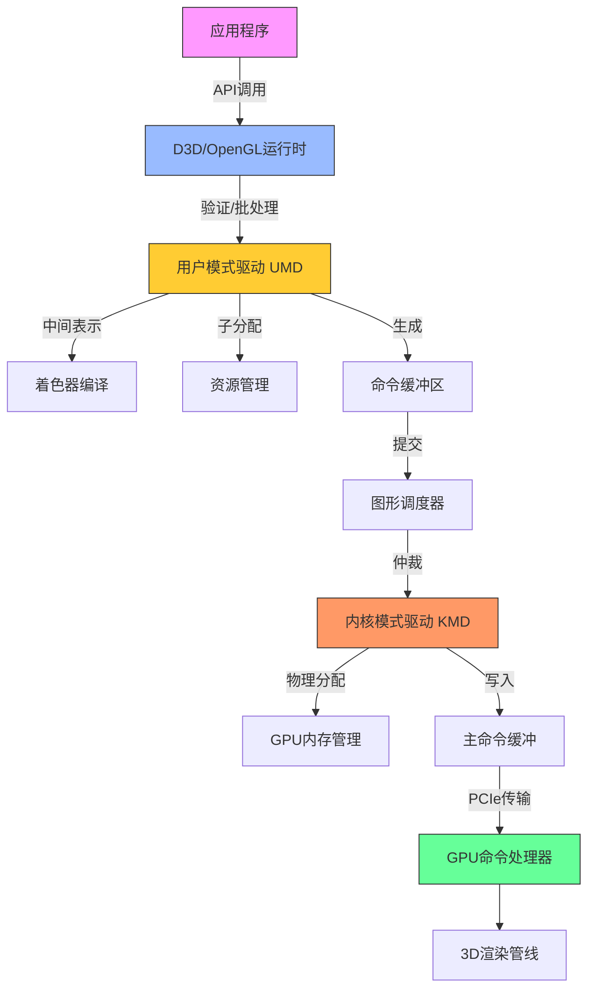
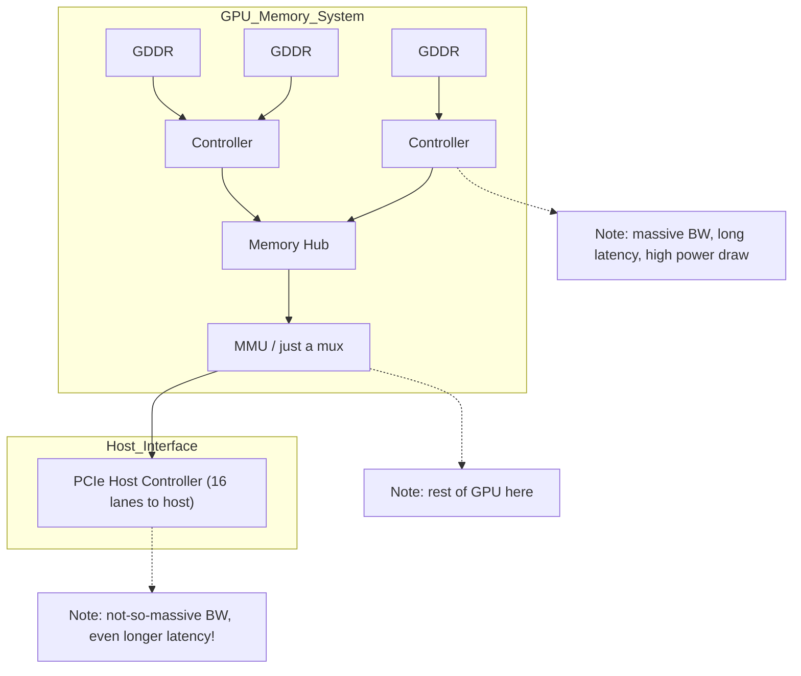

# Part 1: Introduction the Software stack

运行 D3D9/10/11 的 DX11 级 PC 硬件， 虽然除了开头部分外，API 细节不会太重要；一旦进入 GPU 内部，一切都是本地指令了



## 应用程序（The application）

这是你写的代码。也是你的 Bug，真的。是的，API 运行库和驱动也有 bug，但这次真不是它们的锅。快去修吧。

---

## API 运行时（The API runtime）

你通过它创建资源、设置状态、发出绘图调用。它记录你设定的状态、检查参数的合法性和一致性，管理用户可见的资源，也可能会验证着色器代码及其 shader 连接（至少 D3D 会处理，OpenGL 则在驱动层面中处理）。它还可能做一些批处理操作，然后将工作交给图形驱动，更具体说，是交给用户态驱动（UMD）。

---

## 用户态图形驱动（User-Mode Driver, UMD）

这是 CPU 端大多数“魔法”发生的地方。如果你的应用因为某个 API 调用崩溃，通常就是在这里发生的。它是一个用户态的 DLL 文件（比如 Nvidia 的 `nvd3dum.dll` 或 AMD 的 `atiumd*.dll`），运行在你的程序地址空间内，没有任何系统权限。

它实现了 D3D 调用的 DDI（Device Driver Interface），这个 API 比你看到的 D3D 更底层些，比如更明确地处理内存管理等。

这里是着色器编译的地方。D3D 会把预验证的着色器令牌流（已经过类型检查、资源数量限制检查等）传给 UMD。这个字节码是从 HLSL 编译而来，并在前期做了一些高级优化（死代码消除、循环展开等），这有助于驱动少做很多耗时优化。

不过，一些底层优化（如寄存器分配、循环展开）还是要由驱动完成，因为这取决于具体硬件资源和调度限制。所以驱动通常会把 D3D 字节码转成中间表示（IR）再进一步编译。

如果你的游戏很有名，Nvidia 或 AMD 的工程师可能会专门为其编写手动优化的替代着色器，并由 UMD 进行识别和替换。当然结果必须一致，否则就是丑闻。

有趣的是，一些 API 状态可能会被“编译进”着色器。例如一些少见功能（如纹理边界）可能不是 GPU 原生支持的，而是由着色器代码模拟的，这意味着驱动可能需要为不同的 API 状态组合生成多个版本的着色器。

你第一次使用某个资源或着色器时可能会卡顿 —— 因为驱动延迟了资源的创建与编译。为了确保资源真正被创建，图形程序员经常会发一个假的绘图调用“热身”资源。虽然丑陋但从1999年以来就是这样，习惯就好。

UMD 还要处理旧版 D3D 的内容，比如 Shader Model 1.x、2.0、3.0，甚至是固定功能管线（FFP），这些东西会被翻译成现代着色器来执行。

此外，它还涉及内存管理，比如纹理创建等。能做一些事情比如交换 texture 的通道，调度 system memory/video memory 之间的传输等。最重要的是，当 KMD 分配并移交给它后，写入 command buffers（或者叫 DMA buffers）。所有的状态切换以及渲染操作会被 UMD 转化为硬件能理解的 commands。还有一些你不会显式执行的操作，比如上传纹理和 shader 到显存。UMD 不能真正映射或管理显存 —— 那是 KMD 的职责 —— 但它可以将纹理做 swizzling（重排）或者安排系统内存与显存之间的数据传输。

更重要的是，它会构建命令缓冲区（Command Buffers 或 DMA Buffers），其中包含所有你设定的状态和绘图命令，还有资源上传指令等。

为了效率，驱动会尽可能将处理放在 UMD 中完成，因为 UMD 是普通 DLL，是用户态代码不需要使用昂贵的内核态切换开销，可以分配内存、多线程、调试等等。如果 UMD 崩溃，只会挂掉应用程序，不会拖垮整个系统。

### 再次解释 UMD 的工作

```text
[ 应用程序 ] 
      ↓ （调用 D3D API）
[ D3D Runtime（验证 $初级优化） ]
      ↓ （提交 ID3D11DeviceContext::XXX）
[ User‑Mode Driver（UMD） ]
   ├─ 二次验证
   ├─ 字节码 → IR → 硬件指令
   ├─ 状态融合与特化
   ├─ 命令缓冲区构建
   └─ 资源管理 / 数据搬运
      ↓ （提交命令缓冲给 KMD）
[ Kernel‑Mode Driver（KMD） ]
   ├─ GPU 内存分配与映射
   ├─ 中断与看门狗
   ├─ DRM / 显示初始化
   └─ 主命令环形缓冲写入
      ↓（DMA via PCIe）
[ GPU Command Processor ] → 后续各硬件流水线
```

-   **接收并验证 API 调用**
    -   当应用调用 `CreateTexture`、`VSSetShader`、`DrawIndexed` 等 D3D API 时，API 运行时（D3D runtime）首先做基本的参数检查和状态追踪，然后把这些调用转发给 UMD。
    -   UMD 会再次检查——尤其是在 Windows 下，D3D runtime 和 UMD 都会做一遍验证，以保证传入的数据完全合法（资源大小、绑定点数量、状态组合等）。
        
-   **高级着色器优化与中间表示转换**
    -   D3D runtime 会将 HLSL 编译成 D3D 字节码，并执行一次“高层”优化（死码消除、常量折叠、循环展开等）。
    -   UMD 接收这个已经过初步优化并验证过的字节码，进一步将其翻译为自己的中间表示（IR），并在此层做与硬件资源、调度策略密切相关的低层优化，例如寄存器分配、指令打包、特定流水线约束调整等。
        
-   **状态合并与特化**
    -   UMD 会把应用在 API 层面设置的各种渲染状态（混合模式、深度测试、采样器状态等）和着色器常量等“融合”到最终的硬件命令中。
    -   对于一些不常用或需要在着色器中模拟的功能（如纹理边界处理、固定功能流水线行为），UMD 会在编译时生成特化版本的着色器或插入额外指令，从而避免硬件中单独实现这些“冷门”特性。
        
-   **命令缓冲区（Command Buffer）构建**
    -   所有“状态更改＋绘制调用＋资源上传”等操作，UMD 最终都会翻译成 GPU 能执行的原语指令，然后打包到所谓的命令缓冲区（也称 DMA buffer）中。
    -   这些缓冲区本身只是普通的 GPU 可寻址内存块，UMD 在用户态完成填充后，将它们提交给内核态驱动。
        
-   **资源管理与数据搬运**
    -   虽然显存真正的分配和映射是由 KMD 执行（因为这是内核特权操作），UMD 可以在用户态挑选合适的内存页、将纹理做“swizzle”（按硬件最优布局重排）或者在后台多线程调度数据上传／下载。
    -   它还负责跟踪哪些资源是“热”的、哪些是“冷”的，以便在必要时向 KMD 提出迁移显存 ↔ 系统内存的请求。
        
-   **插件与游戏特化**
    -   UMD 通常会内置一份“已知热门游戏的着色器替换列表”，当检测到某款游戏的特定 HLSL 字节码时，UMD 会自动用手工高度优化的等效着色器替换它，从而提升性能或修复兼容性问题。
---

## 但等等，我们说的是“用户态驱动”？其实是“多个用户态驱动”

UMD 是 DLL，运行在调用它的每个进程中。但 GPU 是全局资源 —— 只有一个（即便你用 SLI/Crossfire），而系统中可能有多个应用同时访问它。这需要某个调度组件来分配 GPU 使用时间。

---

## 调度器（The Scheduler）

图形调度器会对多个进程之间的 GPU 使用进行时间分片，它会仲裁谁来访问 3D 管线，根据时间片等考虑。切换上下文会带来 GPU 状态的额外切换（会产生额外的 command buffer 指令），而且有可能带来显存资源的 swap in/out。一段时间内只有一个进程会提交 3D 指令。 一次上下文切换意味着要切换 GPU 状态，有时还需要换显存资源 —— 代价不小。而同一时刻只能有一个进程提交命令到 GPU。

控制台游戏程序员常抱怨 PC 的图形 API 抽象太高，影响性能。但其实 PC 驱动的任务更复杂 —— 它必须时刻维护完整状态，因为你可能随时被中断。而且为了避免程序崩溃或性能问题，驱动往往会在用户不知情的情况下悄悄修复错误或优化 —— 不讨好但没办法，商业需求优先。

---

## 内核态驱动（Kernel-Mode Driver, KMD）

KMD 是唯一的、系统级别的图形驱动。多个 UMD 可以同时存在，但只有一个 KMD。如果 KMD 崩溃，整个图形系统都会重启（现在不会蓝屏了，会重载驱动）。

KMD 负责 GPU 初始化、设置显示模式、处理鼠标光标（是的，硬件只支持一个）、设定看门狗定时器、处理中断、管理物理内存映射、处理内容保护路径（DRM）等等。

最关键的是：KMD 管理实际被 GPU 执行的命令缓冲。UMD 构造的命令缓冲只是 GPU 可访问的内存区域，而 KMD 会把它们打包进主命令缓冲（一般是一个小环形缓冲），并通过寄存器将读写指针告诉 GPU。

---

## 总线（The Bus）

这些数据传输并不是直接通往显卡，而是经过总线 —— 通常是 PCI Express。DMA 传输也一样。虽然很快，但也是一个流程阶段。

---

## 命令处理器（The Command Processor）

这是 GPU 的前端 —— 负责读取命令缓冲并执行它们的部分。本文篇幅已长，后续将在下一篇继续介绍从这里开始的内容。

---

## OpenGL 小插曲

OpenGL 与上文类似，但 API 与 UMD 之间界限不明显。而且 GLSL 编译完全由驱动处理，每个硬件厂商都有自己实现的前端 —— 结果就是有一堆略微不同、互相不兼容的 GLSL 方言，还有各种 bug。

相比之下，D3D 的字节码方案更清晰：只有一个编译器，避免了语法差异，且允许在编译阶段进行更复杂的优化。

---

## 遗漏与简化说明

本文只是概览，省略了大量细节。例如调度器有多个实现、CPU 和 GPU 的同步机制没有讲、可能还有我忘记的内容。欢迎指出错误，我会修正！希望下次继续为你带来更多 GPU 内部的内容！


# Part2: GPU memory architecture and the Command Processor.

在上一部分，我解释了你在 PC 上发出的 3D 渲染指令在真正送达 GPU 之前所经历的各个阶段；简而言之：这过程比你想得要复杂。我最后提到了**命令处理器（Command Processor）**，以及它如何最终处理我们辛苦准备好的命令缓冲区。嗯……我要说实话了，我之前其实“骗”了你一点点。这一次我们确实会首次“见到”命令处理器，但你要记住，所有这些命令缓冲其实都还是**通过内存传递**的——要么是通过 PCI Express 访问的系统内存，要么是本地显存。我们正在按顺序讲解整个渲染管线，所以，在真正谈论命令处理器之前，我们得先来谈谈内存子系统。

---

## GPU 内存子系统

GPU 的内存子系统和一般的 CPU 或其他硬件用的内存架构不同，因为 GPU 的设计目标完全不同，使用方式也不一样。有两个关键区别：

---

### 第一：GPU 的内存子系统非常快。真的很快。

比如，一颗 Core i7 2600K 的内存带宽可能最多能达到 19GB/s——那是在理想状态下，比如顺风、下坡、天气晴朗的情况下。而一块 GeForce GTX 480，内存带宽接近 **180GB/s** ——相差快一个数量级！有没有很震撼？

---

### 第二：GPU 的内存子系统非常慢。真的很慢。

比如 Nehalem 架构的第一代 Core i7，在缓存未命中时访问主内存，大约需要 **140 个时钟周期**（你可以拿 AnandTech 给出的延迟乘以频率来算）。而 GTX 480 的内存访问延迟是 **400–800 个时钟周期**。更糟的是，这颗 Core i7 的频率是 **2.93GHz**，而 GTX 480 的 Shader Clock 是 **1.4GHz**，再来一个 2 倍的差距。哎呀，又是一个数量级的落差！

---

## 这意味着什么？

这正是你经常听说的那个经典权衡之一：

> **GPU 获得了超高的带宽，但为此付出了高延迟的代价**（还有较高的功耗，不过我们暂且不谈）。

GPU 的整体设计哲学就是：**“吞吐量优先，延迟靠边站”**。不要傻傻地等结果，没结果的时候就干别的去！

---

## 一点 DRAM 冷知识（对于后面很重要）

GPU 使用的显存（GDDR）是基于 DRAM 技术的。而 DRAM 的内部结构是个二维网格，有水平的“行线”和垂直的“列线”。每个交点都有一个电容和一个晶体管。

> 内部地址会被分为“行地址”和“列地址”，一次 DRAM 访问实际上是**整行**数据被读取或写入。

这意味着，如果你要访问一个 DRAM 的完整行，速度是很快的。但如果你访问的地址跨越了多个行，那延迟就会拉爆。所以如果你想充分发挥前面提到的惊人带宽，你得**按 DRAM 行来批量读取**数据，而不是到处零散读几字节。

---

## PCIe 主机接口

对图形程序员来说，这玩意儿可能没什么好说的；对 GPU 硬件架构师也一样。但当它成了性能瓶颈时，你就不得不重视它了。

它的主要作用是：

-   CPU 可通过它访问视频内存和 GPU 寄存器；
    
-   GPU 可访问系统内存的部分区域；
    
-   然后大家一起头疼，因为延迟非常大，信号必须从芯片走出、穿过主板、到达 CPU，然后感觉像是经历了一个世纪。
    

> **带宽倒还可以**——PCIe 2.0 x16 理论带宽为 8GB/s，约等于 CPU 内存带宽的一半到三分之一，是可以接受的。

而且和 AGP 不同的是，**PCIe 是双向对等链接**——AGP 只有从 CPU 到 GPU 是快通道，反向很慢；而 PCIe 是双向都有带宽。

---

### 🔧 AGP 的基本概念

AGP，全称 **Accelerated Graphics Port（加速图形端口）**，是英特尔于 1997 年推出的一种专门为图形加速卡（显卡）设计的高速通道接口标准，目的是提供比传统 PCI 更高效的图形数据传输能力。

-   **用途：** 专门为显卡与主板之间的数据传输设计，主要服务于 3D 图形渲染。
    
-   **接口位置：** AGP 插槽通常位于主板上，紧邻 PCI 插槽，但结构略有不同。
    
-   **数据通道：** 单向通道，**从 CPU 到 GPU 是高速的**，**但反方向（GPU → CPU）不快**，这和后来的 PCIe 不同。

---

## 最后再谈点内存细节

我们真的快要看到 3D 渲染命令了，几乎触手可及。但还有最后一个问题：

我们现在有两类内存：**本地显存** 和 **映射的系统内存**。一条通往北方的道路，另一条是南下几千里的长路。我们该走哪一条？

最简单的解决方法是：**加一根地址线**，指明该去哪里。这种方法很简单，也很常见。

但如果你在**统一内存架构**下，比如某些游戏主机（注意：不是 PC），那就只有一块内存，不用选路，去哪都一样。

如果你想更高级点，可以加个 **MMU（内存管理单元）**。这样就可以虚拟化 GPU 的内存地址空间，实现很多技巧：

-   热门数据放在显存；
    
-   冷数据放系统内存；
    
-   甚至未加载的资源可以动态从硬盘读取（大概需要 50 年 😂，因为硬盘真的慢，不是夸张）。
    

MMU 还能在你显存快满时，动态整理内存空间而不真的移动数据。

> MMU 也很有利于多进程共享 GPU。

至于是否必须有 MMU，我也不确定；反正它确实很有用。如果有人能帮我补充这部分，我愿意更新这篇文章。但说实话，现在我懒得查……

---

## DMA 引擎

还有一个叫 DMA（直接内存访问）的模块，能在系统内存与视频内存之间搬数据，而不占用 GPU 核心或 CPU 资源。

通常它可以完成：

-   **系统内存 ↔ 显存** 的复制；
    
-   **显存 ↔ 显存** 的复制（比如进行显存碎片整理）；
    
-   但 **不能做系统内存 ↔ 系统内存** 的搬运——因为你这是 GPU，不是内存拷贝专用设备！你要复制系统内存，**去找 CPU 处理**，不然还得绕 PCIe 一圈呢！
    

---

### DMA（Direct Memory Access，直接内存访问）的作用

1.  **绕过 CPU 直接传输**
    
    -   在没有 DMA 之前，CPU 要在系统内存和外设（如显卡、硬盘、网卡等）之间搬数据，必须不停地读写寄存器，然后把数据从一个缓冲区搬到另一个缓冲区，这样 CPU 要花大量周期来“搬运”数据。
        
    -   有了 DMA，外设可以在不经过 CPU 算术/逻辑单元的情况下，直接将数据从一块内存拷贝到另一块内存。CPU 只需设置一次 DMA 传输的源地址、目的地址、长度等参数，然后去做别的事，DMA 控制器会自动完成后续拷贝，拷完了还会生成一个中断通知 CPU。
        
2.  **减轻 CPU 负担**
    
    -   把大批量数据传输的工作交给 DMA 控制器做，CPU 可以把精力放在更“聪明”的计算任务上，比如图形算法、物理仿真、AI 推理等等。
        
    -   对于 GPU 内部来说，自己的 DMA 引擎可以在后台把系统内存 ↔ 显存的数据搬运搞定，3D 渲染单元（Shader 核心）就不用管这些“搬砖”任务了。
        
3.  **提高总体带宽和效率**
    
    -   DMA 通常有专门的、优化过的总线通路和多通道设计，能让内存拷贝速度更快，而且不会占用 CPU 的缓存或总线带宽，整体系统更加流畅。
        

---

### “系统内存”（System Memory）指哪里

-   “系统内存”就是**主机（PC）上插在主板上的那一组 DRAM 条（DIMM）**，也常称为 **主存** 或 **主内存**，由 CPU 通过内存控制器直接访问。
    
-   API/驱动概念中，系统内存指的就是这块内存区域，与 GPU 的**专用显存（Video Memory / VRAM）**相对。
    
    -   **系统内存**（System Memory）
        
        -   由操作系统管理，用于存放程序代码、全局数据、堆栈、缓存等。
            
        -   CPU 访问延迟低（几十纳秒），带宽一般几十 GB/s。
            
    -   **显存**（Video Memory / VRAM）
        
        -   专门给 GPU 用的高速内存，通常 GDDR或HBM，带宽非常高（上百 GB/s），但往往延迟也更高。
            
        -   只能通过 GPU 或者 PCIe DMA 引擎来读写。
            

在 GPU 渲染流程中，**DMA 引擎** 就是负责在这两者之间搬运数据的“搬运工”。它能从系统内存中把贴图、顶点数据等拉到显存，也能把渲染结果输出到系统内存，供 CPU 或其他外设继续处理。


---

## 总结

---


现在我们有：

-   CPU 端准备好的命令缓冲；
    
-   PCIe 接口，让 CPU 能把它地址写入寄存器；
    
-   KMD 能通过 DMA 把命令从系统内存搬到显存；
    
-   然后 GPU 的内存子系统能读出这些命令；
    

所有路径都准备好了——我们终于，终于可以来看真正的 GPU 渲染命令了！


## 指令处理器，终于登场！

我们的讨论从一个熟悉的词开始：

> **“缓冲……”（Buffering…）**

### 缓冲的必要性

在 GPU 中，数据通路虽然带宽高，但延迟也高。为了避免在处理命令时卡顿，GPU 会使用较大的 **命令缓冲区（Command Buffer）**，并尽量 **预取（prefetch）** 足够远的命令内容，避免处理器“饿死”。

### 部分指令

从这个缓冲 buffer 开始，我们就将进入实际的命令处理前端。**这个指令处理前端基本上是一个状态机，知道如何解析指令（硬件特定格式的指令）。**
有些指令处理的是 2D 渲染操作--除非有一个单独的指令处理器来处理 2D 的东西，而 3D 前端根本看不到它。
不管是哪种方式，现代 GPU 上仍然隐藏着专门的 2D 硬件，就像在片上的某个地方有一个 VGA 芯片，仍然支持文本模式、4-bit/pixel 位平面模式、平滑滚动和所有这些东西。
没有显微镜的话，很难在片上找到这些部分。总之，那些模块是存在的，但从此以后我就不再提了。
还有一些指令，实际上是把一些图元交给 3D/着色器管道，我将在接下来的文章中介绍它们。还有一些跳转到 3D/shader pipe 的指令，实际上并不渲染任何东西，出于各种原因（以及由于各种流水线配置）；这些将在以后的章节中讨论。

> **位平面模式**
> 是一种图形显示模式。在计算机图形学中，位平面是用于表示图像像素的二进制位的集合。每个位平面包含图像的一个二进制位，多个位平面组合在一起可以表示不同颜色深度的图像。例如，一个8位的图像就有8个位平面，每个位平面表示图像的一个二进制位。这种模式主要用于描述图形硬件如何处理和显示图像数据。

指令会从缓冲区进入命令处理器的前端，这是一个解析硬件格式命令的 **状态机（state machine）**。命令类型包括不限于：

-   2D 渲染操作（可能由独立的 2D 命令处理器处理）
-   提交几何图元到 3D / shader 管线
-   不绘制但会影响渲染管线的状态设置命令
    

### 状态变更指令

然后就是那些**改变状态**的指令。作为程序员，你可能觉得这就像“改个变量”那么简单——实际上基本上确实是这样。但问题在于，GPU 是一个**高度并行的计算机系统**，你不能在这种并行系统中随便改变一个**全局变量**，然后指望一切都能顺利运行——如果你不能通过某种**约束条件（invariant）** 来确保一切都正确运行，那系统中就一定存在 bug，而且迟早会暴露出来。

#### 1. 管线刷新（Flush）

每次改变某个状态时，都必须先让所有可能引用该状态的未完成工作执行完毕（即执行**部分管线刷新**）。过去，显卡芯片就是通过这种方式来处理大多数状态变更的——如果批次少、三角形数量少、管线也短，这种做法既简单又不太昂贵。但随着批次和三角形数量的激增，管线也越来越长，这种方法的成本便骤增。
不过，对于那些**很少变更**的状态（在一帧中只需十几次部分刷新并不会带来太大开销），或者**用更复杂方案实现难度过高**的场景，这种方式依然有效。

#### 2. 无状态设计

某些模块可以设计为 **完全无状态**，只要将状态变化传递到需要它的阶段，每个周期都将当前状态附加在数据上，向下游传递。但若状态数据太大（如纹理采样配置），此方法就不现实了。

#### 3. 双缓冲（State Slot 双槽）

用足够的寄存器（slots）来存储每个状态的两个版本，部分当前任务用 Slot 0 时，可以在不停止任何工作的情况下修改 Slot 1。切换状态只需一个比特位来选择使用哪个槽，而不需要将整个状态在流水线上传递。当然，如果 Slot1 和 Slot 0 都被占用，你还是需要等待，但是你可以领先一步。多槽位的做法同理可推。

#### 4. 类似寄存器重命名机制（Register Renaming）

对于诸如采样器或纹理 Shader Resource View 的状态，理论上可能一次性要设置大量数据，但实际应用中往往不会如此。你不会仅仅因为要跟踪两个“使用中”的状态集合，就为 2×128 个活动纹理预留状态空间。
对于此类场景，可以使用类似**寄存器重命名**的方案——维护一个 128 个物理纹理描述符的“池子”。只有在某个着色器真的需要 128 纹理时，状态变更才会变慢（那就认栽吧）；而在更常见的状况下，应用使用少于 20 个纹理，你就有充足空间同时保留多个状态版本。

这并不是要给出一份详尽的清单——但关键点在于，看似简单地在你的应用程序中改变一个变量（甚至是在 UMD/KMD 或命令缓冲区里改变一个状态！）实际上可能需要相当复杂的硬件支持，以避免性能大幅下降。

---

### 同步（Synchronization）指令

#### CPU ↔ GPU、GPU ↔ GPU 同步

通常，所有这些操作都遵循 **“如果事件 X 发生，就执行 Y”** 的模式。先说说 “执行 Y” 部分——这里的 Y 有两种合理的实现方式：

-   **推送模型（Push）**  
    GPU 主动向 CPU 发出通知，让 CPU 立即采取行动。比如：
    
    > “喂！CPU！我现在进入显示器 0 的垂直消隐区，如果你想无割裂地交换缓冲区，现在就是时候了！”
    
-   **拉取模型（Pull）**  
    GPU 只是在内部记录事件已发生，CPU 日后再去询问。比如：
    
    > “喂，GPU，上次开始处理的是哪个命令缓冲区？”  
    > “让我查查……是序号 303。”
    
推送模型通常用中断来实现，但由于中断开销较大，只会用于不频繁且优先级很高的事件。至于拉取模型，你只需要预留一些 CPU 可见的 GPU 寄存器，并在命令缓冲区里插入指令：在特定事件发生时，把某个值写到这些寄存器里。

举例来说，假设你有 16 个这样的状态寄存器。你可以把当前命令缓冲区的序号（`currentCommandBufferSeqId`）映射到寄存器 0。每次提交一个新的命令缓冲区，都在内核驱动（KMD）里给它分配一个递增的序号；然后在命令缓冲区开头，插入一条“当执行到这里时，把序号写入寄存器 0” 的指令。这样一来，CPU 就能随时读取寄存器 0，知道 GPU 正在处理哪个命令缓冲区。

因为命令处理器会严格按序号顺序执行命令，所以如果我们看到寄存器 0 已经写入了 303，就能确定命令缓冲区 303 的第一条命令已经执行完成。由此可推断，序号 302 及之前的所有命令缓冲区都已经执行完毕，可以由内核驱动回收、重用、修改，或者…做一些别的好玩的事情。

我们现在也有了 X 可能是什么的例子：

> “如果执行到这里”  （我理解为分支判断指令这类）

这或许是最简单的例子，却已经非常有用了。其他例子还包括：

-   “如果所有着色器已完成命令缓冲区中此点之前所有批次的所有纹理读取”
    -   （这标志着可以安全回收纹理或渲染目标的内存）
        
-   “如果对所有活动的渲染目标/UAV（读写纹理）都已完成渲染”
    -   （这标志着可以将它们当作纹理安全地再次使用）
        
-   “如果到此为止的所有操作都已完全完成”

 诸如此类

> **UAV**
>在 Direct3D 11 及以后的版本中，**UAV** 是 **Unordered Access View**（无序访问视图）的缩写。
  -  **含义**：它是一种资源视图，允许着色器（尤其是计算着色器或像素着色器）对缓冲区或纹理进行**无序**的读写访问。

顺便说一句，这类操作通常被称为 **“栅栏”（fence）**。至于写入状态寄存器的值该怎么选，有多种方法可行，但在我看来，最合理的做法是**使用一个递增的计数器**（当然你可能会把其中若干位挪来存放其他信息）。好吧，这条看似随口抛出的建议并没有什么深层理由，只是我觉得你该知道而已。也许在以后的博客里我会详细讲讲（不过不会是本系列的内容）😊
    

### GPU 内部等待指令

我们已经完成了一半——可以把 GPU 的状态反馈给 CPU，从而让驱动程序能够进行合理的内存管理（例如，知道什么时候可以安全地回收顶点缓冲区、命令缓冲区、纹理等资源的内存）。但这还不是全部——还缺少一个关键环节：如果我们需要在纯 GPU 侧进行同步，该怎么办？回到渲染目标的例子，在渲染完成之前（以及某些后续步骤完成之前），我们不能把它当作纹理来使用。解决方案是引入一种“等待”指令：

> “等待，直到寄存器 M 的值变为 N”。

该指令可以是“等于”比较，也可以是“小于”比较（要注意处理值回绕的问题），或者更复杂的条件——这里为简单起见，只讨论等于比较。这条指令允许我们在提交绘制批次前，先对渲染目标进行同步。它也能让我们构建一个完整的 GPU 刷新操作：

1.  “如果所有挂起的任务都完成，则将寄存器 0 的值递增并写入 seqId” ++seqId
    
2.  “等待，直到寄存器 0 的值等于 seqId”
    
如此一来，GPU↔GPU 的同步问题就解决了。在引入具有更细粒度同步功能的 DX11 计算着色器之前，这通常是 GPU 侧唯一的同步机制。对于常规渲染管线而言，也完全足够。


### CPU 控制 GPU 等待

甚至可以反过来：GPU 先执行一个等待指令，等待 CPU 设置某个寄存器值再继续。这可用于实现 **多线程渲染（如 D3D11 风格）**，提前提交命令缓冲，GPU 等待数据准备好。

甚至不需要 CPU 可写寄存器，只要能修改已提交的命令缓冲，插入条件跳转指令就能实现相似机制。

顺便一提，如果你能从 CPU 端也能写这些寄存器，你还可以反向利用它——提交一个包含“等待特定寄存器值”的部分命令缓冲区，然后由 CPU 而不是 GPU 去修改那个寄存器的值。

这种机制可以用来实现 D3D11 风格的**多线程渲染**：你可以提交一个批次（to GPU？），该批次所引用的顶点/索引缓冲区可能仍在 CPU 端被另一个线程锁定并写入。你只需在真正的渲染调用前插入一个等待指令，当顶点/索引缓冲区解锁后，CPU 再去修改那个寄存器的值。


如果 GPU 没执行到那条等待指令，等待就是空操作；如果执行到了，就会在执行处理器里不断轮询，直到数据就绪。挺巧妙的，对吧？实际上，即便没有 CPU 可写的状态寄存器，只要在提交指令缓冲后还能修改它，并且插入“跳转”指令，也能实现类似机制。细节就留给感兴趣的读者自行探索吧 😀

---

#### 解释流程
具体流程可以这样理解：

1.  **CPU 准备数据**
    
    -   线程 A 在 CPU 上锁定一段缓冲区，并往里写新的顶点或索引数据。
        
    -   写完之前，这段缓冲区对 GPU 来说“还不可读”。
        
2.  **提交“部分”命令缓冲区到 GPU**
    
    -   在 CPU 把完整的绘制命令发给 GPU 之前，会先生成一个**命令缓冲区**（Command Buffer），把前面那些不依赖这段缓冲区的渲染或状态切换命令都写进去。
        
    -   在最后你要真正用到该顶点/索引数据之前，命令缓冲里插入一条“Wait until Register X == 1”的指令。
        
3.  **GPU 异步接收并预取命令**
    
    -   GPU 在后台不断**预取**命令缓冲，但当预取到那条“Wait”指令时，它会停下来，不往下执行也不去读那块缓冲区的数据。
        
    -   此时 GPU 的其它任务（如果有）仍可继续执行。
        
4.  **CPU 解锁并通知 GPU**
    
    -   线程 A 完成对缓冲区的数据写入后，释放锁，并通过写寄存器（Register X）或触发一个信号，将它的值设为 1。
        
    -   这个写操作可以是一次简单的 MMIO 写寄存器，或者是通过另一条命令缓冲“写寄存器”指令。
        
5.  **GPU 恢复执行**
    
    -   GPU 在命令处理器中检测到 Register X == 1，就跳过“Wait”，开始执行接下来的绘制调用，安全地从刚才那段缓冲区读取顶点/索引数据。
        

---

### 为什么这么做？

-   **重叠 CPU 与 GPU 工作**：CPU 在准备数据（写缓冲区）的同时，GPU 可以先做其他工作，甚至先把后续不依赖该数据的命令“吃”进来。
    
-   **避免同步阻塞**：在传统做法里，CPU 写完数据后必须完整发一整批绘制命令，然后 GPU 才开始执行；现在则是先提交一部分，让 GPU 等待真正的数据准备好，减少了 CPU/GPU 端点对点的等待时间。
    
-   **支持多线程渲染**：在 D3D11 中，应用可以在多个线程里分别生成命令列表（Command List），然后再在主线程里将它们串联提交。用“Wait”机制，就能安全地跨线程引用同一缓冲区，而不会因为缓冲区还未写完就被 GPU 读取而出错。
    

这样就实现了**CPU 端写数据、GPU 端并行预取命令、再同步到数据就绪**的完整流水，让两者的资源利用率更高。

---

## 可视化结构（简图说明）

当然，你并不一定非要使用“写寄存器/等寄存器”这种模型；对于 GPU ↔ GPU 侧的同步，你也可以直接提供一个“渲染目标屏障（rendertarget barrier）”指令来保证渲染目标可安全使用，或者使用一个“一键刷新”命令来完成所有挂起操作。但我更喜欢写寄存器的方式，因为它能“一石二鸟”：既能把资源使用情况反馈给 CPU，又能让 GPU 自行完成同步。

**更新**：我已经为你画了一张示意图。图有点复杂，以后我会简化细节。基本思路如下：


1.  **FIFO 缓冲区**：命令最先进入一个硬件 FIFO
    
2.  **命令解码逻辑**：从 FIFO 中读出命令并解析
    
3.  **执行单元**：解析后分发到不同模块
    
    -   2D 单元（2D 渲染）
        
    -   3D 前端（常规 3D 渲染）
        
    -   着色器单元（Compute Shader 等）
        
4.  **同步/等待模块**：处理那些 “写寄存器” 或 “等待寄存器” 的命令，这里有之前提到的公开可见寄存器
    
5.  **跳转/调用单元**：处理命令缓冲中的跳转或调用指令，动态改变从 FIFO 拉取命令的地址
    
6.  **完成事件**：所有被调度执行的单元在任务完成后，都会向命令处理器反馈“完成事件”，以便驱动回收不再使用的资源（比如纹理内存）
    

这样就构成了一个完整的命令处理器内部流程。
    

---

## 小结

下一步，我们终于要进入真正的渲染工作了。到这里，我的 GPU 系列文章才讲到第三部分——我们实际上要开始看一些顶点数据了！（还不涉及三角形光栅化，那要稍后才讲。）

实际上，到这个阶段，管线已经出现分支了：如果我们运行的是计算着色器，那么下一步就会直接进入……计算着色器执行。但我们现在还没谈计算着色器，那是后面才会讲的内容！先把常规渲染管线说完。

小小免责声明：我这里主要给你勾勒出大体框架，必要或有趣的地方会深入讲解，但为了方便理解也省略了不少细节。我相信自己没有漏掉真正关键的内容，但难免有疏漏或不当之处。如果你发现任何错误，请告诉我！

# Part3：3D pipeline overview, vertex processing.
本篇文章是“2011 年图形管线之旅”系列的一部分。到目前为止，我们已经将绘制调用从应用程序一路送过各种驱动层和命令处理器；现在，终于要对这些调用做一些真正的图形处理了！在本篇中，我将重点介绍**顶点管线**

## 字母缩写

我们现在正式进入 3D 渲染管线，它由多个阶段组成，每个阶段负责一个特定的任务。我会给出所有阶段的名称——主要沿用 D3D10/11 的“官方”命名以保持一致——并列出对应的缩写。我们在这次系列中最终会看到它们，但要等好几篇文章才会讲到大部分内容——我还专门列了个大纲，要覆盖的内容足够我忙上至少两周！话不多说，下面列出各阶段的名称及一句话概述它们的作用：

-   **IA — 输入装配器（Input Assembler）**  
    读取顶点和索引数据，将它们按绘制调用组装成原语的顶点列表。
    
-   **VS — 顶点着色器（Vertex Shader）**  
    接收 IA 输出的顶点输入，对每个顶点执行用户定义的变换与计算，并输出给下一级。
    
-   **PA — 原语装配（Primitive Assembly）**  
    将经过 VS 处理的顶点按索引组合成基本图元（点、线、三角形）并传递下去。
    
-   **HS — Hull 着色器（Hull Shader）**  
    接受补丁（patch）原语，输出用于域着色器（DS）的控制点及驱动细分所需的额外数据。
    
-   **TS — 细分器阶段（Tessellator Stage）**  
    根据 HS 提供的细分因子，生成新的顶点位置和图元连通性，实现曲面细分。
    
-   **DS — 域着色器（Domain Shader）**  
    输入 HS 的控制点输出、TS 细分后的位置和额外数据，对细分后的顶点执行计算，输出新的顶点。
    
-   **GS — 几何着色器（Geometry Shader）**  
    接收完整图元（可附带邻接信息），可生成新的图元或修改原图元，也常作为…
    
-   **SO — 流式输出（Stream-Out）**  
    将 GS 或 VS/DS 的输出原语写回内存缓冲区，用于后续处理或复用。
    
-   **RS — 光栅化器（Rasterizer）**  
    将图元转换成片元（fragments），**执行裁剪、投影和插值运算**，准备送入像素着色器。
    
-   **PS — 像素着色器（Pixel Shader）**  
    接收插值后的片元数据，计算并输出最终像素颜色；也可向无序访问视图（UAV）写入数据。
    
-   **OM — 输出合并器（Output Merger）**  
    接收 PS 输出的像素，**执行混合、深度/模板测试等操作**，并写回后备缓冲区。
    
-   **CS — 计算着色器（Compute Shader）**  
    独立于上述渲染管线运行，仅以常量缓冲区和线程 ID 为输入，可对缓冲区和 UAV 进行任意读写。

现在，先把这些内容放一边，下面是我将要讨论的各种数据路径列表（我会省略掉 IA、PA、RS 和 OM 阶段，因为在我们讨论的目的中，它们实际上并没有对数据执行任何操作，只是重新排列或重新排序数据——也就是说，它们本质上是粘合剂）：

-   **VS→PS**：古老的可编程管线。在 D3D9 中，这就是你所拥有的一切。到目前为止，这仍然是常规渲染中最重要的路径。我会从头到尾讲解这个路径，然后再回过头来讲解其他更复杂的路径。
    
-   **VS→GS→PS**：几何着色（D3D10 新增）。
    
-   **VS→HS→TS→DS→PS，VS→HS→TS→DS→GS→PS**：细分（D3D11 新增）。
    
-   **VS→SO，VS→GS→SO，VS→HS→TS→DS→GS→SO**：流输出（带细分和不带细分）。
    
-   **CS**：计算着色器。D3D11 新增。
    
现在你已经知道接下来要讲的内容，让我们开始讲解顶点着色器吧！

## 输入组装阶段IA（Input Assembler Stage）

在这里，首先发生的事情是从**索引缓冲区加载索引**——如果这是一个带索引的批次。如果不是带索引的批次，就假装它使用了一个恒等索引缓冲区 identity index buffer（即索引序列为 0、1、2、3、4……），并使用这个作为索引。如果存在索引缓冲区，其内容会在这一阶段从内存中读取——不过，读取并不是直接进行的，输入组装阶段 IA 通常有一个**数据缓存**，以便利用索引/顶点缓冲区访问的局部性（空间局部性？）。
此外，需要注意的是，索引缓冲区的读取（实际上，在 Direct3D 10 及更高版本中所有资源访问）都会进行**边界检查**。如果你引用了超出原始索引缓冲区范围的元素（例如，从一个只有 5 个索引的缓冲区中发出一个索引计数为 6 的 `DrawIndexed` 调用），所有越界的读取都会返回零。在这种特定情况下，这个结果完全没用，但却是明确定义好的。同样地，如果你发出一个设置了空索引缓冲区的 `DrawIndexed` 调用，其行为就好像你设置了一个大小为零的索引缓冲区一样，即所有读取都是越界的，因此返回零。在 Direct3D 10 及更高版本中，你必须更加努力才能进入未定义行为的领域。 ：）

一旦我们有了索引，我们就有了读取每个顶点数据和每个实例数据所需的一切（当前实例 ID 在这一阶段只是一个简单的计数器，相对而言比较容易处理）。这相当直接——我们有一个数据布局的声明，只需从缓存/内存中读取数据，并将其解包成着色器核心所需的浮点格式作为输入即可。然而，这个读取操作并不是立即执行的。硬件在运行一个已着色顶点的缓存，这样如果**一个顶点被多个三角形引用**（在一个完全规则的封闭三角形网格中，每个顶点大约会被 6 个三角形引用！），就不需要每次都对其进行着色——我们只需引用已经存在的着色数据即可！

## 顶点缓存与着色

**注意**：本节内容部分基于推测。这些推测基于一些“知情人士”对当前 GPU 的公开评论，这只能让我了解“是什么”，而不是“为什么”，因此这里有一些推断。另外，我在这里简单地猜测了一些细节。话虽如此，但我并不是在胡猜——我有信心我所描述的内容是合理的，并且在一般意义上是可行的，我只是不能保证这在实际硬件中确实是这样的，或者我没有遗漏一些复杂的细节。 ：）

### 早期的做法：简单 FIFO 缓存 + 专用顶点着色器单元
长期以来（直到包括着色器模型 3.0 时代的 GPU），顶点着色器和像素着色器是用具有不同性能权衡的不同单元实现的，顶点缓存也相对简单：通常只是一个用于少量顶点（想想一两个打头的）的 FIFO（先进先出队列），并且有足够的空间用于最坏情况下的输出属性数量，使用顶点索引作为标签。正如所说的那样，相当简单直白的东西。

### 转向统一着色器架构后的问题
然后统一着色器出现了。如果你统一了两种曾经不同的着色器类型，设计必然会在某种程度上有所妥协。
所以一方面，你有顶点着色器，它们在正常情况下每帧可能处理多达 100 万个顶点。
另一方面，你有像素着色器，在 1920×1200 的分辨率下，仅仅填满整个屏幕一次就需要每帧处理至少 230 万个像素——如果你想渲染一些有趣的内容，这个数字会更大。
所以猜猜看，哪个单元最终会处于不利地位？

好吧，情况是这样的：与旧的每次着色一个顶点（或多或少）的顶点着色单元不同，你现在有一个巨大的统一着色器单元，它为最大吞吐量而设计，而不是为延迟，因此它希望处理大量工作批次（有多大？目前，这个神奇的数字似乎在每次批量着色 16 到 64 个顶点之间）。

#### 统一着色器
后来，GPU 逐步转向**统一着色器（Unified Shader）架构**：所有类型的着色器（VS、PS、CS 等）共用相同的计算单元。
这带来一个问题：
-   顶点着色通常每帧处理几十万~百万个顶点
-   而像素着色在 1920×1200 这种分辨率下，每帧至少需要处理 230 万像素，而且这只是“全屏填充”！
所以统一后的着色器单元必须优化吞吐量（throughput），不是延迟（latency）——**它们倾向于批量执行（Batch）**。如今一次处理 **16 到 64 个顶点**是较常见的做法。

#### 传统顶点着色器与像素着色器的性能权衡

##### 顶点着色器

-   **处理对象与规模**：  
    主要处理顶点数据，单个场景中顶点数量通常较少（如几万到几十万级别），例如一个三角形网格模型的顶点数远低于其像素数。
-   **性能特点**：
    -   **低吞吐量，高灵活性**：每次处理单个顶点，适合执行逐顶点的变换（如坐标转换、骨骼蒙皮）等逻辑复杂但数据量小的任务。
    -   **顶点缓存简单**：早期采用 FIFO 缓存（容量通常为几十顶点），通过顶点索引快速查找已处理顶点，减少重复计算。

##### 像素着色器

-   **处理对象与规模**：  
    处理像素数据，在高分辨率下（如 1920×1200），单帧需处理数百万像素，数据量远超顶点。
-   **性能特点**：
    -   **高吞吐量，低延迟敏感性**：需并行处理大量像素，硬件设计侧重批量操作（如 SIMD 指令），对延迟不敏感但追求吞吐量最大化。
    -   **无传统缓存机制**：像素处理依赖流水线式并行，而非缓存复用（因像素间相关性低）。

#### 统一着色器的设计妥协与性能逻辑

##### 整合背景与核心目标

统一着色器将顶点着色器和像素着色器合并为单一计算单元，核心目标是**通过硬件资源复用提升整体效率**，避免传统架构中两类单元负载不均衡的问题（如顶点单元空闲而像素单元过载）。

##### 性能权衡与设计取舍

-   **牺牲单顶点处理效率，换取批量吞吐量**：  
    传统顶点着色器一次处理 1 个顶点，而统一着色器以**批量方式**处理顶点（如 16-64 个顶点 / 批次），通过 “延迟处理” 提升硬件利用率，但引入了批次调度开销。
-   **顶点缓存机制重构**：
    -   传统 FIFO 缓存无法适配批量处理（因批次间顶点缓存可能失效），改为基于**批次独立缓存**的设计（如每批次维护 32 顶点的缓存标签数组），避免缓存冲突但增加了内存开销。
    -   缓存查找改为全关联模式（需并行对比所有标签），虽提升命中率但功耗较高。
-   **通用化计算架构**：  
    统一着色器采用类似 GPU 计算核心的架构（如基于 FMAC 的 ALU、高线程数覆盖延迟），顶点和像素逻辑通过软件指令区分，而非硬件单元隔离。

### 结论
所以统一后的着色器单元必须优化吞吐量（throughput），不是延迟（latency）——**它们倾向于批量执行（Batch）**。如今一次处理 **16 到 64 个顶点**是较常见的做法。

## 为什么不继续用 FIFO

**当你将新顶点写入 FIFO 时，旧的顶点就被“挤出”队列，但如果这些旧顶点刚好是后续三角形要引用的，就 GG 了，为了避免这种“缓存刚好被挤掉”的情况，你只能每次重建缓存，那 FIFO 的意义就大大降低了**
所以，如果你不想低效地着色，你需要在派遣一个顶点着色负载之前有 16-64 次顶点缓存未命中。但是 FIFO 的整个概念与这种批量处理顶点缓存未命中的想法不太契合。
问题在于：如果你一次着色一整个批次的顶点，这意味着你实际上只能在所有这些顶点完成着色后才能开始组装三角形。这时，你刚刚向 FIFO 的末尾添加了一个完整的批次（在这里和接下来的示例中，我们假设是 32 个顶点），这意味着 FIFO 中的 32 个旧顶点现在被移除了——但这些 32 个顶点中的每一个都可能是我们正在尝试组装的当前批次三角形中的一个顶点缓存命中！
哦，这不行。显然，我们不能将 FIFO 中最老的 32 个顶点算作顶点缓存命中，因为当我们想要引用它们时，它们已经不在了！此外，我们想把 FIFO 做多大？如果我们一批次着色 32 个顶点，它需要至少有 32 个条目的大小，但由于我们不能使用最老的 32 个条目（因为我们会将它们移出），这意味着实际上我们每次批次开始时都会有一个空的 FIFO。那么，将其增大到 64 个条目？这已经相当大了。

还要注意，每次顶点缓存查找都需要将标签（顶点索引）与 FIFO 中的所有标签进行比较——这是完全并行的，但它也是一个耗电的过程；我们实际上在这里实现了一个全相联缓存。
此外，在派遣一个着色负载的 32 个顶点和接收结果之间我们该做什么——只是等待吗？这个着色过程需要几百个周期，等待似乎是个愚蠢的主意！也许可以并行地有两个着色负载？但现在我们的 FIFO 需要至少有 64 个条目长，并且我们不能将最后的 64 个条目算作顶点缓存命中，因为当我们收到结果时，它们会被移出。
此外，一个 FIFO 与大量的着色器核心相比？Amdahl 定律仍然适用——在一个完全并行的管道中放入一个严格的串行组件，这肯定会成为瓶颈。

这个 FIFO 的整个概念在这种环境中真的不太适应，所以，好吧，干脆扔掉它。回到绘图板上重新设计。我们实际上想做什么？获取一批次 decently-sized（适中大小）的顶点进行着色，并且尽量不重复着色顶点。

### 结论
如果你想支持多个批次同时在处理中（提高并行度），FIFO 又得变得更大，而且每次查找都要全匹配 tag（索引标签），**功耗和硬件成本大增**。

于是，作者得出结论：**老的 FIFO 方案在当前架构下不再合适，应该被淘汰**。

### Amdahl 定律
[Amdahl's law - Wikipedia](https://en.wikipedia.org/wiki/Amdahl%27s_law)
定律的核心观点是：**通过优化系统中的一个部分所能获得的整体性能提升，受到该部分实际使用时间比例的限制**。

#### 定律的数学表达

在阿姆达尔定律中，加速比（Speedup）可以定义为：

$$S = \frac{T_{\text{原}}}{T_{\text{优}}} $$

其中：
- $S$ 是加速比。
- $T_{\text{原}}$是原始系统执行任务所需的时间。
- $T_{\text{优}}$是优化后系统执行任务所需的时间。

阿姆达尔定律可以表示为：

$$ S = \frac{1}{(1 - p) + \frac{p}{s}}$$

其中：
- $p$是程序中可以被加速或并行化的部分所占的比例（通常以时间比例表示）。
- $s$是加速因子，即优化后的部分相对于原始部分的加速倍数。

## 现代 GPU 的做法（猜测）
好吧，保持简单：预留足够的缓冲区空间用于 32 个顶点（=1 个批次），并同样为 32 个条目的缓存标签预留空间。从一个空的“缓存”开始，即所有条目都无效。对于索引缓冲区中的每个图元，对所有索引进行查找；如果在缓存中命中，很好。如果是未命中，则在当前批次中分配一个插槽，并将新的索引添加到缓存标签数组中。一旦我们没有足够的空间来添加新的图元，就派遣整个批次进行顶点着色，保存缓存标签数组（即我们刚刚着色的 32 个顶点的索引），并开始设置下一个批次，同样从一个空缓存开始——确保批次是完全独立的。

每个批次将使一个着色器单元忙一段时间（可能至少几百个周期！）。但这不是问题，因为我们有很多这样的单元——只需选择不同的单元来执行每个批次！变戏法般地实现了并行性。我们最终会收到结果。这时，我们可以使用保存的缓存标签和原始索引缓冲区数据来组装要发送到管道下游的图元（这就是“图元组装”所做的事情，我将在后面的部分中介绍）。

### 结论
1.  为一次着色保留 32 个顶点的缓冲空间，及对应的索引标签表（cache tag array）
2.  遍历索引，如果命中缓存，跳过；否则加入当前 batch
3.  当前 batch 满了（不能再加新顶点）后：
    -   **统一派发这个 batch 交给某个着色器单元处理**
    -   **保存这 32 个顶点的索引列表**
    -   清空缓存，开始处理下一个 batch
        
💡 **注意**：每个 batch 的顶点着色任务在着色器单元中可能运行几百个周期，但这没问题，因为有很多着色器单元可以轮流用，**天然并行**。

## 着色结果存哪？
顺便说一下，当我提到“收到结果”，这是什么意思？它们会去哪里？有两种主要选择：1. 专用缓冲区或 2. 某种通用缓存/暂存内存。过去是选择 1），其固定组织围绕顶点数据设计（每个顶点有 16 个 float4 向量的属性空间等等），但最近 GPU 似乎正转向选择 2），即“只是内存”。这更加灵活，并且有一个明显的优势，即你可以将此内存用于其他着色器阶段，而像专用顶点缓存这样的东西对于像素着色或计算管道来说基本上是无用的，仅举一个例子。

1.  **专用的顶点缓存区（固定结构）**
    -   比如每个顶点保留 16 个 float4 属性向量空间
2.  **更通用的 scratchpad/共享内存缓存（现代主流）**
    -   可用于多个 shader 阶段（如像素、计算），灵活性更高
    -   有利于资源重用和调度优化

作者指出现代 GPU 越来越倾向于第 2 种方式。

## 流程图
更新：这里有一张到目前为止所描述的顶点着色数据流的图片。


## 着色器单元内部（Shader Unit Internals）

**简短版本**：这基本上就是你查看反编译的 HLSL 编译器输出（`fxc /dumpbin` 是你的好帮手！）所期望看到的内容。你猜怎么样，这其实是非常擅长运行这类代码的处理器，而这类代码在硬件中的实现方式是构建某种东西，本质上能够处理与着色器字节码相当接近的指令集的架构。与我之前讨论的内容不同，这部分内容其实文档记录得相当完善——如果你感兴趣的话，可以查看 AMD 和 NVIDIA 的会议演讲，或者阅读 CUDA/Stream SDK 的文档。

无论如何，这里是总结：快速的算术逻辑单元（ALU），主要围绕一个浮点乘加（FMAC，Floating Multiply-Accumulate）单元构建，提供（至少）倒数、倒数平方根、log2、exp2、sin、cos 的硬件支持，旨在优化高吞吐量和高密度，而非低延迟，通过运行大量线程来掩盖延迟，每个线程的寄存器数量相对较少（因为你运行了如此多的线程！），非常擅长执行直线代码，但在分支处理上表现不佳（尤其是当分支不一致时）。

所有这些都是几乎所有实现的共同点。也有一些差异；AMD 的硬件过去直接遵循 HLSL/GLSL 和着色器字节码所暗示的 4 宽度 SIMD（尽管他们似乎最近正在逐渐远离这种设计），而 NVIDIA 则在一段时间前决定将 4 路SIMD 转化为标量指令。不过，所有这些内容都已经可以在网上找到！

然而，值得注意的是着色器各个阶段之间的差异。简而言之，这些差异其实很少；例如，所有阶段的算术和逻辑指令完全相同。某些构造（如像素着色器中的导数指令和插值属性）仅存在于某些阶段；但大部分情况下，差异仅在于输入和输出的数据类型（和格式）。

有一个与着色器相关的特殊主题足够重要，值得单独讨论。这个主题就是纹理采样（和纹理单元）。结果证明，这将是我们的下一个主题！到时候见。

## 结尾评论

再次重申我在 “顶点缓存与着色” 部分的免责声明：其中部分内容是我个人的推测，因此请以怀疑的态度看待它。或者说，带着一磅怀疑吧。我也不知道。

我也没有详细说明如何管理暂存/缓存内存；缓冲区的大小主要取决于你处理的批次大小和预期的顶点输出属性数量。缓冲区大小和管理对性能至关重要，但我无法在这里有意义地解释它，我也不想这样做；尽管很有趣，但这些内容非常具体地取决于你所讨论的硬件，我也不是有很深刻的了解。

# Part4: Texture unit

欢迎回来。上一部分讲的是顶点着色器，还大致介绍了通用的 GPU 着色器单元。总的来说，它们只是向量处理器，但它们可以访问一种在其他向量处理架构中不存在的资源：纹理采样器。纹理采样器是 GPU 流水线不可或缺的一部分，其复杂程度（以及趣味性！）足以单独写一篇文章来介绍，那接下来就开始吧。

## 