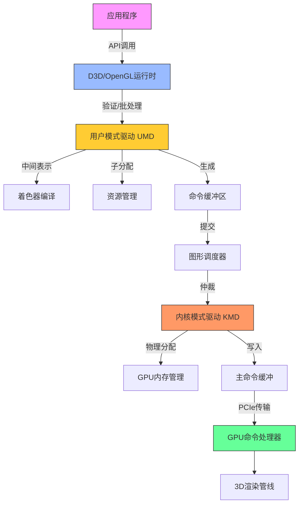

# Part 1: Introduction the Software stack

运行 D3D9/10/11 的 DX11 级 PC 硬件， 虽然除了开头部分外，API 细节不会太重要；一旦进入 GPU 内部，一切都是本地指令了



## 应用程序（The application）

这是你写的代码。也是你的 Bug，真的。是的，API 运行库和驱动也有 bug，但这次真不是它们的锅。快去修吧。

---

## API 运行时（The API runtime）

你通过它创建资源、设置状态、发出绘图调用。它记录你设定的状态、检查参数的合法性和一致性，管理用户可见的资源，也可能会验证着色器代码及其 shader 连接（至少 D3D 会处理，OpenGL 则在驱动层面中处理）。它还可能做一些批处理操作，然后将工作交给图形驱动，更具体说，是交给用户态驱动（UMD）。

---

## 用户态图形驱动（User-Mode Driver, UMD）

这是 CPU 端大多数“魔法”发生的地方。如果你的应用因为某个 API 调用崩溃，通常就是在这里发生的。它是一个用户态的 DLL 文件（比如 Nvidia 的 `nvd3dum.dll` 或 AMD 的 `atiumd*.dll`），运行在你的程序地址空间内，没有任何系统权限。

它实现了 D3D 调用的 DDI（Device Driver Interface），这个 API 比你看到的 D3D 更底层些，比如更明确地处理内存管理等。

这里是着色器编译的地方。D3D 会把预验证的着色器令牌流（已经过类型检查、资源数量限制检查等）传给 UMD。这个字节码是从 HLSL 编译而来，并在前期做了一些高级优化（死代码消除、循环展开等），这有助于驱动少做很多耗时优化。

不过，一些底层优化（如寄存器分配、循环展开）还是要由驱动完成，因为这取决于具体硬件资源和调度限制。所以驱动通常会把 D3D 字节码转成中间表示（IR）再进一步编译。

如果你的游戏很有名，Nvidia 或 AMD 的工程师可能会专门为其编写手动优化的替代着色器，并由 UMD 进行识别和替换。当然结果必须一致，否则就是丑闻。

有趣的是，一些 API 状态可能会被“编译进”着色器。例如一些少见功能（如纹理边界）可能不是 GPU 原生支持的，而是由着色器代码模拟的，这意味着驱动可能需要为不同的 API 状态组合生成多个版本的着色器。

你第一次使用某个资源或着色器时可能会卡顿 —— 因为驱动延迟了资源的创建与编译。为了确保资源真正被创建，图形程序员经常会发一个假的绘图调用“热身”资源。虽然丑陋但从1999年以来就是这样，习惯就好。

UMD 还要处理旧版 D3D 的内容，比如 Shader Model 1.x、2.0、3.0，甚至是固定功能管线（FFP），这些东西会被翻译成现代着色器来执行。

此外，它还涉及内存管理，比如纹理创建等。能做一些事情比如交换 texture 的通道，调度 system memory/video memory 之间的传输等。最重要的是，当 KMD 分配并移交给它后，写入 command buffers（或者叫 DMA buffers）。所有的状态切换以及渲染操作会被 UMD 转化为硬件能理解的 commands。还有一些你不会显式执行的操作，比如上传纹理和 shader 到显存。UMD 不能真正映射或管理显存 —— 那是 KMD 的职责 —— 但它可以将纹理做 swizzling（重排）或者安排系统内存与显存之间的数据传输。

更重要的是，它会构建命令缓冲区（Command Buffers 或 DMA Buffers），其中包含所有你设定的状态和绘图命令，还有资源上传指令等。

为了效率，驱动会尽可能将处理放在 UMD 中完成，因为 UMD 是普通 DLL，是用户态代码不需要使用昂贵的内核态切换开销，可以分配内存、多线程、调试等等。如果 UMD 崩溃，只会挂掉应用程序，不会拖垮整个系统。

### 再次解释 UMD 的工作

```text
[ 应用程序 ] 
      ↓ （调用 D3D API）
[ D3D Runtime（验证 & 初级优化） ]
      ↓ （提交 ID3D11DeviceContext::XXX）
[ User‑Mode Driver（UMD） ]
   ├─ 二次验证
   ├─ 字节码 → IR → 硬件指令
   ├─ 状态融合与特化
   ├─ 命令缓冲区构建
   └─ 资源管理 / 数据搬运
      ↓ （提交命令缓冲给 KMD）
[ Kernel‑Mode Driver（KMD） ]
   ├─ GPU 内存分配与映射
   ├─ 中断与看门狗
   ├─ DRM / 显示初始化
   └─ 主命令环形缓冲写入
      ↓（DMA via PCIe）
[ GPU Command Processor ] → 后续各硬件流水线
```

-   **接收并验证 API 调用**
    -   当应用调用 `CreateTexture`、`VSSetShader`、`DrawIndexed` 等 D3D API 时，API 运行时（D3D runtime）首先做基本的参数检查和状态追踪，然后把这些调用转发给 UMD。
    -   UMD 会再次检查——尤其是在 Windows 下，D3D runtime 和 UMD 都会做一遍验证，以保证传入的数据完全合法（资源大小、绑定点数量、状态组合等）。
        
-   **高级着色器优化与中间表示转换**
    -   D3D runtime 会将 HLSL 编译成 D3D 字节码，并执行一次“高层”优化（死码消除、常量折叠、循环展开等）。
    -   UMD 接收这个已经过初步优化并验证过的字节码，进一步将其翻译为自己的中间表示（IR），并在此层做与硬件资源、调度策略密切相关的低层优化，例如寄存器分配、指令打包、特定流水线约束调整等。
        
-   **状态合并与特化**
    -   UMD 会把应用在 API 层面设置的各种渲染状态（混合模式、深度测试、采样器状态等）和着色器常量等“融合”到最终的硬件命令中。
    -   对于一些不常用或需要在着色器中模拟的功能（如纹理边界处理、固定功能流水线行为），UMD 会在编译时生成特化版本的着色器或插入额外指令，从而避免硬件中单独实现这些“冷门”特性。
        
-   **命令缓冲区（Command Buffer）构建**
    -   所有“状态更改＋绘制调用＋资源上传”等操作，UMD 最终都会翻译成 GPU 能执行的原语指令，然后打包到所谓的命令缓冲区（也称 DMA buffer）中。
    -   这些缓冲区本身只是普通的 GPU 可寻址内存块，UMD 在用户态完成填充后，将它们提交给内核态驱动。
        
-   **资源管理与数据搬运**
    -   虽然显存真正的分配和映射是由 KMD 执行（因为这是内核特权操作），UMD 可以在用户态挑选合适的内存页、将纹理做“swizzle”（按硬件最优布局重排）或者在后台多线程调度数据上传／下载。
    -   它还负责跟踪哪些资源是“热”的、哪些是“冷”的，以便在必要时向 KMD 提出迁移显存 ↔ 系统内存的请求。
        
-   **插件与游戏特化**
    -   UMD 通常会内置一份“已知热门游戏的着色器替换列表”，当检测到某款游戏的特定 HLSL 字节码时，UMD 会自动用手工高度优化的等效着色器替换它，从而提升性能或修复兼容性问题。
---

## 但等等，我们说的是“用户态驱动”？其实是“多个用户态驱动”

UMD 是 DLL，运行在调用它的每个进程中。但 GPU 是全局资源 —— 只有一个（即便你用 SLI/Crossfire），而系统中可能有多个应用同时访问它。这需要某个调度组件来分配 GPU 使用时间。

---

## 调度器（The Scheduler）

图形调度器会对多个进程之间的 GPU 使用进行时间分片，它会仲裁谁来访问 3D 管线，根据时间片等考虑。切换上下文会带来 GPU 状态的额外切换（会产生额外的 command buffer 指令），而且有可能带来显存资源的 swap in/out。一段时间内只有一个进程会提交 3D 指令。 一次上下文切换意味着要切换 GPU 状态，有时还需要换显存资源 —— 代价不小。而同一时刻只能有一个进程提交命令到 GPU。

控制台游戏程序员常抱怨 PC 的图形 API 抽象太高，影响性能。但其实 PC 驱动的任务更复杂 —— 它必须时刻维护完整状态，因为你可能随时被中断。而且为了避免程序崩溃或性能问题，驱动往往会在用户不知情的情况下悄悄修复错误或优化 —— 不讨好但没办法，商业需求优先。

---

## 内核态驱动（Kernel-Mode Driver, KMD）

KMD 是唯一的、系统级别的图形驱动。多个 UMD 可以同时存在，但只有一个 KMD。如果 KMD 崩溃，整个图形系统都会重启（现在不会蓝屏了，会重载驱动）。

KMD 负责 GPU 初始化、设置显示模式、处理鼠标光标（是的，硬件只支持一个）、设定看门狗定时器、处理中断、管理物理内存映射、处理内容保护路径（DRM）等等。

最关键的是：KMD 管理实际被 GPU 执行的命令缓冲。UMD 构造的命令缓冲只是 GPU 可访问的内存区域，而 KMD 会把它们打包进主命令缓冲（一般是一个小环形缓冲），并通过寄存器将读写指针告诉 GPU。

---

## 总线（The Bus）

这些数据传输并不是直接通往显卡，而是经过总线 —— 通常是 PCI Express。DMA 传输也一样。虽然很快，但也是一个流程阶段。

---

## 命令处理器（The Command Processor）

这是 GPU 的前端 —— 负责读取命令缓冲并执行它们的部分。本文篇幅已长，后续将在下一篇继续介绍从这里开始的内容。

---

## OpenGL 小插曲

OpenGL 与上文类似，但 API 与 UMD 之间界限不明显。而且 GLSL 编译完全由驱动处理，每个硬件厂商都有自己实现的前端 —— 结果就是有一堆略微不同、互相不兼容的 GLSL 方言，还有各种 bug。

相比之下，D3D 的字节码方案更清晰：只有一个编译器，避免了语法差异，且允许在编译阶段进行更复杂的优化。

---

## 遗漏与简化说明

本文只是概览，省略了大量细节。例如调度器有多个实现、CPU 和 GPU 的同步机制没有讲、可能还有我忘记的内容。欢迎指出错误，我会修正！希望下次继续为你带来更多 GPU 内部的内容！


# Part2: GPU memory architecture and the Command Processor.

在上一部分，我解释了你在 PC 上发出的 3D 渲染指令在真正送达 GPU 之前所经历的各个阶段；简而言之：这过程比你想得要复杂。我最后提到了**命令处理器（Command Processor）**，以及它如何最终处理我们辛苦准备好的命令缓冲区。嗯……我要说实话了，我之前其实“骗”了你一点点。这一次我们确实会首次“见到”命令处理器，但你要记住，所有这些命令缓冲其实都还是**通过内存传递**的——要么是通过 PCI Express 访问的系统内存，要么是本地显存。我们正在按顺序讲解整个渲染管线，所以，在真正谈论命令处理器之前，我们得先来谈谈内存子系统。

---

## GPU 内存子系统

GPU 的内存子系统和一般的 CPU 或其他硬件用的内存架构不同，因为 GPU 的设计目标完全不同，使用方式也不一样。有两个关键区别：

---

### 第一：GPU 的内存子系统非常快。真的很快。

比如，一颗 Core i7 2600K 的内存带宽可能最多能达到 19GB/s——那是在理想状态下，比如顺风、下坡、天气晴朗的情况下。而一块 GeForce GTX 480，内存带宽接近 **180GB/s** ——相差快一个数量级！有没有很震撼？

---

### 第二：GPU 的内存子系统非常慢。真的很慢。

比如 Nehalem 架构的第一代 Core i7，在缓存未命中时访问主内存，大约需要 **140 个时钟周期**（你可以拿 AnandTech 给出的延迟乘以频率来算）。而 GTX 480 的内存访问延迟是 **400–800 个时钟周期**。更糟的是，这颗 Core i7 的频率是 **2.93GHz**，而 GTX 480 的 Shader Clock 是 **1.4GHz**，再来一个 2 倍的差距。哎呀，又是一个数量级的落差！

---

## 这意味着什么？

这正是你经常听说的那个经典权衡之一：

> **GPU 获得了超高的带宽，但为此付出了高延迟的代价**（还有较高的功耗，不过我们暂且不谈）。

GPU 的整体设计哲学就是：**“吞吐量优先，延迟靠边站”**。不要傻傻地等结果，没结果的时候就干别的去！

---

## 一点 DRAM 冷知识（对于后面很重要）

GPU 使用的显存（GDDR）是基于 DRAM 技术的。而 DRAM 的内部结构是个二维网格，有水平的“行线”和垂直的“列线”。每个交点都有一个电容和一个晶体管。

> 内部地址会被分为“行地址”和“列地址”，一次 DRAM 访问实际上是**整行**数据被读取或写入。

这意味着，如果你要访问一个 DRAM 的完整行，速度是很快的。但如果你访问的地址跨越了多个行，那延迟就会拉爆。所以如果你想充分发挥前面提到的惊人带宽，你得**按 DRAM 行来批量读取**数据，而不是到处零散读几字节。

---

## PCIe 主机接口

对图形程序员来说，这玩意儿可能没什么好说的；对 GPU 硬件架构师也一样。但当它成了性能瓶颈时，你就不得不重视它了。

它的主要作用是：

-   CPU 可通过它访问视频内存和 GPU 寄存器；
    
-   GPU 可访问系统内存的部分区域；
    
-   然后大家一起头疼，因为延迟非常大，信号必须从芯片走出、穿过主板、到达 CPU，然后感觉像是经历了一个世纪。
    

> **带宽倒还可以**——PCIe 2.0 x16 理论带宽为 8GB/s，约等于 CPU 内存带宽的一半到三分之一，是可以接受的。

而且和 AGP 不同的是，**PCIe 是双向对等链接**——AGP 只有从 CPU 到 GPU 是快通道，反向很慢；而 PCIe 是双向都有带宽。

---

### 🔧 AGP 的基本概念

AGP，全称 **Accelerated Graphics Port（加速图形端口）**，是英特尔于 1997 年推出的一种专门为图形加速卡（显卡）设计的高速通道接口标准，目的是提供比传统 PCI 更高效的图形数据传输能力。

-   **用途：** 专门为显卡与主板之间的数据传输设计，主要服务于 3D 图形渲染。
    
-   **接口位置：** AGP 插槽通常位于主板上，紧邻 PCI 插槽，但结构略有不同。
    
-   **数据通道：** 单向通道，**从 CPU 到 GPU 是高速的**，**但反方向（GPU → CPU）不快**，这和后来的 PCIe 不同。

---

## 最后再谈点内存细节

我们真的快要看到 3D 渲染命令了，几乎触手可及。但还有最后一个问题：

我们现在有两类内存：**本地显存** 和 **映射的系统内存**。一条通往北方的道路，另一条是南下几千里的长路。我们该走哪一条？

最简单的解决方法是：**加一根地址线**，指明该去哪里。这种方法很简单，也很常见。

但如果你在**统一内存架构**下，比如某些游戏主机（注意：不是 PC），那就只有一块内存，不用选路，去哪都一样。

如果你想更高级点，可以加个 **MMU（内存管理单元）**。这样就可以虚拟化 GPU 的内存地址空间，实现很多技巧：

-   热门数据放在显存；
    
-   冷数据放系统内存；
    
-   甚至未加载的资源可以动态从硬盘读取（大概需要 50 年 😂，因为硬盘真的慢，不是夸张）。
    

MMU 还能在你显存快满时，动态整理内存空间而不真的移动数据。

> MMU 也很有利于多进程共享 GPU。

至于是否必须有 MMU，我也不确定；反正它确实很有用。如果有人能帮我补充这部分，我愿意更新这篇文章。但说实话，现在我懒得查……

---

## DMA 引擎

还有一个叫 DMA（直接内存访问）的模块，能在系统内存与视频内存之间搬数据，而不占用 GPU 核心或 CPU 资源。

通常它可以完成：

-   **系统内存 ↔ 显存** 的复制；
    
-   **显存 ↔ 显存** 的复制（比如进行显存碎片整理）；
    
-   但 **不能做系统内存 ↔ 系统内存** 的搬运——因为你这是 GPU，不是内存拷贝专用设备！你要复制系统内存，**去找 CPU 处理**，不然还得绕 PCIe 一圈呢！
    

---

## 总结

现在我们有：

-   CPU 端准备好的命令缓冲；
    
-   PCIe 接口，让 CPU 能把它地址写入寄存器；
    
-   KMD 能通过 DMA 把命令从系统内存搬到显存；
    
-   然后 GPU 的内存子系统能读出这些命令；
    

所有路径都准备好了——我们终于，终于可以来看真正的 GPU 渲染命令了！